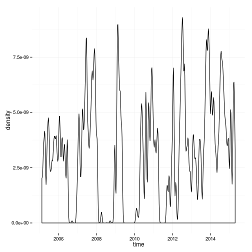
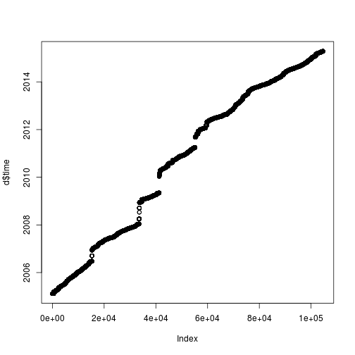
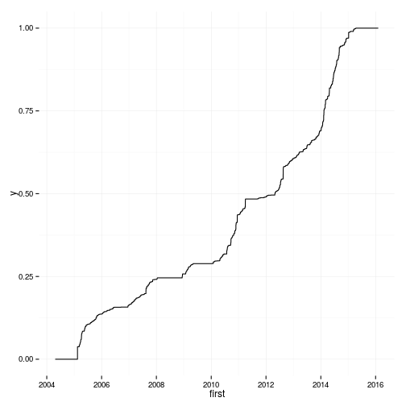
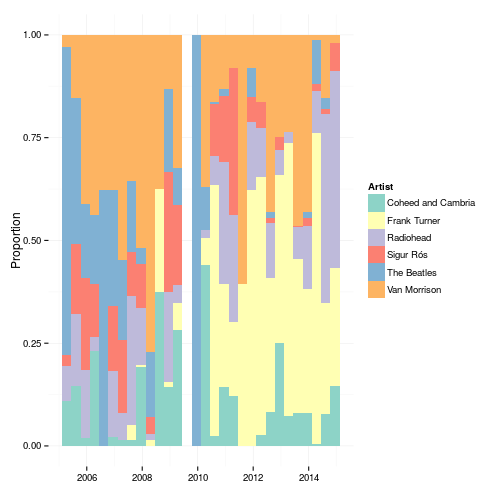
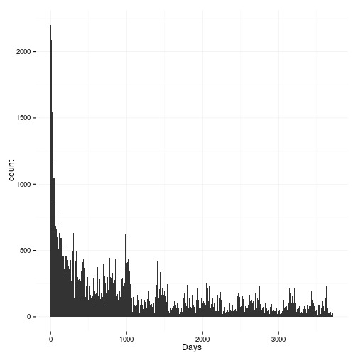

Last.fm Data analysis
=======================


I discovered that you can download your [last.fm](www.last.fm) [data](http://www.last.fm/settings/dataexporter).
For those that don't use it, last.fm records all the music you listen to (as long as you listen on something that supports it) and records it for you.
It uses this data to give you recomendations of other artists you might like.
It also gives you weekly, monthly, 6 monthly lists of who you have been listening to.

If I go to a care home when I am old, I intend to put my last.fm profile in as part of my [care plan](http://www.nhs.uk/Planners/Yourhealth/Pages/Careplan.aspx).
I don't want to spend the last years of my life listening to cruddy music.

Anyway, you can now download all your data quite easily.
So here I will just have a play around and see what is interesting.
By the way, I am [t3h_m013](www.last.fm/user/t3h_m013) on last.fm.
This is an old and embaressing nickname... but oh well.


Read in the data
-----------------

First some libraries

```r
library(ggplot2)
library(magrittr)
library(dplyr)
library(lubridate)
library(RColorBrewer)

theme_set(theme_minimal())
knit_theme$set("solarized-light")
```

Then read in the data.


```r
d <- read.table('data/scrobbles.tsv')
```

```
## Error in scan(file, what, nmax, sep, dec, quote, skip, nlines, na.strings, : line 1091 did not have 15 elements
```

Ok. It doesn't work. Blerg. 

I've made a copy of the file and removed the offending line. I guess this will just move the error on to the next line with a similar problem.


```r
d <- read.table('data/scrobbles\ (copy).tsv')
```

```
## Error in scan(file, what, nmax, sep, dec, quote, skip, nlines, na.strings, : line 1096 did not have 15 elements
```

Ok it's to do with quoted text inside song names. 
"07 - Excepts From ""The Six Wives Of Henry VIII""" for example. 
Funny that I've never encountered this before.


```r
d <- read.table('data/scrobbles.tsv', header = TRUE, sep = '\t', stringsAsFactors = FALSE, quote = "\"")
dim(d)
```

```
## [1] 104571     15
```

```r
names(d)
```

```
##  [1] "ISO.time"                "unixtime"               
##  [3] "track.name"              "track.mbid"             
##  [5] "artist.name"             "artist.mbid"            
##  [7] "uncorrected.track.name"  "uncorrected.track.mbid" 
##  [9] "uncorrected.artist.name" "uncorrected.artist.mbid"
## [11] "album.name"              "album.mbid"             
## [13] "album.artist.name"       "album.artist.mbid"      
## [15] "application"
```

Hooray. It works. 
We have some fairly obvious column names.
Note that last.fm matches incorrectly named artists.
So "uncorrected*" are the original data.

So let's look at some basic overview stuff.


```r
artistData <- data.frame(table(d$artist.name))
names(artistData)[1] <- 'Artist'

artistData[order(artistData$Freq, decreasing = TRUE), ] %>% head
```

```
##                  Artist Freq
## 1926       Van Morrison 5707
## 675        Frank Turner 2789
## 1356          Radiohead 2743
## 1651        The Beatles 2296
## 365  Coheed and Cambria 1819
## 1496          Sigur Rós 1734
```

```r
ggplot(artistData, aes(x = Freq)) + 
  geom_density() 
```

 

Ok, the top artists match.


And as expected, there's a few artists with loads of listen, and lots of artists with very few listens.

Now to think of some interesting things to look at.


When do I listen to music?
---------------------------


```r
# convert to POSIXct
d$time <- ymd_hms(d$ISO.time)


# Through time
ggplot(d, aes(x = time)) +
  geom_density(adjust = 0.1) 
```

 

```r
# Another simple way to look at times
#   Can't work out how to do this in ggplot2. 
plot(d$time)
```

 

I've had some periods where my music player didn't support scrobbling and things like that. 
Seems I also just listened to less music back in 2005/2006. 
I probably listened to more CDs back then.

To give some overview, I was doing my undergraduate degree September 2006 - July 2010.
Then I spent 1 year working and travelling (I'm surprised you can't see a drop in listens there.
From 2012 I've been doing an MRes/PhD in London.


```r
# Get the time of day
d$timeOnly <- hour(d$time) + minute(d$time)/60


ggplot(d, aes(x = timeOnly)) +
  geom_density(adjust = 0.001) 
```

 

So I listen to music less at night (makes sense).
I also listen less in the evening.
Which I guess is me being either out or listening to music with other people and therefore not necessarily on my player.

That spike is I think artificial. 
But I can't think what it might be.


```r
table(d$timeOnly)[order(table(d$timeOnly), decreasing = TRUE)] %>% head
```

```
## 
## 10.3333333333333            14.95 15.5833333333333 14.7833333333333 
##              593              174              154              152 
##            15.15            14.45 
##              150              149
```

It seems the spike is 10:20 (above is decimal I think). 
I think this must be something server side at last.fm.


When did I start listening to bands?
-------------------------------------


So first I'll look at a cumulative graph of number of bands in my 'library'.
I expect there will be a quick ramp up (I already listened to plenty of bands before I started scrobbling).
I'm not sure what else I might see.
Perhaps a ramp up in about 2010.
In particular I started listening to more electonic music and importantly more compilations at that time.


```r
first <- d %>% 
  group_by(artist.name) %>% 
  select(time) %>%
  summarise(first = sort(time)[1])

first %>% head
```

```
## Source: local data frame [6 x 2]
## 
##            artist.name               first
## 1               *shels 2007-11-01 14:36:20
## 2                  +44 2012-04-27 15:32:33
## 3              101/SiD 2006-01-17 22:49:38
## 4 13th Floor Elevators 2014-07-03 15:17:43
## 5                16bit 2010-10-27 12:43:01
## 6          2 Many DJ's 2005-03-08 12:44:25
```

```r
# Add this data to artistData data.frame
#   If someone knows how to do this better please tell me. (left_join?)
artistData$first <- first$first[sapply(as.character(artistData$Artist), function(x) which(x == first$artist.name))]


ggplot(artistData, aes(x = first)) +
  geom_density(adjust = 0.2)
```

 

```r
ggplot(artistData, aes(x = first)) + 
  stat_ecdf()
```

 

Well I guess that's pretty much just when I was scrobbling lots, I added new artists. 
I guess it's nice to know I'm still discovering new music and now just listening to bands from my youth.


When did I most listen to my favourite bands?
----------------------------------------------


```r
top <- artistData[order(artistData$Freq, decreasing = TRUE), ] %>% head(., 6)

topScrobbles <- d %>%
  filter(artist.name %in% top$Artist)

topScrobbles$artist.factor <- factor(topScrobbles$artist.name)

topScrobbles %<>% select(artist.factor, time)

brks <- data.frame(interval = seq(min(topScrobbles$time), max(topScrobbles$time), by = '4 month'))

ggplot(topScrobbles, aes(x = time, fill = artist.factor)) + 
  geom_histogram(breaks = as.numeric(brks[,1]), position = 'fill') +
  scale_fill_manual(values = brewer.pal(6, 'Set3'), name = "Artist") +
  ylab('Proportion') +
  xlab('')
```

```
## Warning: position_fill requires constant width: output may be incorrect
```

 

Meh. Still not a big fan of stacked bar chart type things. Mebbe I should try something else.


Getting into a band
---------------------

I notice with some bands that I get into them and absolutely binge.
Other bands I listen to them, then months later I finally get into them.
So let's look at that.


```r
# http://stackoverflow.com/questions/10836503/convert-difftime-time-to-years-months-and-days

f <- sapply(d$artist.name, function(x) which(artistData$Artist == x))

d$sinceFirst <- as.numeric(difftime( d$time , artistData$first[f], units = "days"))

ggplot(d, aes(x = sinceFirst)) + 
  geom_histogram(binwidth = 7) +
  xlab('Days')+
  scale_y_log10() +
  ylab('Log Count')
```

```
## Warning: Stacking not well defined when ymin != 0
```

 

```r
d %>% 
  filter(sinceFirst >= 1) %>%
  ggplot(., aes(x = sinceFirst)) + 
    geom_histogram(binwidth = 7) +
    xlab('Days')
```

 

```r
ggplot(d, aes(x = sinceFirst)) + 
  geom_histogram(binwidth = 1) +
  scale_x_continuous(limits = c(0, 120)) +
  xlab('Days') +
  ggtitle('First four months') 
```

 

```r
d %>% 
  filter(sinceFirst >= 1) %>%
  ggplot(., aes(x = sinceFirst)) + 
    geom_histogram(binwidth = 1) +
    scale_x_continuous(limits = c(0, 120)) +
    xlab('Days') +
    ggtitle('First four months')
```

 

I don't know which of these is best. 
A lot of plays are on the first day I've ever listened to that band.
Spelling mistakes in band names could accentuate this.


Diversity of bands listened to
--------------------------------


Where do bands come from
---------------------------

Right. This requires some web scrapping. So it's time to learn `rvest`.

First I need to get URLs for the bands. Then download ALLL the data.


```r
library(rvest)
library(XML)
```


```r
artistData$urlencode <- sapply(artistData$Artist %>% as.character, URLencode)

artistData$lastfmurl <- paste0('http://www.last.fm/music/', artistData$urlencode, '/+wiki')

wikiData <- lapply(artistData$lastfmurl, function(x) try(html(x))) 

save(wikiData, file = 'data/lastfmWebpages.RData')
```


```r
# 62 out of ~2000 artists failed.

sapply(wikiData, function(x) inherits(x, 'try-error')) %>% sum
```

```
## [1] 59
```

```r
# A function to pull out the location from the last.fm data.
extractLocation <- function(x){
  
  # We've still got the failed data in there. So return NAs for those.  
  if(inherits(x, 'try-error')){
    return(NA)
  }

  # If there is now wikiFractBox, give na.
  if(is.null(html_node(x, ".wikiFactBox:nth-child(1) .factbox"))){
    return(NA)
  }

  # Extract the 'factbox' using rvest and convert to character
  factbox <- x %>%
    html_node(".wikiFactBox:nth-child(1) .factbox") %>%
    saveXML 

  # If there isn't any location data then return NA as well.
  if(!grepl('Founded in', factbox)){
    return(NA)
  }
  
  st <- 'Founded in</dt>\n        <dd>\n            <ul><li>\n'  
  pat <- paste0('(.*', st, ')(.*?)(</li>.*$)')

  location <- gsub(pat, '\\2', factbox)
  
  # clean up
  location <- gsub('(^\ *)(.*)(\ *$)', '\\2', location)
  location <- gsub('(^.*)(\ \\n.*$)', '\\1', location)
  
  return(location)
}
  

artistData$locations <- sapply(wikiData, extractLocation)

sum(!is.na(artistData$locations))
```

```
## [1] 841
```

Doing it like this, unfortunately we only find ~800 locations. 
This is still awesome.
But maybe I'll have a go at scrapping wikipedia at some point.

Right. Now to convert locations to latitude and longitude.


```r
# Code from http://stackoverflow.com/questions/3257441/geocoding-in-r-with-google-maps
library(RCurl)
library(RJSONIO)

construct.geocode.url <- function(address, return.call = "json", sensor = "false") {
  root <- "http://maps.google.com/maps/api/geocode/"
  u <- paste(root, return.call, "?address=", address, "&sensor=", sensor, sep = "")
  return(URLencode(u))
}

gGeoCode <- function(address,verbose=FALSE) {

  if(is.na(address)){ return(c(NA, NA)) }

  if(verbose) cat(address,"\n")
  u <- construct.geocode.url(address)
  doc <- getURL(u)
  x <- fromJSON(doc,simplify = FALSE)
  if(x$status=="OK") {
    lat <- x$results[[1]]$geometry$location$lat
    lng <- x$results[[1]]$geometry$location$lng
    return(c(lat, lng))
  } else {
    return(c(NA,NA))
  }
}

geo <- lapply(artistData$locations, gGeoCode) %>% do.call(rbind, .)

colnames(geo) <- c('latitude', 'longitude')

artistData <- cbind(artistData, geo)
```

Now to plot! 


```r
library(leaflet)


blank = list(
  list(
    type = 'Feature',
    properties = list(
      popup = 'blnk'
    ),
    geometry = list(
      type = 'MultiPoint',
      coordinates = NA
    )
  )
)

s <- artistData[!is.na(artistData$latitude), c('Artist', 'longitude', 'latitude')]

shapes <- rep(blank, nrow(s))

for(i in 1:nrow(s)){
  #shapes[[i]]$geometry$coordinates <- matrix(rnorm(2), ncol = 2) 
  shapes[[i]]$geometry$coordinates <- as.matrix(s[i, 2:3]) 
  rownames(shapes[[i]]$geometry$coordinates) <- NULL
  colnames(shapes[[i]]$geometry$coordinates) <- NULL
  shapes[[i]]$properties$popup = as.character(s[i, 1])
}

leaflet() %>% 
  addTiles() %>%
  addGeoJSON(shapes)
```

<!--html_preserve--><div id="htmlwidget-7614" style="width:504px;height:504px;" class="leaflet"></div>
<script type="application/json" data-for="htmlwidget-7614">{ "x": {
 "calls": [
 {
 "method": "tileLayer",
"args": [
 "http://{s}.tile.openstreetmap.org/{z}/{x}/{y}.png",
{
 "minZoom":                 0,
"maxZoom":                18,
"maxNativeZoom": null,
"tileSize":               256,
"subdomains": "abc",
"errorTileUrl": "",
"tms": false,
"continuousWorld": false,
"noWrap": false,
"zoomOffset":                 0,
"zoomReverse": false,
"opacity":                 1,
"zIndex": null,
"unloadInvisibleTiles": null,
"updateWhenIdle": null,
"detectRetina": false,
"reuseTiles": false,
"attribution": "&copy; <a href=\"http://openstreetmap.org\">OpenStreetMap</a> contributors, <a href=\"http://creativecommons.org/licenses/by-sa/2.0/\">CC-BY-SA</a>" 
} 
] 
},
{
 "method": "geoJSON",
"args": [
 [
 {
 "type": "Feature",
"properties": {
 "popup": "13th Floor Elevators" 
},
"geometry": {
 "type": "MultiPoint",
"coordinates": [ [ -97.74306079999999,         30.267153 ] ] 
} 
},
{
 "type": "Feature",
"properties": {
 "popup": "30 Seconds to Mars" 
},
"geometry": {
 "type": "MultiPoint",
"coordinates": [ [      -118.2436849,        34.0522342 ] ] 
} 
},
{
 "type": "Feature",
"properties": {
 "popup": "65daysofstatic" 
},
"geometry": {
 "type": "MultiPoint",
"coordinates": [ [         -1.470085, 53.38112899999999 ] ] 
} 
},
{
 "type": "Feature",
"properties": {
 "popup": "Aaron Carter" 
},
"geometry": {
 "type": "MultiPoint",
"coordinates": [ [ -82.45717759999999,         27.950575 ] ] 
} 
},
{
 "type": "Feature",
"properties": {
 "popup": "Absentee" 
},
"geometry": {
 "type": "MultiPoint",
"coordinates": [ [        -0.1277583,        51.5073509 ] ] 
} 
},
{
 "type": "Feature",
"properties": {
 "popup": "Aconite Thrill" 
},
"geometry": {
 "type": "MultiPoint",
"coordinates": [ [         -0.358953, 51.81845999999999 ] ] 
} 
},
{
 "type": "Feature",
"properties": {
 "popup": "Admiral Angry" 
},
"geometry": {
 "type": "MultiPoint",
"coordinates": [ [      -118.2436849,        34.0522342 ] ] 
} 
},
{
 "type": "Feature",
"properties": {
 "popup": "A Fine Frenzy" 
},
"geometry": {
 "type": "MultiPoint",
"coordinates": [ [      -118.2436849,        34.0522342 ] ] 
} 
},
{
 "type": "Feature",
"properties": {
 "popup": "Afrojack" 
},
"geometry": {
 "type": "MultiPoint",
"coordinates": [ [         4.2972181, 51.85615019999999 ] ] 
} 
},
{
 "type": "Feature",
"properties": {
 "popup": "Against Me!" 
},
"geometry": {
 "type": "MultiPoint",
"coordinates": [ [ -82.32482619999999,        29.6516344 ] ] 
} 
},
{
 "type": "Feature",
"properties": {
 "popup": "Agoraphobic Nosebleed" 
},
"geometry": {
 "type": "MultiPoint",
"coordinates": [ [       -71.3824374,        42.4072107 ] ] 
} 
},
{
 "type": "Feature",
"properties": {
 "popup": "Air Formation" 
},
"geometry": {
 "type": "MultiPoint",
"coordinates": [ [        -0.1612657,        51.4946288 ] ] 
} 
},
{
 "type": "Feature",
"properties": {
 "popup": "Airiel" 
},
"geometry": {
 "type": "MultiPoint",
"coordinates": [ [ -86.52638569999999,         39.165325 ] ] 
} 
},
{
 "type": "Feature",
"properties": {
 "popup": "Alcest" 
},
"geometry": {
 "type": "MultiPoint",
"coordinates": [ [          4.620075,          44.16252 ] ] 
} 
},
{
 "type": "Feature",
"properties": {
 "popup": "Aldo Ranks" 
},
"geometry": {
 "type": "MultiPoint",
"coordinates": [ [        -80.782127,          8.537981 ] ] 
} 
},
{
 "type": "Feature",
"properties": {
 "popup": "Alexisonfire" 
},
"geometry": {
 "type": "MultiPoint",
"coordinates": [ [       -79.2468626,        43.1593745 ] ] 
} 
},
{
 "type": "Feature",
"properties": {
 "popup": "Al Green" 
},
"geometry": {
 "type": "MultiPoint",
"coordinates": [ [       -90.7898342,        35.0081474 ] ] 
} 
},
{
 "type": "Feature",
"properties": {
 "popup": "Alicia Keys" 
},
"geometry": {
 "type": "MultiPoint",
"coordinates": [ [       -74.0059413,        40.7127837 ] ] 
} 
},
{
 "type": "Feature",
"properties": {
 "popup": "A Loss for Words" 
},
"geometry": {
 "type": "MultiPoint",
"coordinates": [ [       -71.0588801,        42.3600825 ] ] 
} 
},
{
 "type": "Feature",
"properties": {
 "popup": "alt-J" 
},
"geometry": {
 "type": "MultiPoint",
"coordinates": [ [        -1.5490774,        53.8007554 ] ] 
} 
},
{
 "type": "Feature",
"properties": {
 "popup": "Alvvays" 
},
"geometry": {
 "type": "MultiPoint",
"coordinates": [ [       -79.3831843,         43.653226 ] ] 
} 
},
{
 "type": "Feature",
"properties": {
 "popup": "American Hi-Fi" 
},
"geometry": {
 "type": "MultiPoint",
"coordinates": [ [       -71.0588801,        42.3600825 ] ] 
} 
},
{
 "type": "Feature",
"properties": {
 "popup": "Amon Amarth" 
},
"geometry": {
 "type": "MultiPoint",
"coordinates": [ [        17.8309572,         59.199859 ] ] 
} 
},
{
 "type": "Feature",
"properties": {
 "popup": "Amy Winehouse" 
},
"geometry": {
 "type": "MultiPoint",
"coordinates": [ [        -0.1267762,        51.6280495 ] ] 
} 
},
{
 "type": "Feature",
"properties": {
 "popup": "Anaal Nathrakh" 
},
"geometry": {
 "type": "MultiPoint",
"coordinates": [ [ -86.80248999999999,        33.5206608 ] ] 
} 
},
{
 "type": "Feature",
"properties": {
 "popup": "Andrew W.K." 
},
"geometry": {
 "type": "MultiPoint",
"coordinates": [ [       -74.0059413,        40.7127837 ] ] 
} 
},
{
 "type": "Feature",
"properties": {
 "popup": "Andy McKee" 
},
"geometry": {
 "type": "MultiPoint",
"coordinates": [ [ -95.68901849999999,        39.0558235 ] ] 
} 
},
{
 "type": "Feature",
"properties": {
 "popup": "Animal Collective" 
},
"geometry": {
 "type": "MultiPoint",
"coordinates": [ [       -76.6121893,        39.2903848 ] ] 
} 
},
{
 "type": "Feature",
"properties": {
 "popup": "Animals as Leaders" 
},
"geometry": {
 "type": "MultiPoint",
"coordinates": [ [ -77.03687069999999,        38.9071923 ] ] 
} 
},
{
 "type": "Feature",
"properties": {
 "popup": "Antares" 
},
"geometry": {
 "type": "MultiPoint",
"coordinates": [ [          4.469936,         50.503887 ] ] 
} 
},
{
 "type": "Feature",
"properties": {
 "popup": "Anton Bruckner" 
},
"geometry": {
 "type": "MultiPoint",
"coordinates": [ [        14.2912729,        48.2077278 ] ] 
} 
},
{
 "type": "Feature",
"properties": {
 "popup": "Aosoon" 
},
"geometry": {
 "type": "MultiPoint",
"coordinates": [ [        -0.1277583,        51.5073509 ] ] 
} 
},
{
 "type": "Feature",
"properties": {
 "popup": "A Perfect Circle" 
},
"geometry": {
 "type": "MultiPoint",
"coordinates": [ [      -118.2436849,        34.0522342 ] ] 
} 
},
{
 "type": "Feature",
"properties": {
 "popup": "Aphex Twin" 
},
"geometry": {
 "type": "MultiPoint",
"coordinates": [ [        -4.6524982,        50.5036299 ] ] 
} 
},
{
 "type": "Feature",
"properties": {
 "popup": "A Place to Bury Strangers" 
},
"geometry": {
 "type": "MultiPoint",
"coordinates": [ [ -73.94415789999999,        40.6781784 ] ] 
} 
},
{
 "type": "Feature",
"properties": {
 "popup": "Apparat" 
},
"geometry": {
 "type": "MultiPoint",
"coordinates": [ [         13.404954, 52.52000659999999 ] ] 
} 
},
{
 "type": "Feature",
"properties": {
 "popup": "Arash" 
},
"geometry": {
 "type": "MultiPoint",
"coordinates": [ [         51.423056,         35.696111 ] ] 
} 
},
{
 "type": "Feature",
"properties": {
 "popup": "Arcade Fire" 
},
"geometry": {
 "type": "MultiPoint",
"coordinates": [ [        -73.567256,        45.5016889 ] ] 
} 
},
{
 "type": "Feature",
"properties": {
 "popup": "Arch Enemy" 
},
"geometry": {
 "type": "MultiPoint",
"coordinates": [ [        12.8577884,        56.6743748 ] ] 
} 
},
{
 "type": "Feature",
"properties": {
 "popup": "Arctic Monkeys" 
},
"geometry": {
 "type": "MultiPoint",
"coordinates": [ [         -1.470085, 53.38112899999999 ] ] 
} 
},
{
 "type": "Feature",
"properties": {
 "popup": "Aretha Franklin" 
},
"geometry": {
 "type": "MultiPoint",
"coordinates": [ [       -83.0457538,         42.331427 ] ] 
} 
},
{
 "type": "Feature",
"properties": {
 "popup": "Arvo Pärt" 
},
"geometry": {
 "type": "MultiPoint",
"coordinates": [ [        25.5699444,        58.8871098 ] ] 
} 
},
{
 "type": "Feature",
"properties": {
 "popup": "Ash" 
},
"geometry": {
 "type": "MultiPoint",
"coordinates": [ [ -5.715692199999999, 54.32875139999999 ] ] 
} 
},
{
 "type": "Feature",
"properties": {
 "popup": "Ashlee Simpson" 
},
"geometry": {
 "type": "MultiPoint",
"coordinates": [ [       -97.1466695,         31.549333 ] ] 
} 
},
{
 "type": "Feature",
"properties": {
 "popup": "Ashley Tisdale" 
},
"geometry": {
 "type": "MultiPoint",
"coordinates": [ [       -74.4056612,        40.0583238 ] ] 
} 
},
{
 "type": "Feature",
"properties": {
 "popup": "A Silver Mt. Zion" 
},
"geometry": {
 "type": "MultiPoint",
"coordinates": [ [        -73.567256,        45.5016889 ] ] 
} 
},
{
 "type": "Feature",
"properties": {
 "popup": "Astral Projection" 
},
"geometry": {
 "type": "MultiPoint",
"coordinates": [ [         34.851612,         31.046051 ] ] 
} 
},
{
 "type": "Feature",
"properties": {
 "popup": "Athlete" 
},
"geometry": {
 "type": "MultiPoint",
"coordinates": [ [        -0.0264139,        51.4815584 ] ] 
} 
},
{
 "type": "Feature",
"properties": {
 "popup": "Atoms for Peace" 
},
"geometry": {
 "type": "MultiPoint",
"coordinates": [ [      -118.2436849,        34.0522342 ] ] 
} 
},
{
 "type": "Feature",
"properties": {
 "popup": "At the Drive-In" 
},
"geometry": {
 "type": "MultiPoint",
"coordinates": [ [      -106.4424559,        31.7775757 ] ] 
} 
},
{
 "type": "Feature",
"properties": {
 "popup": "At the Gates" 
},
"geometry": {
 "type": "MultiPoint",
"coordinates": [ [          11.97456,          57.70887 ] ] 
} 
},
{
 "type": "Feature",
"properties": {
 "popup": "Audio Bullys" 
},
"geometry": {
 "type": "MultiPoint",
"coordinates": [ [         -3.435973,         55.378051 ] ] 
} 
},
{
 "type": "Feature",
"properties": {
 "popup": "Audioslave" 
},
"geometry": {
 "type": "MultiPoint",
"coordinates": [ [      -118.2436849,        34.0522342 ] ] 
} 
},
{
 "type": "Feature",
"properties": {
 "popup": "Autechre" 
},
"geometry": {
 "type": "MultiPoint",
"coordinates": [ [           -2.1561,        53.6097136 ] ] 
} 
},
{
 "type": "Feature",
"properties": {
 "popup": "Avicii" 
},
"geometry": {
 "type": "MultiPoint",
"coordinates": [ [        18.0685808, 59.32932349999999 ] ] 
} 
},
{
 "type": "Feature",
"properties": {
 "popup": "Avril Lavigne" 
},
"geometry": {
 "type": "MultiPoint",
"coordinates": [ [ -77.38323149999999,        44.1627589 ] ] 
} 
},
{
 "type": "Feature",
"properties": {
 "popup": "AWOLNATION" 
},
"geometry": {
 "type": "MultiPoint",
"coordinates": [ [      -118.2436849,        34.0522342 ] ] 
} 
},
{
 "type": "Feature",
"properties": {
 "popup": "Babyshambles" 
},
"geometry": {
 "type": "MultiPoint",
"coordinates": [ [        -0.1277583,        51.5073509 ] ] 
} 
},
{
 "type": "Feature",
"properties": {
 "popup": "Badly Drawn Boy" 
},
"geometry": {
 "type": "MultiPoint",
"coordinates": [ [        -2.4282192, 53.57686469999999 ] ] 
} 
},
{
 "type": "Feature",
"properties": {
 "popup": "Band of Horses" 
},
"geometry": {
 "type": "MultiPoint",
"coordinates": [ [      -122.3320708,        47.6062095 ] ] 
} 
},
{
 "type": "Feature",
"properties": {
 "popup": "Barenaked Ladies" 
},
"geometry": {
 "type": "MultiPoint",
"coordinates": [ [ -79.23175209999999,        43.7764258 ] ] 
} 
},
{
 "type": "Feature",
"properties": {
 "popup": "Baroness" 
},
"geometry": {
 "type": "MultiPoint",
"coordinates": [ [ -81.09983419999999,        32.0835407 ] ] 
} 
},
{
 "type": "Feature",
"properties": {
 "popup": "Basement Jaxx" 
},
"geometry": {
 "type": "MultiPoint",
"coordinates": [ [        -0.1156148,        51.4612794 ] ] 
} 
},
{
 "type": "Feature",
"properties": {
 "popup": "Bassnectar" 
},
"geometry": {
 "type": "MultiPoint",
"coordinates": [ [      -122.0307963,        36.9741171 ] ] 
} 
},
{
 "type": "Feature",
"properties": {
 "popup": "Bat for Lashes" 
},
"geometry": {
 "type": "MultiPoint",
"coordinates": [ [         -0.137163, 50.82253000000001 ] ] 
} 
},
{
 "type": "Feature",
"properties": {
 "popup": "Battle of Mice" 
},
"geometry": {
 "type": "MultiPoint",
"coordinates": [ [       -74.0059413,        40.7127837 ] ] 
} 
},
{
 "type": "Feature",
"properties": {
 "popup": "Bayside" 
},
"geometry": {
 "type": "MultiPoint",
"coordinates": [ [ -73.13496049999999,        40.7891424 ] ] 
} 
},
{
 "type": "Feature",
"properties": {
 "popup": "Beans On Toast" 
},
"geometry": {
 "type": "MultiPoint",
"coordinates": [ [         0.4757762, 51.76683689999999 ] ] 
} 
},
{
 "type": "Feature",
"properties": {
 "popup": "Beastie Boys" 
},
"geometry": {
 "type": "MultiPoint",
"coordinates": [ [       -74.0059413,        40.7127837 ] ] 
} 
},
{
 "type": "Feature",
"properties": {
 "popup": "Beat Happening" 
},
"geometry": {
 "type": "MultiPoint",
"coordinates": [ [      -122.9006951,        47.0378741 ] ] 
} 
},
{
 "type": "Feature",
"properties": {
 "popup": "Béla Fleck" 
},
"geometry": {
 "type": "MultiPoint",
"coordinates": [ [       -74.0059413,        40.7127837 ] ] 
} 
},
{
 "type": "Feature",
"properties": {
 "popup": "Belleruche" 
},
"geometry": {
 "type": "MultiPoint",
"coordinates": [ [        -0.1277583,        51.5073509 ] ] 
} 
},
{
 "type": "Feature",
"properties": {
 "popup": "Ben Folds Five" 
},
"geometry": {
 "type": "MultiPoint",
"coordinates": [ [ -79.05584450000001,        35.9131996 ] ] 
} 
},
{
 "type": "Feature",
"properties": {
 "popup": "Benga" 
},
"geometry": {
 "type": "MultiPoint",
"coordinates": [ [         -0.098234,         51.376165 ] ] 
} 
},
{
 "type": "Feature",
"properties": {
 "popup": "Ben Howard" 
},
"geometry": {
 "type": "MultiPoint",
"coordinates": [ [         -3.685797,         50.433741 ] ] 
} 
},
{
 "type": "Feature",
"properties": {
 "popup": "beNUTS" 
},
"geometry": {
 "type": "MultiPoint",
"coordinates": [ [        11.5819806,        48.1351253 ] ] 
} 
},
{
 "type": "Feature",
"properties": {
 "popup": "Berliner Philharmoniker" 
},
"geometry": {
 "type": "MultiPoint",
"coordinates": [ [         13.404954, 52.52000659999999 ] ] 
} 
},
{
 "type": "Feature",
"properties": {
 "popup": "Beth Orton" 
},
"geometry": {
 "type": "MultiPoint",
"coordinates": [ [          0.937827, 52.68161800000001 ] ] 
} 
},
{
 "type": "Feature",
"properties": {
 "popup": "Betty Davis" 
},
"geometry": {
 "type": "MultiPoint",
"coordinates": [ [       -74.0059413,        40.7127837 ] ] 
} 
},
{
 "type": "Feature",
"properties": {
 "popup": "Between the Buried and Me" 
},
"geometry": {
 "type": "MultiPoint",
"coordinates": [ [       -78.6381787,        35.7795897 ] ] 
} 
},
{
 "type": "Feature",
"properties": {
 "popup": "Biffy Clyro" 
},
"geometry": {
 "type": "MultiPoint",
"coordinates": [ [         -4.498792,         55.614719 ] ] 
} 
},
{
 "type": "Feature",
"properties": {
 "popup": "Big Black" 
},
"geometry": {
 "type": "MultiPoint",
"coordinates": [ [ -87.68769689999999,        42.0450722 ] ] 
} 
},
{
 "type": "Feature",
"properties": {
 "popup": "Bill Withers" 
},
"geometry": {
 "type": "MultiPoint",
"coordinates": [ [       -81.3314915,        37.6870584 ] ] 
} 
},
{
 "type": "Feature",
"properties": {
 "popup": "Björk" 
},
"geometry": {
 "type": "MultiPoint",
"coordinates": [ [        -21.933333, 64.13333299999999 ] ] 
} 
},
{
 "type": "Feature",
"properties": {
 "popup": "Black Sabbath" 
},
"geometry": {
 "type": "MultiPoint",
"coordinates": [ [         -1.890401, 52.48624299999999 ] ] 
} 
},
{
 "type": "Feature",
"properties": {
 "popup": "Black Tusk" 
},
"geometry": {
 "type": "MultiPoint",
"coordinates": [ [ -81.09983419999999,        32.0835407 ] ] 
} 
},
{
 "type": "Feature",
"properties": {
 "popup": "Blame" 
},
"geometry": {
 "type": "MultiPoint",
"coordinates": [ [         -3.435973,         55.378051 ] ] 
} 
},
{
 "type": "Feature",
"properties": {
 "popup": "Blessed By A Broken Heart" 
},
"geometry": {
 "type": "MultiPoint",
"coordinates": [ [        -73.567256,        45.5016889 ] ] 
} 
},
{
 "type": "Feature",
"properties": {
 "popup": "blink-182" 
},
"geometry": {
 "type": "MultiPoint",
"coordinates": [ [      -117.1610838,         32.715738 ] ] 
} 
},
{
 "type": "Feature",
"properties": {
 "popup": "Bloc Party" 
},
"geometry": {
 "type": "MultiPoint",
"coordinates": [ [        -0.1277583,        51.5073509 ] ] 
} 
},
{
 "type": "Feature",
"properties": {
 "popup": "Bloodhound Gang" 
},
"geometry": {
 "type": "MultiPoint",
"coordinates": [ [        -75.451571,        40.1856597 ] ] 
} 
},
{
 "type": "Feature",
"properties": {
 "popup": "Blur" 
},
"geometry": {
 "type": "MultiPoint",
"coordinates": [ [ 0.8918740000000001,         51.895927 ] ] 
} 
},
{
 "type": "Feature",
"properties": {
 "popup": "Blut aus Nord" 
},
"geometry": {
 "type": "MultiPoint",
"coordinates": [ [         -0.319769,         49.176963 ] ] 
} 
},
{
 "type": "Feature",
"properties": {
 "popup": "Boards of Canada" 
},
"geometry": {
 "type": "MultiPoint",
"coordinates": [ [         -3.188267,         55.953252 ] ] 
} 
},
{
 "type": "Feature",
"properties": {
 "popup": "Bobby Womack" 
},
"geometry": {
 "type": "MultiPoint",
"coordinates": [ [       -81.6943605,          41.49932 ] ] 
} 
},
{
 "type": "Feature",
"properties": {
 "popup": "Bob Dylan" 
},
"geometry": {
 "type": "MultiPoint",
"coordinates": [ [ -92.10048519999999, 46.78667189999999 ] ] 
} 
},
{
 "type": "Feature",
"properties": {
 "popup": "Bob Marley & The Wailers" 
},
"geometry": {
 "type": "MultiPoint",
"coordinates": [ [             -76.8,         17.983333 ] ] 
} 
},
{
 "type": "Feature",
"properties": {
 "popup": "Bomb the Bass" 
},
"geometry": {
 "type": "MultiPoint",
"coordinates": [ [        -0.1277583,        51.5073509 ] ] 
} 
},
{
 "type": "Feature",
"properties": {
 "popup": "Boney M." 
},
"geometry": {
 "type": "MultiPoint",
"coordinates": [ [ 7.150763599999999,        51.2562128 ] ] 
} 
},
{
 "type": "Feature",
"properties": {
 "popup": "Bon Jovi" 
},
"geometry": {
 "type": "MultiPoint",
"coordinates": [ [        -74.360846, 40.45940210000001 ] ] 
} 
},
{
 "type": "Feature",
"properties": {
 "popup": "Bonobo" 
},
"geometry": {
 "type": "MultiPoint",
"coordinates": [ [         -0.137163, 50.82253000000001 ] ] 
} 
},
{
 "type": "Feature",
"properties": {
 "popup": "Boris" 
},
"geometry": {
 "type": "MultiPoint",
"coordinates": [ [       139.6917064,        35.6894875 ] ] 
} 
},
{
 "type": "Feature",
"properties": {
 "popup": "Botch" 
},
"geometry": {
 "type": "MultiPoint",
"coordinates": [ [      -122.4442906,        47.2528768 ] ] 
} 
},
{
 "type": "Feature",
"properties": {
 "popup": "Bowling for Soup" 
},
"geometry": {
 "type": "MultiPoint",
"coordinates": [ [ -98.49338729999999,        33.9137085 ] ] 
} 
},
{
 "type": "Feature",
"properties": {
 "popup": "Breakage" 
},
"geometry": {
 "type": "MultiPoint",
"coordinates": [ [        -0.1277583,        51.5073509 ] ] 
} 
},
{
 "type": "Feature",
"properties": {
 "popup": "Breathe Carolina" 
},
"geometry": {
 "type": "MultiPoint",
"coordinates": [ [       -104.990251,        39.7392358 ] ] 
} 
},
{
 "type": "Feature",
"properties": {
 "popup": "Breather Resist" 
},
"geometry": {
 "type": "MultiPoint",
"coordinates": [ [       -85.7584557,        38.2526647 ] ] 
} 
},
{
 "type": "Feature",
"properties": {
 "popup": "Brenda Holloway" 
},
"geometry": {
 "type": "MultiPoint",
"coordinates": [ [      -118.2436849,        34.0522342 ] ] 
} 
},
{
 "type": "Feature",
"properties": {
 "popup": "Brian Wilson" 
},
"geometry": {
 "type": "MultiPoint",
"coordinates": [ [      -118.3531311,        33.9616801 ] ] 
} 
},
{
 "type": "Feature",
"properties": {
 "popup": "Bring Me the Horizon" 
},
"geometry": {
 "type": "MultiPoint",
"coordinates": [ [         -1.470085, 53.38112899999999 ] ] 
} 
},
{
 "type": "Feature",
"properties": {
 "popup": "Britney Spears" 
},
"geometry": {
 "type": "MultiPoint",
"coordinates": [ [ -90.50898429999999,        30.9382358 ] ] 
} 
},
{
 "type": "Feature",
"properties": {
 "popup": "Broken Bells" 
},
"geometry": {
 "type": "MultiPoint",
"coordinates": [ [      -118.2436849,        34.0522342 ] ] 
} 
},
{
 "type": "Feature",
"properties": {
 "popup": "Broken Note" 
},
"geometry": {
 "type": "MultiPoint",
"coordinates": [ [        -0.1277583,        51.5073509 ] ] 
} 
},
{
 "type": "Feature",
"properties": {
 "popup": "Bruce Springsteen" 
},
"geometry": {
 "type": "MultiPoint",
"coordinates": [ [       -74.3000878,        40.2136754 ] ] 
} 
},
{
 "type": "Feature",
"properties": {
 "popup": "Bruno Mars" 
},
"geometry": {
 "type": "MultiPoint",
"coordinates": [ [       -157.835698,         21.285002 ] ] 
} 
},
{
 "type": "Feature",
"properties": {
 "popup": "Buck 65" 
},
"geometry": {
 "type": "MultiPoint",
"coordinates": [ [       -63.5753196,        44.6488625 ] ] 
} 
},
{
 "type": "Feature",
"properties": {
 "popup": "Built to Spill" 
},
"geometry": {
 "type": "MultiPoint",
"coordinates": [ [      -116.2146068,        43.6187102 ] ] 
} 
},
{
 "type": "Feature",
"properties": {
 "popup": "Bunny Wailer" 
},
"geometry": {
 "type": "MultiPoint",
"coordinates": [ [             -76.8,         17.983333 ] ] 
} 
},
{
 "type": "Feature",
"properties": {
 "popup": "Buraka Som Sistema" 
},
"geometry": {
 "type": "MultiPoint",
"coordinates": [ [ -9.224547399999999,        38.7577603 ] ] 
} 
},
{
 "type": "Feature",
"properties": {
 "popup": "Burning Spear" 
},
"geometry": {
 "type": "MultiPoint",
"coordinates": [ [ -77.19739969999999,        18.4329473 ] ] 
} 
},
{
 "type": "Feature",
"properties": {
 "popup": "Cajun Dance Party" 
},
"geometry": {
 "type": "MultiPoint",
"coordinates": [ [        -0.1277583,        51.5073509 ] ] 
} 
},
{
 "type": "Feature",
"properties": {
 "popup": "Calvin Harris" 
},
"geometry": {
 "type": "MultiPoint",
"coordinates": [ [          -3.60512,         55.070859 ] ] 
} 
},
{
 "type": "Feature",
"properties": {
 "popup": "Camel" 
},
"geometry": {
 "type": "MultiPoint",
"coordinates": [ [        -0.1277583,        51.5073509 ] ] 
} 
},
{
 "type": "Feature",
"properties": {
 "popup": "Camper Van Beethoven" 
},
"geometry": {
 "type": "MultiPoint",
"coordinates": [ [      -117.1825381,        34.0555693 ] ] 
} 
},
{
 "type": "Feature",
"properties": {
 "popup": "Candi Staton" 
},
"geometry": {
 "type": "MultiPoint",
"coordinates": [ [ -86.76749799999999,        34.0606545 ] ] 
} 
},
{
 "type": "Feature",
"properties": {
 "popup": "Carly Rae Jepsen" 
},
"geometry": {
 "type": "MultiPoint",
"coordinates": [ [      -122.3261603,        49.1329272 ] ] 
} 
},
{
 "type": "Feature",
"properties": {
 "popup": "Carrie Underwood" 
},
"geometry": {
 "type": "MultiPoint",
"coordinates": [ [       -95.5230356,        35.4700993 ] ] 
} 
},
{
 "type": "Feature",
"properties": {
 "popup": "Caspian" 
},
"geometry": {
 "type": "MultiPoint",
"coordinates": [ [        -70.880049,        42.5584283 ] ] 
} 
},
{
 "type": "Feature",
"properties": {
 "popup": "Catatonia" 
},
"geometry": {
 "type": "MultiPoint",
"coordinates": [ [          -3.17909, 51.48158100000001 ] ] 
} 
},
{
 "type": "Feature",
"properties": {
 "popup": "Cave In" 
},
"geometry": {
 "type": "MultiPoint",
"coordinates": [ [       -71.1908924,        42.7262016 ] ] 
} 
},
{
 "type": "Feature",
"properties": {
 "popup": "Cavity" 
},
"geometry": {
 "type": "MultiPoint",
"coordinates": [ [       -80.1917902,        25.7616798 ] ] 
} 
},
{
 "type": "Feature",
"properties": {
 "popup": "Cephalic Carnage" 
},
"geometry": {
 "type": "MultiPoint",
"coordinates": [ [       -104.990251,        39.7392358 ] ] 
} 
},
{
 "type": "Feature",
"properties": {
 "popup": "Chaka Khan" 
},
"geometry": {
 "type": "MultiPoint",
"coordinates": [ [       -87.6297982,        41.8781136 ] ] 
} 
},
{
 "type": "Feature",
"properties": {
 "popup": "Chapterhouse" 
},
"geometry": {
 "type": "MultiPoint",
"coordinates": [ [        -0.9781303,        51.4542645 ] ] 
} 
},
{
 "type": "Feature",
"properties": {
 "popup": "Chic" 
},
"geometry": {
 "type": "MultiPoint",
"coordinates": [ [       -74.0059413,        40.7127837 ] ] 
} 
},
{
 "type": "Feature",
"properties": {
 "popup": "Chickenfoot" 
},
"geometry": {
 "type": "MultiPoint",
"coordinates": [ [      -115.1398296,        36.1699412 ] ] 
} 
},
{
 "type": "Feature",
"properties": {
 "popup": "Christina Aguilera" 
},
"geometry": {
 "type": "MultiPoint",
"coordinates": [ [       -74.1502007,        40.5795317 ] ] 
} 
},
{
 "type": "Feature",
"properties": {
 "popup": "Chromeo" 
},
"geometry": {
 "type": "MultiPoint",
"coordinates": [ [        -73.567256,        45.5016889 ] ] 
} 
},
{
 "type": "Feature",
"properties": {
 "popup": "Chumbawamba" 
},
"geometry": {
 "type": "MultiPoint",
"coordinates": [ [        -1.5490774,        53.8007554 ] ] 
} 
},
{
 "type": "Feature",
"properties": {
 "popup": "Cibo Matto" 
},
"geometry": {
 "type": "MultiPoint",
"coordinates": [ [       -74.0059413,        40.7127837 ] ] 
} 
},
{
 "type": "Feature",
"properties": {
 "popup": "City and Colour" 
},
"geometry": {
 "type": "MultiPoint",
"coordinates": [ [       -79.2468626,        43.1593745 ] ] 
} 
},
{
 "type": "Feature",
"properties": {
 "popup": "Clannad" 
},
"geometry": {
 "type": "MultiPoint",
"coordinates": [ [         -8.228704,        55.0498014 ] ] 
} 
},
{
 "type": "Feature",
"properties": {
 "popup": "Clap Your Hands Say Yeah" 
},
"geometry": {
 "type": "MultiPoint",
"coordinates": [ [       -72.0995209,        41.3556539 ] ] 
} 
},
{
 "type": "Feature",
"properties": {
 "popup": "cLOUDDEAD" 
},
"geometry": {
 "type": "MultiPoint",
"coordinates": [ [       -84.5120196,        39.1031182 ] ] 
} 
},
{
 "type": "Feature",
"properties": {
 "popup": "Cocteau Twins" 
},
"geometry": {
 "type": "MultiPoint",
"coordinates": [ [        -3.7227698,        56.0097152 ] ] 
} 
},
{
 "type": "Feature",
"properties": {
 "popup": "Coldplay" 
},
"geometry": {
 "type": "MultiPoint",
"coordinates": [ [        -0.1277583,        51.5073509 ] ] 
} 
},
{
 "type": "Feature",
"properties": {
 "popup": "Comets On Fire" 
},
"geometry": {
 "type": "MultiPoint",
"coordinates": [ [      -122.0307963,        36.9741171 ] ] 
} 
},
{
 "type": "Feature",
"properties": {
 "popup": "Commodores" 
},
"geometry": {
 "type": "MultiPoint",
"coordinates": [ [       -85.7077266,         32.430237 ] ] 
} 
},
{
 "type": "Feature",
"properties": {
 "popup": "Conan" 
},
"geometry": {
 "type": "MultiPoint",
"coordinates": [ [        -2.9915726,        53.4083714 ] ] 
} 
},
{
 "type": "Feature",
"properties": {
 "popup": "Con Funk Shun" 
},
"geometry": {
 "type": "MultiPoint",
"coordinates": [ [      -122.2566367,        38.1040864 ] ] 
} 
},
{
 "type": "Feature",
"properties": {
 "popup": "Converge" 
},
"geometry": {
 "type": "MultiPoint",
"coordinates": [ [       -70.8967155,          42.51954 ] ] 
} 
},
{
 "type": "Feature",
"properties": {
 "popup": "Corinne Bailey Rae" 
},
"geometry": {
 "type": "MultiPoint",
"coordinates": [ [        -1.5490774,        53.8007554 ] ] 
} 
},
{
 "type": "Feature",
"properties": {
 "popup": "Cory Branan" 
},
"geometry": {
 "type": "MultiPoint",
"coordinates": [ [       -90.0125913,        34.9889818 ] ] 
} 
},
{
 "type": "Feature",
"properties": {
 "popup": "Courtney Barnett" 
},
"geometry": {
 "type": "MultiPoint",
"coordinates": [ [       147.3238148,       -42.8819032 ] ] 
} 
},
{
 "type": "Feature",
"properties": {
 "popup": "Cradle of Filth" 
},
"geometry": {
 "type": "MultiPoint",
"coordinates": [ [ 0.9707800999999999,        52.1872472 ] ] 
} 
},
{
 "type": "Feature",
"properties": {
 "popup": "Cream" 
},
"geometry": {
 "type": "MultiPoint",
"coordinates": [ [        -0.1277583,        51.5073509 ] ] 
} 
},
{
 "type": "Feature",
"properties": {
 "popup": "Crown the Empire" 
},
"geometry": {
 "type": "MultiPoint",
"coordinates": [ [ -96.79698789999999,        32.7766642 ] ] 
} 
},
{
 "type": "Feature",
"properties": {
 "popup": "Cult of Luna" 
},
"geometry": {
 "type": "MultiPoint",
"coordinates": [ [        20.2630354,        63.8258471 ] ] 
} 
},
{
 "type": "Feature",
"properties": {
 "popup": "Curtis Mayfield" 
},
"geometry": {
 "type": "MultiPoint",
"coordinates": [ [       -87.6297982,        41.8781136 ] ] 
} 
},
{
 "type": "Feature",
"properties": {
 "popup": "Cute Is What We Aim For" 
},
"geometry": {
 "type": "MultiPoint",
"coordinates": [ [       -78.8783689, 42.88644679999999 ] ] 
} 
},
{
 "type": "Feature",
"properties": {
 "popup": "Daft Punk" 
},
"geometry": {
 "type": "MultiPoint",
"coordinates": [ [         2.3522219,         48.856614 ] ] 
} 
},
{
 "type": "Feature",
"properties": {
 "popup": "dälek" 
},
"geometry": {
 "type": "MultiPoint",
"coordinates": [ [       -74.1723667,         40.735657 ] ] 
} 
},
{
 "type": "Feature",
"properties": {
 "popup": "Damageplan" 
},
"geometry": {
 "type": "MultiPoint",
"coordinates": [ [ -96.79698789999999,        32.7766642 ] ] 
} 
},
{
 "type": "Feature",
"properties": {
 "popup": "Damon Albarn" 
},
"geometry": {
 "type": "MultiPoint",
"coordinates": [ [        -0.0707284,        51.5139486 ] ] 
} 
},
{
 "type": "Feature",
"properties": {
 "popup": "Dark Castle" 
},
"geometry": {
 "type": "MultiPoint",
"coordinates": [ [ -81.31444399999999,         29.894722 ] ] 
} 
},
{
 "type": "Feature",
"properties": {
 "popup": "Dark Tranquillity" 
},
"geometry": {
 "type": "MultiPoint",
"coordinates": [ [          11.97456,          57.70887 ] ] 
} 
},
{
 "type": "Feature",
"properties": {
 "popup": "Dashboard Confessional" 
},
"geometry": {
 "type": "MultiPoint",
"coordinates": [ [       -80.1289321,        26.3683064 ] ] 
} 
},
{
 "type": "Feature",
"properties": {
 "popup": "Daughter" 
},
"geometry": {
 "type": "MultiPoint",
"coordinates": [ [        -0.1277583,        51.5073509 ] ] 
} 
},
{
 "type": "Feature",
"properties": {
 "popup": "Daughters" 
},
"geometry": {
 "type": "MultiPoint",
"coordinates": [ [       -71.4128343,        41.8239891 ] ] 
} 
},
{
 "type": "Feature",
"properties": {
 "popup": "David Bowie" 
},
"geometry": {
 "type": "MultiPoint",
"coordinates": [ [        -0.1156148,        51.4612794 ] ] 
} 
},
{
 "type": "Feature",
"properties": {
 "popup": "David Gilmour" 
},
"geometry": {
 "type": "MultiPoint",
"coordinates": [ [          0.121817,         52.205337 ] ] 
} 
},
{
 "type": "Feature",
"properties": {
 "popup": "David Gray" 
},
"geometry": {
 "type": "MultiPoint",
"coordinates": [ [         -2.323702, 53.42556099999999 ] ] 
} 
},
{
 "type": "Feature",
"properties": {
 "popup": "David Guetta" 
},
"geometry": {
 "type": "MultiPoint",
"coordinates": [ [         2.3522219,         48.856614 ] ] 
} 
},
{
 "type": "Feature",
"properties": {
 "popup": "Day One" 
},
"geometry": {
 "type": "MultiPoint",
"coordinates": [ [          -2.58791,         51.454513 ] ] 
} 
},
{
 "type": "Feature",
"properties": {
 "popup": "Dead Kennedys" 
},
"geometry": {
 "type": "MultiPoint",
"coordinates": [ [      -122.4194155,        37.7749295 ] ] 
} 
},
{
 "type": "Feature",
"properties": {
 "popup": "deadmau5" 
},
"geometry": {
 "type": "MultiPoint",
"coordinates": [ [       -79.0849436,        43.0895577 ] ] 
} 
},
{
 "type": "Feature",
"properties": {
 "popup": "Dead Meadow" 
},
"geometry": {
 "type": "MultiPoint",
"coordinates": [ [ -77.03687069999999,        38.9071923 ] ] 
} 
},
{
 "type": "Feature",
"properties": {
 "popup": "Deaf Havana" 
},
"geometry": {
 "type": "MultiPoint",
"coordinates": [ [ 0.4022963000000001,        52.7516798 ] ] 
} 
},
{
 "type": "Feature",
"properties": {
 "popup": "Deafheaven" 
},
"geometry": {
 "type": "MultiPoint",
"coordinates": [ [      -122.4194155,        37.7749295 ] ] 
} 
},
{
 "type": "Feature",
"properties": {
 "popup": "Death Cab for Cutie" 
},
"geometry": {
 "type": "MultiPoint",
"coordinates": [ [      -122.4781473,          48.74908 ] ] 
} 
},
{
 "type": "Feature",
"properties": {
 "popup": "Death from Above 1979" 
},
"geometry": {
 "type": "MultiPoint",
"coordinates": [ [       -79.3831843,         43.653226 ] ] 
} 
},
{
 "type": "Feature",
"properties": {
 "popup": "Death in Vegas" 
},
"geometry": {
 "type": "MultiPoint",
"coordinates": [ [        -0.1277583,        51.5073509 ] ] 
} 
},
{
 "type": "Feature",
"properties": {
 "popup": "Decapitated" 
},
"geometry": {
 "type": "MultiPoint",
"coordinates": [ [        21.7660531,        49.6824761 ] ] 
} 
},
{
 "type": "Feature",
"properties": {
 "popup": "Deep Purple" 
},
"geometry": {
 "type": "MultiPoint",
"coordinates": [ [        -0.2376744, 51.80978229999999 ] ] 
} 
},
{
 "type": "Feature",
"properties": {
 "popup": "Defeater" 
},
"geometry": {
 "type": "MultiPoint",
"coordinates": [ [       -71.0588801,        42.3600825 ] ] 
} 
},
{
 "type": "Feature",
"properties": {
 "popup": "Def Leppard" 
},
"geometry": {
 "type": "MultiPoint",
"coordinates": [ [         -1.470085, 53.38112899999999 ] ] 
} 
},
{
 "type": "Feature",
"properties": {
 "popup": "Descendents" 
},
"geometry": {
 "type": "MultiPoint",
"coordinates": [ [      -118.3150722,        33.7922392 ] ] 
} 
},
{
 "type": "Feature",
"properties": {
 "popup": "Devil Sold His Soul" 
},
"geometry": {
 "type": "MultiPoint",
"coordinates": [ [        -0.1277583,        51.5073509 ] ] 
} 
},
{
 "type": "Feature",
"properties": {
 "popup": "Devo" 
},
"geometry": {
 "type": "MultiPoint",
"coordinates": [ [ -81.51900529999999,        41.0814447 ] ] 
} 
},
{
 "type": "Feature",
"properties": {
 "popup": "Dexys Midnight Runners" 
},
"geometry": {
 "type": "MultiPoint",
"coordinates": [ [         -1.890401, 52.48624299999999 ] ] 
} 
},
{
 "type": "Feature",
"properties": {
 "popup": "Diana Ross" 
},
"geometry": {
 "type": "MultiPoint",
"coordinates": [ [       -83.0457538,         42.331427 ] ] 
} 
},
{
 "type": "Feature",
"properties": {
 "popup": "Digitalism" 
},
"geometry": {
 "type": "MultiPoint",
"coordinates": [ [ 9.993681799999999,        53.5510846 ] ] 
} 
},
{
 "type": "Feature",
"properties": {
 "popup": "Digital Mystikz" 
},
"geometry": {
 "type": "MultiPoint",
"coordinates": [ [        -0.1277583,        51.5073509 ] ] 
} 
},
{
 "type": "Feature",
"properties": {
 "popup": "Dillinja" 
},
"geometry": {
 "type": "MultiPoint",
"coordinates": [ [          -0.14756,          51.45265 ] ] 
} 
},
{
 "type": "Feature",
"properties": {
 "popup": "Dimmu Borgir" 
},
"geometry": {
 "type": "MultiPoint",
"coordinates": [ [        10.7522454,        59.9138688 ] ] 
} 
},
{
 "type": "Feature",
"properties": {
 "popup": "Dinosaur Jr." 
},
"geometry": {
 "type": "MultiPoint",
"coordinates": [ [ -72.49681889999999, 42.34037989999999 ] ] 
} 
},
{
 "type": "Feature",
"properties": {
 "popup": "Dismantle" 
},
"geometry": {
 "type": "MultiPoint",
"coordinates": [ [         -0.137163, 50.82253000000001 ] ] 
} 
},
{
 "type": "Feature",
"properties": {
 "popup": "Dog Fashion Disco" 
},
"geometry": {
 "type": "MultiPoint",
"coordinates": [ [       -76.6121893,        39.2903848 ] ] 
} 
},
{
 "type": "Feature",
"properties": {
 "popup": "Dolly Parton" 
},
"geometry": {
 "type": "MultiPoint",
"coordinates": [ [ -83.56183500000002,        35.8681455 ] ] 
} 
},
{
 "type": "Feature",
"properties": {
 "popup": "Donald Byrd" 
},
"geometry": {
 "type": "MultiPoint",
"coordinates": [ [       -83.0457538,         42.331427 ] ] 
} 
},
{
 "type": "Feature",
"properties": {
 "popup": "Drive Like Jehu" 
},
"geometry": {
 "type": "MultiPoint",
"coordinates": [ [      -117.1610838,         32.715738 ] ] 
} 
},
{
 "type": "Feature",
"properties": {
 "popup": "Dropkick Murphys" 
},
"geometry": {
 "type": "MultiPoint",
"coordinates": [ [ -71.00227049999999,        42.2528772 ] ] 
} 
},
{
 "type": "Feature",
"properties": {
 "popup": "Duck Sauce" 
},
"geometry": {
 "type": "MultiPoint",
"coordinates": [ [       -74.0059413,        40.7127837 ] ] 
} 
},
{
 "type": "Feature",
"properties": {
 "popup": "Dwele" 
},
"geometry": {
 "type": "MultiPoint",
"coordinates": [ [       -83.0457538,         42.331427 ] ] 
} 
},
{
 "type": "Feature",
"properties": {
 "popup": "Dying Fetus" 
},
"geometry": {
 "type": "MultiPoint",
"coordinates": [ [       -76.4921829,        38.9784453 ] ] 
} 
},
{
 "type": "Feature",
"properties": {
 "popup": "Eagle Twin" 
},
"geometry": {
 "type": "MultiPoint",
"coordinates": [ [      -111.8910474,        40.7607793 ] ] 
} 
},
{
 "type": "Feature",
"properties": {
 "popup": "earthtone9" 
},
"geometry": {
 "type": "MultiPoint",
"coordinates": [ [        -1.1581086, 52.95478319999999 ] ] 
} 
},
{
 "type": "Feature",
"properties": {
 "popup": "Earth, Wind & Fire" 
},
"geometry": {
 "type": "MultiPoint",
"coordinates": [ [       -87.6297982,        41.8781136 ] ] 
} 
},
{
 "type": "Feature",
"properties": {
 "popup": "Easy Star All-Stars" 
},
"geometry": {
 "type": "MultiPoint",
"coordinates": [ [       -74.0059413,        40.7127837 ] ] 
} 
},
{
 "type": "Feature",
"properties": {
 "popup": "Echo & the Bunnymen" 
},
"geometry": {
 "type": "MultiPoint",
"coordinates": [ [        -2.9915726,        53.4083714 ] ] 
} 
},
{
 "type": "Feature",
"properties": {
 "popup": "Edgard Varèse" 
},
"geometry": {
 "type": "MultiPoint",
"coordinates": [ [       -63.9153523,       -34.0032332 ] ] 
} 
},
{
 "type": "Feature",
"properties": {
 "popup": "Editors" 
},
"geometry": {
 "type": "MultiPoint",
"coordinates": [ [         -1.890401, 52.48624299999999 ] ] 
} 
},
{
 "type": "Feature",
"properties": {
 "popup": "Ed Motta" 
},
"geometry": {
 "type": "MultiPoint",
"coordinates": [ [       -43.1728965,       -22.9068467 ] ] 
} 
},
{
 "type": "Feature",
"properties": {
 "popup": "Ed Sheeran" 
},
"geometry": {
 "type": "MultiPoint",
"coordinates": [ [ 0.9707800999999999,        52.1872472 ] ] 
} 
},
{
 "type": "Feature",
"properties": {
 "popup": "Edwin Starr" 
},
"geometry": {
 "type": "MultiPoint",
"coordinates": [ [       -86.7816016,        36.1626638 ] ] 
} 
},
{
 "type": "Feature",
"properties": {
 "popup": "Eels" 
},
"geometry": {
 "type": "MultiPoint",
"coordinates": [ [      -118.2436849,        34.0522342 ] ] 
} 
},
{
 "type": "Feature",
"properties": {
 "popup": "EF" 
},
"geometry": {
 "type": "MultiPoint",
"coordinates": [ [          11.97456,          57.70887 ] ] 
} 
},
{
 "type": "Feature",
"properties": {
 "popup": "Elastica" 
},
"geometry": {
 "type": "MultiPoint",
"coordinates": [ [        -0.1277583,        51.5073509 ] ] 
} 
},
{
 "type": "Feature",
"properties": {
 "popup": "Eliza Doolittle" 
},
"geometry": {
 "type": "MultiPoint",
"coordinates": [ [        -0.1277583,        51.5073509 ] ] 
} 
},
{
 "type": "Feature",
"properties": {
 "popup": "Ella Eyre" 
},
"geometry": {
 "type": "MultiPoint",
"coordinates": [ [        -0.1277583,        51.5073509 ] ] 
} 
},
{
 "type": "Feature",
"properties": {
 "popup": "Ellie Goulding" 
},
"geometry": {
 "type": "MultiPoint",
"coordinates": [ [        -2.6544182,        52.0765164 ] ] 
} 
},
{
 "type": "Feature",
"properties": {
 "popup": "Elvis Costello" 
},
"geometry": {
 "type": "MultiPoint",
"coordinates": [ [        -0.1277583,        51.5073509 ] ] 
} 
},
{
 "type": "Feature",
"properties": {
 "popup": "Emeli Sandé" 
},
"geometry": {
 "type": "MultiPoint",
"coordinates": [ [         -2.704753,         57.233323 ] ] 
} 
},
{
 "type": "Feature",
"properties": {
 "popup": "Ephixa" 
},
"geometry": {
 "type": "MultiPoint",
"coordinates": [ [       -106.346771,         56.130366 ] ] 
} 
},
{
 "type": "Feature",
"properties": {
 "popup": "Erato" 
},
"geometry": {
 "type": "MultiPoint",
"coordinates": [ [         18.643501, 60.12816100000001 ] ] 
} 
},
{
 "type": "Feature",
"properties": {
 "popup": "Erykah Badu" 
},
"geometry": {
 "type": "MultiPoint",
"coordinates": [ [ -96.79698789999999,        32.7766642 ] ] 
} 
},
{
 "type": "Feature",
"properties": {
 "popup": "Europe" 
},
"geometry": {
 "type": "MultiPoint",
"coordinates": [ [          17.92834,          59.51961 ] ] 
} 
},
{
 "type": "Feature",
"properties": {
 "popup": "EVE 6" 
},
"geometry": {
 "type": "MultiPoint",
"coordinates": [ [      -118.2351192,         34.228754 ] ] 
} 
},
{
 "type": "Feature",
"properties": {
 "popup": "Everything But the Girl" 
},
"geometry": {
 "type": "MultiPoint",
"coordinates": [ [        -0.3367413,        53.7456709 ] ] 
} 
},
{
 "type": "Feature",
"properties": {
 "popup": "Every Time I Die" 
},
"geometry": {
 "type": "MultiPoint",
"coordinates": [ [       -78.8783689, 42.88644679999999 ] ] 
} 
},
{
 "type": "Feature",
"properties": {
 "popup": "Exhumed" 
},
"geometry": {
 "type": "MultiPoint",
"coordinates": [ [      -121.8863286,        37.3382082 ] ] 
} 
},
{
 "type": "Feature",
"properties": {
 "popup": "Explosions in the Sky" 
},
"geometry": {
 "type": "MultiPoint",
"coordinates": [ [ -97.74306079999999,         30.267153 ] ] 
} 
},
{
 "type": "Feature",
"properties": {
 "popup": "Faithless" 
},
"geometry": {
 "type": "MultiPoint",
"coordinates": [ [        -0.1277583,        51.5073509 ] ] 
} 
},
{
 "type": "Feature",
"properties": {
 "popup": "Faith No More" 
},
"geometry": {
 "type": "MultiPoint",
"coordinates": [ [      -122.4194155,        37.7749295 ] ] 
} 
},
{
 "type": "Feature",
"properties": {
 "popup": "Fall Out Boy" 
},
"geometry": {
 "type": "MultiPoint",
"coordinates": [ [       -87.7878408,        42.0697509 ] ] 
} 
},
{
 "type": "Feature",
"properties": {
 "popup": "Fennesz" 
},
"geometry": {
 "type": "MultiPoint",
"coordinates": [ [        16.3738189,        48.2081743 ] ] 
} 
},
{
 "type": "Feature",
"properties": {
 "popup": "Fergie" 
},
"geometry": {
 "type": "MultiPoint",
"coordinates": [ [      -117.9686755,        33.9930677 ] ] 
} 
},
{
 "type": "Feature",
"properties": {
 "popup": "Fever Ray" 
},
"geometry": {
 "type": "MultiPoint",
"coordinates": [ [        18.0685808, 59.32932349999999 ] ] 
} 
},
{
 "type": "Feature",
"properties": {
 "popup": "Five Finger Death Punch" 
},
"geometry": {
 "type": "MultiPoint",
"coordinates": [ [      -118.2436849,        34.0522342 ] ] 
} 
},
{
 "type": "Feature",
"properties": {
 "popup": "Fleeting Joys" 
},
"geometry": {
 "type": "MultiPoint",
"coordinates": [ [      -121.4943996,        38.5815719 ] ] 
} 
},
{
 "type": "Feature",
"properties": {
 "popup": "Fleetwood Mac" 
},
"geometry": {
 "type": "MultiPoint",
"coordinates": [ [        -0.1277583,        51.5073509 ] ] 
} 
},
{
 "type": "Feature",
"properties": {
 "popup": "Flogging Molly" 
},
"geometry": {
 "type": "MultiPoint",
"coordinates": [ [      -118.2436849,        34.0522342 ] ] 
} 
},
{
 "type": "Feature",
"properties": {
 "popup": "Florence + the Machine" 
},
"geometry": {
 "type": "MultiPoint",
"coordinates": [ [        -0.1277583,        51.5073509 ] ] 
} 
},
{
 "type": "Feature",
"properties": {
 "popup": "Flux Pavilion" 
},
"geometry": {
 "type": "MultiPoint",
"coordinates": [ [ -0.9896879999999999,         52.135107 ] ] 
} 
},
{
 "type": "Feature",
"properties": {
 "popup": "Flying Lotus" 
},
"geometry": {
 "type": "MultiPoint",
"coordinates": [ [      -118.2436849,        34.0522342 ] ] 
} 
},
{
 "type": "Feature",
"properties": {
 "popup": "Fly Pan Am" 
},
"geometry": {
 "type": "MultiPoint",
"coordinates": [ [        -73.567256,        45.5016889 ] ] 
} 
},
{
 "type": "Feature",
"properties": {
 "popup": "Foals" 
},
"geometry": {
 "type": "MultiPoint",
"coordinates": [ [        -1.2577263,        51.7520209 ] ] 
} 
},
{
 "type": "Feature",
"properties": {
 "popup": "Foo Fighters" 
},
"geometry": {
 "type": "MultiPoint",
"coordinates": [ [      -122.3320708,        47.6062095 ] ] 
} 
},
{
 "type": "Feature",
"properties": {
 "popup": "Former Thieves" 
},
"geometry": {
 "type": "MultiPoint",
"coordinates": [ [        -93.097702,        41.8780025 ] ] 
} 
},
{
 "type": "Feature",
"properties": {
 "popup": "Fountains of Wayne" 
},
"geometry": {
 "type": "MultiPoint",
"coordinates": [ [       -74.0059413,        40.7127837 ] ] 
} 
},
{
 "type": "Feature",
"properties": {
 "popup": "Four Tet" 
},
"geometry": {
 "type": "MultiPoint",
"coordinates": [ [        -0.2171801,        51.4605741 ] ] 
} 
},
{
 "type": "Feature",
"properties": {
 "popup": "Four Year Strong" 
},
"geometry": {
 "type": "MultiPoint",
"coordinates": [ [       -71.8022934,        42.2625932 ] ] 
} 
},
{
 "type": "Feature",
"properties": {
 "popup": "Foxes" 
},
"geometry": {
 "type": "MultiPoint",
"coordinates": [ [        -0.1277583,        51.5073509 ] ] 
} 
},
{
 "type": "Feature",
"properties": {
 "popup": "Fox Stevenson" 
},
"geometry": {
 "type": "MultiPoint",
"coordinates": [ [        -1.5490774,        53.8007554 ] ] 
} 
},
{
 "type": "Feature",
"properties": {
 "popup": "Franz Ferdinand" 
},
"geometry": {
 "type": "MultiPoint",
"coordinates": [ [         -4.251806,         55.864237 ] ] 
} 
},
{
 "type": "Feature",
"properties": {
 "popup": "Franz Liszt" 
},
"geometry": {
 "type": "MultiPoint",
"coordinates": [ [         16.531075,        47.5653026 ] ] 
} 
},
{
 "type": "Feature",
"properties": {
 "popup": "Frédéric Chopin" 
},
"geometry": {
 "type": "MultiPoint",
"coordinates": [ [        20.3248609,        52.2573815 ] ] 
} 
},
{
 "type": "Feature",
"properties": {
 "popup": "Fugazi" 
},
"geometry": {
 "type": "MultiPoint",
"coordinates": [ [ -77.03687069999999,        38.9071923 ] ] 
} 
},
{
 "type": "Feature",
"properties": {
 "popup": "Fugees" 
},
"geometry": {
 "type": "MultiPoint",
"coordinates": [ [       -74.4056612,        40.0583238 ] ] 
} 
},
{
 "type": "Feature",
"properties": {
 "popup": "Funeral for a Friend" 
},
"geometry": {
 "type": "MultiPoint",
"coordinates": [ [        -3.7837117,        52.1306607 ] ] 
} 
},
{
 "type": "Feature",
"properties": {
 "popup": "Fun Lovin' Criminals" 
},
"geometry": {
 "type": "MultiPoint",
"coordinates": [ [       -74.0059413,        40.7127837 ] ] 
} 
},
{
 "type": "Feature",
"properties": {
 "popup": "Gabriel Fauré" 
},
"geometry": {
 "type": "MultiPoint",
"coordinates": [ [          1.607953,         43.114753 ] ] 
} 
},
{
 "type": "Feature",
"properties": {
 "popup": "Gabrielle Aplin" 
},
"geometry": {
 "type": "MultiPoint",
"coordinates": [ [         -2.083788,         51.505328 ] ] 
} 
},
{
 "type": "Feature",
"properties": {
 "popup": "Gallows" 
},
"geometry": {
 "type": "MultiPoint",
"coordinates": [ [        -0.2376744, 51.80978229999999 ] ] 
} 
},
{
 "type": "Feature",
"properties": {
 "popup": "Genesis" 
},
"geometry": {
 "type": "MultiPoint",
"coordinates": [ [         -0.612808, 51.18573199999999 ] ] 
} 
},
{
 "type": "Feature",
"properties": {
 "popup": "GG Allin" 
},
"geometry": {
 "type": "MultiPoint",
"coordinates": [ [        -95.712891,          37.09024 ] ] 
} 
},
{
 "type": "Feature",
"properties": {
 "popup": "Giant Sand" 
},
"geometry": {
 "type": "MultiPoint",
"coordinates": [ [       -110.926479,        32.2217429 ] ] 
} 
},
{
 "type": "Feature",
"properties": {
 "popup": "Girls Aloud" 
},
"geometry": {
 "type": "MultiPoint",
"coordinates": [ [        -0.1277583,        51.5073509 ] ] 
} 
},
{
 "type": "Feature",
"properties": {
 "popup": "Gladys Knight & The Pips" 
},
"geometry": {
 "type": "MultiPoint",
"coordinates": [ [       -84.3879824,        33.7489954 ] ] 
} 
},
{
 "type": "Feature",
"properties": {
 "popup": "Glassjaw" 
},
"geometry": {
 "type": "MultiPoint",
"coordinates": [ [ -73.13496049999999,        40.7891424 ] ] 
} 
},
{
 "type": "Feature",
"properties": {
 "popup": "Godflesh" 
},
"geometry": {
 "type": "MultiPoint",
"coordinates": [ [         -1.890401, 52.48624299999999 ] ] 
} 
},
{
 "type": "Feature",
"properties": {
 "popup": "God Forbid" 
},
"geometry": {
 "type": "MultiPoint",
"coordinates": [ [       -74.4518188,        40.4862157 ] ] 
} 
},
{
 "type": "Feature",
"properties": {
 "popup": "Godspeed You! Black Emperor" 
},
"geometry": {
 "type": "MultiPoint",
"coordinates": [ [        -73.567256,        45.5016889 ] ] 
} 
},
{
 "type": "Feature",
"properties": {
 "popup": "Gogol Bordello" 
},
"geometry": {
 "type": "MultiPoint",
"coordinates": [ [       -74.0059413,        40.7127837 ] ] 
} 
},
{
 "type": "Feature",
"properties": {
 "popup": "Goldfrapp" 
},
"geometry": {
 "type": "MultiPoint",
"coordinates": [ [        -0.1277583,        51.5073509 ] ] 
} 
},
{
 "type": "Feature",
"properties": {
 "popup": "Grandaddy" 
},
"geometry": {
 "type": "MultiPoint",
"coordinates": [ [      -120.9968782, 37.63909719999999 ] ] 
} 
},
{
 "type": "Feature",
"properties": {
 "popup": "Guillemots" 
},
"geometry": {
 "type": "MultiPoint",
"coordinates": [ [        -0.1277583,        51.5073509 ] ] 
} 
},
{
 "type": "Feature",
"properties": {
 "popup": "Guns N' Roses" 
},
"geometry": {
 "type": "MultiPoint",
"coordinates": [ [      -118.2436849,        34.0522342 ] ] 
} 
},
{
 "type": "Feature",
"properties": {
 "popup": "Gustav Holst" 
},
"geometry": {
 "type": "MultiPoint",
"coordinates": [ [        -2.0782533,        51.8993855 ] ] 
} 
},
{
 "type": "Feature",
"properties": {
 "popup": "Gustav Mahler" 
},
"geometry": {
 "type": "MultiPoint",
"coordinates": [ [         14.550072,         47.516231 ] ] 
} 
},
{
 "type": "Feature",
"properties": {
 "popup": "Hadouken!" 
},
"geometry": {
 "type": "MultiPoint",
"coordinates": [ [        -1.5490774,        53.8007554 ] ] 
} 
},
{
 "type": "Feature",
"properties": {
 "popup": "Happy Mondays" 
},
"geometry": {
 "type": "MultiPoint",
"coordinates": [ [        -2.2901264, 53.48752349999999 ] ] 
} 
},
{
 "type": "Feature",
"properties": {
 "popup": "Harkonen" 
},
"geometry": {
 "type": "MultiPoint",
"coordinates": [ [      -122.4442906,        47.2528768 ] ] 
} 
},
{
 "type": "Feature",
"properties": {
 "popup": "Harvey Milk" 
},
"geometry": {
 "type": "MultiPoint",
"coordinates": [ [        -83.357567,        33.9519347 ] ] 
} 
},
{
 "type": "Feature",
"properties": {
 "popup": "Hate Eternal" 
},
"geometry": {
 "type": "MultiPoint",
"coordinates": [ [       -81.5157535,        27.6648274 ] ] 
} 
},
{
 "type": "Feature",
"properties": {
 "popup": "Have a Nice Life" 
},
"geometry": {
 "type": "MultiPoint",
"coordinates": [ [       -72.6506488,        41.5623209 ] ] 
} 
},
{
 "type": "Feature",
"properties": {
 "popup": "Heart of a Coward" 
},
"geometry": {
 "type": "MultiPoint",
"coordinates": [ [         -3.435973,         55.378051 ] ] 
} 
},
{
 "type": "Feature",
"properties": {
 "popup": "Hell Is For Heroes" 
},
"geometry": {
 "type": "MultiPoint",
"coordinates": [ [        -0.1588255, 51.55170589999999 ] ] 
} 
},
{
 "type": "Feature",
"properties": {
 "popup": "Hellyeah" 
},
"geometry": {
 "type": "MultiPoint",
"coordinates": [ [ -96.79698789999999,        32.7766642 ] ] 
} 
},
{
 "type": "Feature",
"properties": {
 "popup": "Henryk Górecki" 
},
"geometry": {
 "type": "MultiPoint",
"coordinates": [ [         18.399722,         50.075278 ] ] 
} 
},
{
 "type": "Feature",
"properties": {
 "popup": "Herbie Hancock" 
},
"geometry": {
 "type": "MultiPoint",
"coordinates": [ [       -87.6297982,        41.8781136 ] ] 
} 
},
{
 "type": "Feature",
"properties": {
 "popup": "Holy Fuck" 
},
"geometry": {
 "type": "MultiPoint",
"coordinates": [ [       -79.3831843,         43.653226 ] ] 
} 
},
{
 "type": "Feature",
"properties": {
 "popup": "Hood" 
},
"geometry": {
 "type": "MultiPoint",
"coordinates": [ [        -1.5490774,        53.8007554 ] ] 
} 
},
{
 "type": "Feature",
"properties": {
 "popup": "Hope of the States" 
},
"geometry": {
 "type": "MultiPoint",
"coordinates": [ [         -0.774936, 50.83761000000001 ] ] 
} 
},
{
 "type": "Feature",
"properties": {
 "popup": "Hopesfall" 
},
"geometry": {
 "type": "MultiPoint",
"coordinates": [ [       -80.8431267,        35.2270869 ] ] 
} 
},
{
 "type": "Feature",
"properties": {
 "popup": "Horsepower Productions" 
},
"geometry": {
 "type": "MultiPoint",
"coordinates": [ [        -0.1277583,        51.5073509 ] ] 
} 
},
{
 "type": "Feature",
"properties": {
 "popup": "HORSE the band" 
},
"geometry": {
 "type": "MultiPoint",
"coordinates": [ [       -117.689218,        33.6469661 ] ] 
} 
},
{
 "type": "Feature",
"properties": {
 "popup": "Hot Hot Heat" 
},
"geometry": {
 "type": "MultiPoint",
"coordinates": [ [      -123.3656444,        48.4284207 ] ] 
} 
},
{
 "type": "Feature",
"properties": {
 "popup": "Howard Shore" 
},
"geometry": {
 "type": "MultiPoint",
"coordinates": [ [       -79.3831843,         43.653226 ] ] 
} 
},
{
 "type": "Feature",
"properties": {
 "popup": "Hozier" 
},
"geometry": {
 "type": "MultiPoint",
"coordinates": [ [        -6.1110741,         53.200903 ] ] 
} 
},
{
 "type": "Feature",
"properties": {
 "popup": "Hṛṣṭa" 
},
"geometry": {
 "type": "MultiPoint",
"coordinates": [ [        -73.567256,        45.5016889 ] ] 
} 
},
{
 "type": "Feature",
"properties": {
 "popup": "Hundred Reasons" 
},
"geometry": {
 "type": "MultiPoint",
"coordinates": [ [ -0.7526149999999999,        51.2868939 ] ] 
} 
},
{
 "type": "Feature",
"properties": {
 "popup": "Hüsker Dü" 
},
"geometry": {
 "type": "MultiPoint",
"coordinates": [ [ -93.28061339999999,        44.9716692 ] ] 
} 
},
{
 "type": "Feature",
"properties": {
 "popup": "Hyatari" 
},
"geometry": {
 "type": "MultiPoint",
"coordinates": [ [ -82.44515400000002,        38.4192496 ] ] 
} 
},
{
 "type": "Feature",
"properties": {
 "popup": "Hypnotic Brass Ensemble" 
},
"geometry": {
 "type": "MultiPoint",
"coordinates": [ [       -87.6297982,        41.8781136 ] ] 
} 
},
{
 "type": "Feature",
"properties": {
 "popup": "Ian Brown" 
},
"geometry": {
 "type": "MultiPoint",
"coordinates": [ [        -2.5969501,        53.3900441 ] ] 
} 
},
{
 "type": "Feature",
"properties": {
 "popup": "Ibrahim Ferrer" 
},
"geometry": {
 "type": "MultiPoint",
"coordinates": [ [ -75.84861099999999,         20.188056 ] ] 
} 
},
{
 "type": "Feature",
"properties": {
 "popup": "Iced Earth" 
},
"geometry": {
 "type": "MultiPoint",
"coordinates": [ [ -82.45717759999999,         27.950575 ] ] 
} 
},
{
 "type": "Feature",
"properties": {
 "popup": "Idina Menzel" 
},
"geometry": {
 "type": "MultiPoint",
"coordinates": [ [ -73.13496049999999,        40.7891424 ] ] 
} 
},
{
 "type": "Feature",
"properties": {
 "popup": "Idiot Pilot" 
},
"geometry": {
 "type": "MultiPoint",
"coordinates": [ [      -122.4781473,          48.74908 ] ] 
} 
},
{
 "type": "Feature",
"properties": {
 "popup": "If These Trees Could Talk" 
},
"geometry": {
 "type": "MultiPoint",
"coordinates": [ [ -81.51900529999999,        41.0814447 ] ] 
} 
},
{
 "type": "Feature",
"properties": {
 "popup": "Igor Stravinsky" 
},
"geometry": {
 "type": "MultiPoint",
"coordinates": [ [        105.318756,          61.52401 ] ] 
} 
},
{
 "type": "Feature",
"properties": {
 "popup": "Illya Kuryaki And The Valderramas" 
},
"geometry": {
 "type": "MultiPoint",
"coordinates": [ [       -58.3815931,       -34.6037232 ] ] 
} 
},
{
 "type": "Feature",
"properties": {
 "popup": "Imogen Heap" 
},
"geometry": {
 "type": "MultiPoint",
"coordinates": [ [        -0.1277583,        51.5073509 ] ] 
} 
},
{
 "type": "Feature",
"properties": {
 "popup": "inestable" 
},
"geometry": {
 "type": "MultiPoint",
"coordinates": [ [        -70.766667,        -33.516667 ] ] 
} 
},
{
 "type": "Feature",
"properties": {
 "popup": "In Flames" 
},
"geometry": {
 "type": "MultiPoint",
"coordinates": [ [          11.97456,          57.70887 ] ] 
} 
},
{
 "type": "Feature",
"properties": {
 "popup": "Ion Dissonance" 
},
"geometry": {
 "type": "MultiPoint",
"coordinates": [ [        -73.567256,        45.5016889 ] ] 
} 
},
{
 "type": "Feature",
"properties": {
 "popup": "Isaac Hayes" 
},
"geometry": {
 "type": "MultiPoint",
"coordinates": [ [ -89.64646719999999,        35.5642474 ] ] 
} 
},
{
 "type": "Feature",
"properties": {
 "popup": "Jackie Wilson" 
},
"geometry": {
 "type": "MultiPoint",
"coordinates": [ [       -83.0457538,         42.331427 ] ] 
} 
},
{
 "type": "Feature",
"properties": {
 "popup": "Jack Johnson" 
},
"geometry": {
 "type": "MultiPoint",
"coordinates": [ [      -158.0715983,        21.5616575 ] ] 
} 
},
{
 "type": "Feature",
"properties": {
 "popup": "Jack's Mannequin" 
},
"geometry": {
 "type": "MultiPoint",
"coordinates": [ [      -117.8311428,        33.7174708 ] ] 
} 
},
{
 "type": "Feature",
"properties": {
 "popup": "Jackson Browne" 
},
"geometry": {
 "type": "MultiPoint",
"coordinates": [ [      -118.2436849,        34.0522342 ] ] 
} 
},
{
 "type": "Feature",
"properties": {
 "popup": "Jaco Pastorius" 
},
"geometry": {
 "type": "MultiPoint",
"coordinates": [ [       -75.3399048,         40.121497 ] ] 
} 
},
{
 "type": "Feature",
"properties": {
 "popup": "Jairus" 
},
"geometry": {
 "type": "MultiPoint",
"coordinates": [ [ 0.5217254000000001,        51.2787075 ] ] 
} 
},
{
 "type": "Feature",
"properties": {
 "popup": "James Blake" 
},
"geometry": {
 "type": "MultiPoint",
"coordinates": [ [        -0.1277583,        51.5073509 ] ] 
} 
},
{
 "type": "Feature",
"properties": {
 "popup": "James Brown" 
},
"geometry": {
 "type": "MultiPoint",
"coordinates": [ [       -81.3587177,        33.2448733 ] ] 
} 
},
{
 "type": "Feature",
"properties": {
 "popup": "James Carr" 
},
"geometry": {
 "type": "MultiPoint",
"coordinates": [ [       -90.6393702,        34.1960298 ] ] 
} 
},
{
 "type": "Feature",
"properties": {
 "popup": "Jamie T" 
},
"geometry": {
 "type": "MultiPoint",
"coordinates": [ [        -0.2206288, 51.41833889999999 ] ] 
} 
},
{
 "type": "Feature",
"properties": {
 "popup": "Jamie Woon" 
},
"geometry": {
 "type": "MultiPoint",
"coordinates": [ [         -0.300689,          51.41233 ] ] 
} 
},
{
 "type": "Feature",
"properties": {
 "popup": "Jamiroquai" 
},
"geometry": {
 "type": "MultiPoint",
"coordinates": [ [        -0.1277583,        51.5073509 ] ] 
} 
},
{
 "type": "Feature",
"properties": {
 "popup": "Japandroids" 
},
"geometry": {
 "type": "MultiPoint",
"coordinates": [ [      -123.1207375,        49.2827291 ] ] 
} 
},
{
 "type": "Feature",
"properties": {
 "popup": "Jawbreaker" 
},
"geometry": {
 "type": "MultiPoint",
"coordinates": [ [      -122.4194155,        37.7749295 ] ] 
} 
},
{
 "type": "Feature",
"properties": {
 "popup": "Jeniferever" 
},
"geometry": {
 "type": "MultiPoint",
"coordinates": [ [        17.6389267, 59.85856380000001 ] ] 
} 
},
{
 "type": "Feature",
"properties": {
 "popup": "Jerry Goldsmith" 
},
"geometry": {
 "type": "MultiPoint",
"coordinates": [ [      -118.2436849,        34.0522342 ] ] 
} 
},
{
 "type": "Feature",
"properties": {
 "popup": "Jesu" 
},
"geometry": {
 "type": "MultiPoint",
"coordinates": [ [         -3.581405,         53.284355 ] ] 
} 
},
{
 "type": "Feature",
"properties": {
 "popup": "Jethro Tull" 
},
"geometry": {
 "type": "MultiPoint",
"coordinates": [ [        -3.0356748,        53.8175053 ] ] 
} 
},
{
 "type": "Feature",
"properties": {
 "popup": "Jill Scott" 
},
"geometry": {
 "type": "MultiPoint",
"coordinates": [ [       -75.1652215,        39.9525839 ] ] 
} 
},
{
 "type": "Feature",
"properties": {
 "popup": "Jimmy Cliff" 
},
"geometry": {
 "type": "MultiPoint",
"coordinates": [ [       -77.0564464,        18.0364134 ] ] 
} 
},
{
 "type": "Feature",
"properties": {
 "popup": "Jimmy Eat World" 
},
"geometry": {
 "type": "MultiPoint",
"coordinates": [ [      -111.8314724,        33.4151843 ] ] 
} 
},
{
 "type": "Feature",
"properties": {
 "popup": "JJ72" 
},
"geometry": {
 "type": "MultiPoint",
"coordinates": [ [        -6.2603097,        53.3498053 ] ] 
} 
},
{
 "type": "Feature",
"properties": {
 "popup": "John Coltrane" 
},
"geometry": {
 "type": "MultiPoint",
"coordinates": [ [       -79.6942222,        34.8848775 ] ] 
} 
},
{
 "type": "Feature",
"properties": {
 "popup": "John Lennon" 
},
"geometry": {
 "type": "MultiPoint",
"coordinates": [ [        -2.9915726,        53.4083714 ] ] 
} 
},
{
 "type": "Feature",
"properties": {
 "popup": "Johnny Truant" 
},
"geometry": {
 "type": "MultiPoint",
"coordinates": [ [         -0.137163, 50.82253000000001 ] ] 
} 
},
{
 "type": "Feature",
"properties": {
 "popup": "Joni Mitchell" 
},
"geometry": {
 "type": "MultiPoint",
"coordinates": [ [      -113.4000408,        49.7216792 ] ] 
} 
},
{
 "type": "Feature",
"properties": {
 "popup": "Jonny Greenwood" 
},
"geometry": {
 "type": "MultiPoint",
"coordinates": [ [        -1.2879529,          51.67078 ] ] 
} 
},
{
 "type": "Feature",
"properties": {
 "popup": "Joy Division" 
},
"geometry": {
 "type": "MultiPoint",
"coordinates": [ [        -2.2901264, 53.48752349999999 ] ] 
} 
},
{
 "type": "Feature",
"properties": {
 "popup": "Joy Orbison" 
},
"geometry": {
 "type": "MultiPoint",
"coordinates": [ [        -0.1277583,        51.5073509 ] ] 
} 
},
{
 "type": "Feature",
"properties": {
 "popup": "Joy Wants Eternity" 
},
"geometry": {
 "type": "MultiPoint",
"coordinates": [ [      -122.3320708,        47.6062095 ] ] 
} 
},
{
 "type": "Feature",
"properties": {
 "popup": "Jr Ewing" 
},
"geometry": {
 "type": "MultiPoint",
"coordinates": [ [        10.7522454,        59.9138688 ] ] 
} 
},
{
 "type": "Feature",
"properties": {
 "popup": "Judas Priest" 
},
"geometry": {
 "type": "MultiPoint",
"coordinates": [ [         -1.890401, 52.48624299999999 ] ] 
} 
},
{
 "type": "Feature",
"properties": {
 "popup": "Julianne Hough" 
},
"geometry": {
 "type": "MultiPoint",
"coordinates": [ [      -111.0937311,        39.3209801 ] ] 
} 
},
{
 "type": "Feature",
"properties": {
 "popup": "Kaiser Chiefs" 
},
"geometry": {
 "type": "MultiPoint",
"coordinates": [ [        -1.5490774,        53.8007554 ] ] 
} 
},
{
 "type": "Feature",
"properties": {
 "popup": "Kaskade" 
},
"geometry": {
 "type": "MultiPoint",
"coordinates": [ [ -87.68769689999999,        42.0450722 ] ] 
} 
},
{
 "type": "Feature",
"properties": {
 "popup": "Kataklysm" 
},
"geometry": {
 "type": "MultiPoint",
"coordinates": [ [        -73.567256,        45.5016889 ] ] 
} 
},
{
 "type": "Feature",
"properties": {
 "popup": "Katatonia" 
},
"geometry": {
 "type": "MultiPoint",
"coordinates": [ [        18.0685808, 59.32932349999999 ] ] 
} 
},
{
 "type": "Feature",
"properties": {
 "popup": "Kate Nash" 
},
"geometry": {
 "type": "MultiPoint",
"coordinates": [ [         -0.341995,         51.580559 ] ] 
} 
},
{
 "type": "Feature",
"properties": {
 "popup": "Katy B" 
},
"geometry": {
 "type": "MultiPoint",
"coordinates": [ [ -0.06913699999999999,         51.474191 ] ] 
} 
},
{
 "type": "Feature",
"properties": {
 "popup": "Katy Perry" 
},
"geometry": {
 "type": "MultiPoint",
"coordinates": [ [      -119.6981901,        34.4208305 ] ] 
} 
},
{
 "type": "Feature",
"properties": {
 "popup": "Keane" 
},
"geometry": {
 "type": "MultiPoint",
"coordinates": [ [          0.483679,         50.917405 ] ] 
} 
},
{
 "type": "Feature",
"properties": {
 "popup": "Kendrick Lamar" 
},
"geometry": {
 "type": "MultiPoint",
"coordinates": [ [      -118.2200712,        33.8958492 ] ] 
} 
},
{
 "type": "Feature",
"properties": {
 "popup": "Kevin Shields" 
},
"geometry": {
 "type": "MultiPoint",
"coordinates": [ [        -6.2603097,        53.3498053 ] ] 
} 
},
{
 "type": "Feature",
"properties": {
 "popup": "Khuda" 
},
"geometry": {
 "type": "MultiPoint",
"coordinates": [ [        -1.5490774,        53.8007554 ] ] 
} 
},
{
 "type": "Feature",
"properties": {
 "popup": "Kid Sister" 
},
"geometry": {
 "type": "MultiPoint",
"coordinates": [ [       -87.6297982,        41.8781136 ] ] 
} 
},
{
 "type": "Feature",
"properties": {
 "popup": "Killswitch Engage" 
},
"geometry": {
 "type": "MultiPoint",
"coordinates": [ [       -71.3824374,        42.4072107 ] ] 
} 
},
{
 "type": "Feature",
"properties": {
 "popup": "Kina Grannis" 
},
"geometry": {
 "type": "MultiPoint",
"coordinates": [ [      -117.8311428,        33.7174708 ] ] 
} 
},
{
 "type": "Feature",
"properties": {
 "popup": "King Cannibal" 
},
"geometry": {
 "type": "MultiPoint",
"coordinates": [ [        -0.1277583,        51.5073509 ] ] 
} 
},
{
 "type": "Feature",
"properties": {
 "popup": "King Crimson" 
},
"geometry": {
 "type": "MultiPoint",
"coordinates": [ [        -0.1277583,        51.5073509 ] ] 
} 
},
{
 "type": "Feature",
"properties": {
 "popup": "Kitchens of Distinction" 
},
"geometry": {
 "type": "MultiPoint",
"coordinates": [ [        -0.0936496,        51.4309209 ] ] 
} 
},
{
 "type": "Feature",
"properties": {
 "popup": "Kongh" 
},
"geometry": {
 "type": "MultiPoint",
"coordinates": [ [        14.6967247, 57.65303549999999 ] ] 
} 
},
{
 "type": "Feature",
"properties": {
 "popup": "Kool & the Gang" 
},
"geometry": {
 "type": "MultiPoint",
"coordinates": [ [       -74.0776417, 40.72815749999999 ] ] 
} 
},
{
 "type": "Feature",
"properties": {
 "popup": "Kowloon Walled City" 
},
"geometry": {
 "type": "MultiPoint",
"coordinates": [ [      -122.4194155,        37.7749295 ] ] 
} 
},
{
 "type": "Feature",
"properties": {
 "popup": "Kromestar" 
},
"geometry": {
 "type": "MultiPoint",
"coordinates": [ [        -0.1277583,        51.5073509 ] ] 
} 
},
{
 "type": "Feature",
"properties": {
 "popup": "Kronos Quartet" 
},
"geometry": {
 "type": "MultiPoint",
"coordinates": [ [      -122.4194155,        37.7749295 ] ] 
} 
},
{
 "type": "Feature",
"properties": {
 "popup": "KT Tunstall" 
},
"geometry": {
 "type": "MultiPoint",
"coordinates": [ [         -3.188267,         55.953252 ] ] 
} 
},
{
 "type": "Feature",
"properties": {
 "popup": "Kula Shaker" 
},
"geometry": {
 "type": "MultiPoint",
"coordinates": [ [        -0.1277583,        51.5073509 ] ] 
} 
},
{
 "type": "Feature",
"properties": {
 "popup": "Labelle" 
},
"geometry": {
 "type": "MultiPoint",
"coordinates": [ [       -75.1652215,        39.9525839 ] ] 
} 
},
{
 "type": "Feature",
"properties": {
 "popup": "La Dispute" 
},
"geometry": {
 "type": "MultiPoint",
"coordinates": [ [       -85.6680863,        42.9633599 ] ] 
} 
},
{
 "type": "Feature",
"properties": {
 "popup": "Lady Gaga" 
},
"geometry": {
 "type": "MultiPoint",
"coordinates": [ [       -74.0059413,        40.7127837 ] ] 
} 
},
{
 "type": "Feature",
"properties": {
 "popup": "Lambchop" 
},
"geometry": {
 "type": "MultiPoint",
"coordinates": [ [       -86.7816016,        36.1626638 ] ] 
} 
},
{
 "type": "Feature",
"properties": {
 "popup": "Lamb of God" 
},
"geometry": {
 "type": "MultiPoint",
"coordinates": [ [       -78.6568942,        37.4315734 ] ] 
} 
},
{
 "type": "Feature",
"properties": {
 "popup": "La Roux" 
},
"geometry": {
 "type": "MultiPoint",
"coordinates": [ [        -0.1277583,        51.5073509 ] ] 
} 
},
{
 "type": "Feature",
"properties": {
 "popup": "Laura Marling" 
},
"geometry": {
 "type": "MultiPoint",
"coordinates": [ [         -0.889119,          51.35248 ] ] 
} 
},
{
 "type": "Feature",
"properties": {
 "popup": "Lauryn Hill" 
},
"geometry": {
 "type": "MultiPoint",
"coordinates": [ [       -74.2609903,        40.7489277 ] ] 
} 
},
{
 "type": "Feature",
"properties": {
 "popup": "LCD Soundsystem" 
},
"geometry": {
 "type": "MultiPoint",
"coordinates": [ [       -74.0059413,        40.7127837 ] ] 
} 
},
{
 "type": "Feature",
"properties": {
 "popup": "Led Zeppelin" 
},
"geometry": {
 "type": "MultiPoint",
"coordinates": [ [        -0.1277583,        51.5073509 ] ] 
} 
},
{
 "type": "Feature",
"properties": {
 "popup": "Lemâitre" 
},
"geometry": {
 "type": "MultiPoint",
"coordinates": [ [        10.7522454,        59.9138688 ] ] 
} 
},
{
 "type": "Feature",
"properties": {
 "popup": "Leo Sayer" 
},
"geometry": {
 "type": "MultiPoint",
"coordinates": [ [        -0.2715558,        50.8342086 ] ] 
} 
},
{
 "type": "Feature",
"properties": {
 "popup": "letlive." 
},
"geometry": {
 "type": "MultiPoint",
"coordinates": [ [      -118.2436849,        34.0522342 ] ] 
} 
},
{
 "type": "Feature",
"properties": {
 "popup": "Leyaks" 
},
"geometry": {
 "type": "MultiPoint",
"coordinates": [ [        -0.1277583,        51.5073509 ] ] 
} 
},
{
 "type": "Feature",
"properties": {
 "popup": "Lily Allen" 
},
"geometry": {
 "type": "MultiPoint",
"coordinates": [ [        -0.1277583,        51.5073509 ] ] 
} 
},
{
 "type": "Feature",
"properties": {
 "popup": "Limp Bizkit" 
},
"geometry": {
 "type": "MultiPoint",
"coordinates": [ [ -81.65565099999999,        30.3321838 ] ] 
} 
},
{
 "type": "Feature",
"properties": {
 "popup": "Linda Lewis" 
},
"geometry": {
 "type": "MultiPoint",
"coordinates": [ [          0.014525,         51.538265 ] ] 
} 
},
{
 "type": "Feature",
"properties": {
 "popup": "Lipps, Inc." 
},
"geometry": {
 "type": "MultiPoint",
"coordinates": [ [       -93.2650108,         44.977753 ] ] 
} 
},
{
 "type": "Feature",
"properties": {
 "popup": "Little Boots" 
},
"geometry": {
 "type": "MultiPoint",
"coordinates": [ [        -3.0356748,        53.8175053 ] ] 
} 
},
{
 "type": "Feature",
"properties": {
 "popup": "Little Jinder" 
},
"geometry": {
 "type": "MultiPoint",
"coordinates": [ [        18.0685808, 59.32932349999999 ] ] 
} 
},
{
 "type": "Feature",
"properties": {
 "popup": "Little River Band" 
},
"geometry": {
 "type": "MultiPoint",
"coordinates": [ [ -80.60810889999999,        28.0836269 ] ] 
} 
},
{
 "type": "Feature",
"properties": {
 "popup": "Liz Phair" 
},
"geometry": {
 "type": "MultiPoint",
"coordinates": [ [ -72.92788349999999,         41.308274 ] ] 
} 
},
{
 "type": "Feature",
"properties": {
 "popup": "LMF" 
},
"geometry": {
 "type": "MultiPoint",
"coordinates": [ [        114.109497,         22.396428 ] ] 
} 
},
{
 "type": "Feature",
"properties": {
 "popup": "Logistics" 
},
"geometry": {
 "type": "MultiPoint",
"coordinates": [ [ -71.10973349999999,        42.3736158 ] ] 
} 
},
{
 "type": "Feature",
"properties": {
 "popup": "Lord Creator" 
},
"geometry": {
 "type": "MultiPoint",
"coordinates": [ [        -61.222503,         10.691803 ] ] 
} 
},
{
 "type": "Feature",
"properties": {
 "popup": "Lorde" 
},
"geometry": {
 "type": "MultiPoint",
"coordinates": [ [       174.7633315,       -36.8484597 ] ] 
} 
},
{
 "type": "Feature",
"properties": {
 "popup": "Loscil" 
},
"geometry": {
 "type": "MultiPoint",
"coordinates": [ [      -123.1207375,        49.2827291 ] ] 
} 
},
{
 "type": "Feature",
"properties": {
 "popup": "Los Prisioneros" 
},
"geometry": {
 "type": "MultiPoint",
"coordinates": [ [       -70.6514213,       -33.4945359 ] ] 
} 
},
{
 "type": "Feature",
"properties": {
 "popup": "Lostprophets" 
},
"geometry": {
 "type": "MultiPoint",
"coordinates": [ [         -3.342314, 51.60077399999999 ] ] 
} 
},
{
 "type": "Feature",
"properties": {
 "popup": "Louis Armstrong" 
},
"geometry": {
 "type": "MultiPoint",
"coordinates": [ [       -90.0715323, 29.95106579999999 ] ] 
} 
},
{
 "type": "Feature",
"properties": {
 "popup": "Low" 
},
"geometry": {
 "type": "MultiPoint",
"coordinates": [ [ -92.10048519999999, 46.78667189999999 ] ] 
} 
},
{
 "type": "Feature",
"properties": {
 "popup": "Lower Than Atlantis" 
},
"geometry": {
 "type": "MultiPoint",
"coordinates": [ [          -0.39032,         51.656489 ] ] 
} 
},
{
 "type": "Feature",
"properties": {
 "popup": "Lukas" 
},
"geometry": {
 "type": "MultiPoint",
"coordinates": [ [          -2.58791,         51.454513 ] ] 
} 
},
{
 "type": "Feature",
"properties": {
 "popup": "Lynyrd Skynyrd" 
},
"geometry": {
 "type": "MultiPoint",
"coordinates": [ [ -81.65565099999999,        30.3321838 ] ] 
} 
},
{
 "type": "Feature",
"properties": {
 "popup": "Macy Gray" 
},
"geometry": {
 "type": "MultiPoint",
"coordinates": [ [ -81.37844699999999, 40.79894729999999 ] ] 
} 
},
{
 "type": "Feature",
"properties": {
 "popup": "Madonna" 
},
"geometry": {
 "type": "MultiPoint",
"coordinates": [ [ -85.60236429999999,        44.3148443 ] ] 
} 
},
{
 "type": "Feature",
"properties": {
 "popup": "Magnetic Man" 
},
"geometry": {
 "type": "MultiPoint",
"coordinates": [ [         -0.098234,         51.376165 ] ] 
} 
},
{
 "type": "Feature",
"properties": {
 "popup": "Malo" 
},
"geometry": {
 "type": "MultiPoint",
"coordinates": [ [      -122.4194155,        37.7749295 ] ] 
} 
},
{
 "type": "Feature",
"properties": {
 "popup": "Manchester Orchestra" 
},
"geometry": {
 "type": "MultiPoint",
"coordinates": [ [       -84.3879824,        33.7489954 ] ] 
} 
},
{
 "type": "Feature",
"properties": {
 "popup": "Manic Street Preachers" 
},
"geometry": {
 "type": "MultiPoint",
"coordinates": [ [         -3.195787,         51.668935 ] ] 
} 
},
{
 "type": "Feature",
"properties": {
 "popup": "Man Overboard" 
},
"geometry": {
 "type": "MultiPoint",
"coordinates": [ [ -74.99516799999999,        39.6862263 ] ] 
} 
},
{
 "type": "Feature",
"properties": {
 "popup": "Mariah Carey" 
},
"geometry": {
 "type": "MultiPoint",
"coordinates": [ [        -73.425676,        40.8681539 ] ] 
} 
},
{
 "type": "Feature",
"properties": {
 "popup": "Maroon 5" 
},
"geometry": {
 "type": "MultiPoint",
"coordinates": [ [      -118.2436849,        34.0522342 ] ] 
} 
},
{
 "type": "Feature",
"properties": {
 "popup": "Martha and The Vandellas" 
},
"geometry": {
 "type": "MultiPoint",
"coordinates": [ [       -83.0457538,         42.331427 ] ] 
} 
},
{
 "type": "Feature",
"properties": {
 "popup": "Martha Reeves & The Vandellas" 
},
"geometry": {
 "type": "MultiPoint",
"coordinates": [ [       -83.0457538,         42.331427 ] ] 
} 
},
{
 "type": "Feature",
"properties": {
 "popup": "Marvin Gaye" 
},
"geometry": {
 "type": "MultiPoint",
"coordinates": [ [ -77.03687069999999,        38.9071923 ] ] 
} 
},
{
 "type": "Feature",
"properties": {
 "popup": "Massive Attack" 
},
"geometry": {
 "type": "MultiPoint",
"coordinates": [ [          -2.58791,         51.454513 ] ] 
} 
},
{
 "type": "Feature",
"properties": {
 "popup": "Mastodon" 
},
"geometry": {
 "type": "MultiPoint",
"coordinates": [ [       -84.3879824,        33.7489954 ] ] 
} 
},
{
 "type": "Feature",
"properties": {
 "popup": "Matt Green" 
},
"geometry": {
 "type": "MultiPoint",
"coordinates": [ [        -0.1277583,        51.5073509 ] ] 
} 
},
{
 "type": "Feature",
"properties": {
 "popup": "Matty G" 
},
"geometry": {
 "type": "MultiPoint",
"coordinates": [ [      -122.0307963,        36.9741171 ] ] 
} 
},
{
 "type": "Feature",
"properties": {
 "popup": "Maxïmo Park" 
},
"geometry": {
 "type": "MultiPoint",
"coordinates": [ [          -1.61778,         54.978252 ] ] 
} 
},
{
 "type": "Feature",
"properties": {
 "popup": "Maxim Vengerov" 
},
"geometry": {
 "type": "MultiPoint",
"coordinates": [ [        82.9357327, 55.00835259999999 ] ] 
} 
},
{
 "type": "Feature",
"properties": {
 "popup": "Maybeshewill" 
},
"geometry": {
 "type": "MultiPoint",
"coordinates": [ [        -1.1405925, 52.74012279999999 ] ] 
} 
},
{
 "type": "Feature",
"properties": {
 "popup": "Mayday Parade" 
},
"geometry": {
 "type": "MultiPoint",
"coordinates": [ [ -84.28073289999999,        30.4382559 ] ] 
} 
},
{
 "type": "Feature",
"properties": {
 "popup": "Mayer Hawthorne" 
},
"geometry": {
 "type": "MultiPoint",
"coordinates": [ [       -83.7430378,        42.2808256 ] ] 
} 
},
{
 "type": "Feature",
"properties": {
 "popup": "MC5" 
},
"geometry": {
 "type": "MultiPoint",
"coordinates": [ [       -83.0457538,         42.331427 ] ] 
} 
},
{
 "type": "Feature",
"properties": {
 "popup": "McFly" 
},
"geometry": {
 "type": "MultiPoint",
"coordinates": [ [        -0.1277583,        51.5073509 ] ] 
} 
},
{
 "type": "Feature",
"properties": {
 "popup": "Meat Beat Manifesto" 
},
"geometry": {
 "type": "MultiPoint",
"coordinates": [ [        -1.7797176, 51.55577390000001 ] ] 
} 
},
{
 "type": "Feature",
"properties": {
 "popup": "Meat Puppets" 
},
"geometry": {
 "type": "MultiPoint",
"coordinates": [ [      -112.0740373,        33.4483771 ] ] 
} 
},
{
 "type": "Feature",
"properties": {
 "popup": "Meet Me in St. Louis" 
},
"geometry": {
 "type": "MultiPoint",
"coordinates": [ [ -0.5704090000000001,          51.23622 ] ] 
} 
},
{
 "type": "Feature",
"properties": {
 "popup": "Megadeth" 
},
"geometry": {
 "type": "MultiPoint",
"coordinates": [ [      -118.2436849,        34.0522342 ] ] 
} 
},
{
 "type": "Feature",
"properties": {
 "popup": "Melvins" 
},
"geometry": {
 "type": "MultiPoint",
"coordinates": [ [      -123.6026629,        46.9812062 ] ] 
} 
},
{
 "type": "Feature",
"properties": {
 "popup": "Mercury Rev" 
},
"geometry": {
 "type": "MultiPoint",
"coordinates": [ [       -78.8783689, 42.88644679999999 ] ] 
} 
},
{
 "type": "Feature",
"properties": {
 "popup": "Me'Shell Ndegéocello" 
},
"geometry": {
 "type": "MultiPoint",
"coordinates": [ [ -77.03687069999999,        38.9071923 ] ] 
} 
},
{
 "type": "Feature",
"properties": {
 "popup": "Meshuggah" 
},
"geometry": {
 "type": "MultiPoint",
"coordinates": [ [        20.2630354,        63.8258471 ] ] 
} 
},
{
 "type": "Feature",
"properties": {
 "popup": "Mest" 
},
"geometry": {
 "type": "MultiPoint",
"coordinates": [ [ -87.68004859999999,        41.6572562 ] ] 
} 
},
{
 "type": "Feature",
"properties": {
 "popup": "Metallica" 
},
"geometry": {
 "type": "MultiPoint",
"coordinates": [ [      -118.2436849,        34.0522342 ] ] 
} 
},
{
 "type": "Feature",
"properties": {
 "popup": "Metric" 
},
"geometry": {
 "type": "MultiPoint",
"coordinates": [ [       -79.3831843,         43.653226 ] ] 
} 
},
{
 "type": "Feature",
"properties": {
 "popup": "Me vs Hero" 
},
"geometry": {
 "type": "MultiPoint",
"coordinates": [ [        -3.0356748,        53.8175053 ] ] 
} 
},
{
 "type": "Feature",
"properties": {
 "popup": "Midtown" 
},
"geometry": {
 "type": "MultiPoint",
"coordinates": [ [       -74.3222146,        40.7016937 ] ] 
} 
},
{
 "type": "Feature",
"properties": {
 "popup": "Mike Oldfield" 
},
"geometry": {
 "type": "MultiPoint",
"coordinates": [ [        -0.9781303,        51.4542645 ] ] 
} 
},
{
 "type": "Feature",
"properties": {
 "popup": "Mike Posner" 
},
"geometry": {
 "type": "MultiPoint",
"coordinates": [ [       -83.2218731,        42.4733688 ] ] 
} 
},
{
 "type": "Feature",
"properties": {
 "popup": "Milanese" 
},
"geometry": {
 "type": "MultiPoint",
"coordinates": [ [        -0.1277583,        51.5073509 ] ] 
} 
},
{
 "type": "Feature",
"properties": {
 "popup": "Miley Cyrus" 
},
"geometry": {
 "type": "MultiPoint",
"coordinates": [ [       -86.7816016,        36.1626638 ] ] 
} 
},
{
 "type": "Feature",
"properties": {
 "popup": "Million Dead" 
},
"geometry": {
 "type": "MultiPoint",
"coordinates": [ [        -0.1277583,        51.5073509 ] ] 
} 
},
{
 "type": "Feature",
"properties": {
 "popup": "Minor Threat" 
},
"geometry": {
 "type": "MultiPoint",
"coordinates": [ [ -77.03687069999999,        38.9071923 ] ] 
} 
},
{
 "type": "Feature",
"properties": {
 "popup": "Minus the Bear" 
},
"geometry": {
 "type": "MultiPoint",
"coordinates": [ [      -122.3320708,        47.6062095 ] ] 
} 
},
{
 "type": "Feature",
"properties": {
 "popup": "Miranda Lambert" 
},
"geometry": {
 "type": "MultiPoint",
"coordinates": [ [       -95.4093998,        32.5156971 ] ] 
} 
},
{
 "type": "Feature",
"properties": {
 "popup": "MitiS" 
},
"geometry": {
 "type": "MultiPoint",
"coordinates": [ [       -75.1652215,        39.9525839 ] ] 
} 
},
{
 "type": "Feature",
"properties": {
 "popup": "MJ Cole" 
},
"geometry": {
 "type": "MultiPoint",
"coordinates": [ [        -0.1277583,        51.5073509 ] ] 
} 
},
{
 "type": "Feature",
"properties": {
 "popup": "Moby" 
},
"geometry": {
 "type": "MultiPoint",
"coordinates": [ [       -74.0059413,        40.7127837 ] ] 
} 
},
{
 "type": "Feature",
"properties": {
 "popup": "Modern Life Is War" 
},
"geometry": {
 "type": "MultiPoint",
"coordinates": [ [ -92.90803749999999,        42.0494674 ] ] 
} 
},
{
 "type": "Feature",
"properties": {
 "popup": "Modestep" 
},
"geometry": {
 "type": "MultiPoint",
"coordinates": [ [        -0.1277583,        51.5073509 ] ] 
} 
},
{
 "type": "Feature",
"properties": {
 "popup": "Modest Mouse" 
},
"geometry": {
 "type": "MultiPoint",
"coordinates": [ [      -122.0326191,        47.5301011 ] ] 
} 
},
{
 "type": "Feature",
"properties": {
 "popup": "Mogwai" 
},
"geometry": {
 "type": "MultiPoint",
"coordinates": [ [         -4.251806,         55.864237 ] ] 
} 
},
{
 "type": "Feature",
"properties": {
 "popup": "Montana" 
},
"geometry": {
 "type": "MultiPoint",
"coordinates": [ [       151.2069902,       -33.8674869 ] ] 
} 
},
{
 "type": "Feature",
"properties": {
 "popup": "Morbid Angel" 
},
"geometry": {
 "type": "MultiPoint",
"coordinates": [ [ -82.45717759999999,         27.950575 ] ] 
} 
},
{
 "type": "Feature",
"properties": {
 "popup": "Morcheeba" 
},
"geometry": {
 "type": "MultiPoint",
"coordinates": [ [        -0.1277583,        51.5073509 ] ] 
} 
},
{
 "type": "Feature",
"properties": {
 "popup": "Motion City Soundtrack" 
},
"geometry": {
 "type": "MultiPoint",
"coordinates": [ [       -93.2650108,         44.977753 ] ] 
} 
},
{
 "type": "Feature",
"properties": {
 "popup": "Motörhead" 
},
"geometry": {
 "type": "MultiPoint",
"coordinates": [ [        -0.1277583,        51.5073509 ] ] 
} 
},
{
 "type": "Feature",
"properties": {
 "popup": "Mount Eerie" 
},
"geometry": {
 "type": "MultiPoint",
"coordinates": [ [      -122.6126718, 48.51260449999999 ] ] 
} 
},
{
 "type": "Feature",
"properties": {
 "popup": "Mount Kimbie" 
},
"geometry": {
 "type": "MultiPoint",
"coordinates": [ [ -0.06913699999999999,         51.474191 ] ] 
} 
},
{
 "type": "Feature",
"properties": {
 "popup": "Mr. Scruff" 
},
"geometry": {
 "type": "MultiPoint",
"coordinates": [ [        -2.1575332, 53.41063159999999 ] ] 
} 
},
{
 "type": "Feature",
"properties": {
 "popup": "múm" 
},
"geometry": {
 "type": "MultiPoint",
"coordinates": [ [        -19.020835, 64.96305099999999 ] ] 
} 
},
{
 "type": "Feature",
"properties": {
 "popup": "Muse" 
},
"geometry": {
 "type": "MultiPoint",
"coordinates": [ [         -3.496688, 50.54703300000001 ] ] 
} 
},
{
 "type": "Feature",
"properties": {
 "popup": "MxPx" 
},
"geometry": {
 "type": "MultiPoint",
"coordinates": [ [      -122.6329356,        47.5673202 ] ] 
} 
},
{
 "type": "Feature",
"properties": {
 "popup": "My Bloody Valentine" 
},
"geometry": {
 "type": "MultiPoint",
"coordinates": [ [        -6.2603097,        53.3498053 ] ] 
} 
},
{
 "type": "Feature",
"properties": {
 "popup": "My Chemical Romance" 
},
"geometry": {
 "type": "MultiPoint",
"coordinates": [ [       -74.4056612,        40.0583238 ] ] 
} 
},
{
 "type": "Feature",
"properties": {
 "popup": "My Latest Novel" 
},
"geometry": {
 "type": "MultiPoint",
"coordinates": [ [         -4.771983, 55.95647599999999 ] ] 
} 
},
{
 "type": "Feature",
"properties": {
 "popup": "Mylo" 
},
"geometry": {
 "type": "MultiPoint",
"coordinates": [ [        -4.2026458, 56.49067119999999 ] ] 
} 
},
{
 "type": "Feature",
"properties": {
 "popup": "naisian" 
},
"geometry": {
 "type": "MultiPoint",
"coordinates": [ [         -1.470085, 53.38112899999999 ] ] 
} 
},
{
 "type": "Feature",
"properties": {
 "popup": "Neck Deep" 
},
"geometry": {
 "type": "MultiPoint",
"coordinates": [ [         -2.992494,          53.04304 ] ] 
} 
},
{
 "type": "Feature",
"properties": {
 "popup": "Necrophagist" 
},
"geometry": {
 "type": "MultiPoint",
"coordinates": [ [         8.4036527,        49.0068901 ] ] 
} 
},
{
 "type": "Feature",
"properties": {
 "popup": "Netsky" 
},
"geometry": {
 "type": "MultiPoint",
"coordinates": [ [         4.4318937,        51.1559541 ] ] 
} 
},
{
 "type": "Feature",
"properties": {
 "popup": "Neurosis" 
},
"geometry": {
 "type": "MultiPoint",
"coordinates": [ [      -122.2711137,        37.8043637 ] ] 
} 
},
{
 "type": "Feature",
"properties": {
 "popup": "New Found Glory" 
},
"geometry": {
 "type": "MultiPoint",
"coordinates": [ [       -80.2706044,         26.271192 ] ] 
} 
},
{
 "type": "Feature",
"properties": {
 "popup": "New Radicals" 
},
"geometry": {
 "type": "MultiPoint",
"coordinates": [ [      -118.2436849,        34.0522342 ] ] 
} 
},
{
 "type": "Feature",
"properties": {
 "popup": "New York Dolls" 
},
"geometry": {
 "type": "MultiPoint",
"coordinates": [ [       -74.0059413,        40.7127837 ] ] 
} 
},
{
 "type": "Feature",
"properties": {
 "popup": "Nightmares on Wax" 
},
"geometry": {
 "type": "MultiPoint",
"coordinates": [ [        -1.5490774,        53.8007554 ] ] 
} 
},
{
 "type": "Feature",
"properties": {
 "popup": "Nina Simone" 
},
"geometry": {
 "type": "MultiPoint",
"coordinates": [ [       -82.2384479,        35.2081694 ] ] 
} 
},
{
 "type": "Feature",
"properties": {
 "popup": "Nneka" 
},
"geometry": {
 "type": "MultiPoint",
"coordinates": [ [ 9.993681799999999,        53.5510846 ] ] 
} 
},
{
 "type": "Feature",
"properties": {
 "popup": "No Age" 
},
"geometry": {
 "type": "MultiPoint",
"coordinates": [ [      -118.2436849,        34.0522342 ] ] 
} 
},
{
 "type": "Feature",
"properties": {
 "popup": "NOFX" 
},
"geometry": {
 "type": "MultiPoint",
"coordinates": [ [      -122.4194155,        37.7749295 ] ] 
} 
},
{
 "type": "Feature",
"properties": {
 "popup": "Norah Jones" 
},
"geometry": {
 "type": "MultiPoint",
"coordinates": [ [       -74.0059413,        40.7127837 ] ] 
} 
},
{
 "type": "Feature",
"properties": {
 "popup": "Northlane" 
},
"geometry": {
 "type": "MultiPoint",
"coordinates": [ [       151.2069902,       -33.8674869 ] ] 
} 
},
{
 "type": "Feature",
"properties": {
 "popup": "N.W.A" 
},
"geometry": {
 "type": "MultiPoint",
"coordinates": [ [      -118.2200712,        33.8958492 ] ] 
} 
},
{
 "type": "Feature",
"properties": {
 "popup": "Obituary" 
},
"geometry": {
 "type": "MultiPoint",
"coordinates": [ [ -82.45717759999999,         27.950575 ] ] 
} 
},
{
 "type": "Feature",
"properties": {
 "popup": "Ocean Colour Scene" 
},
"geometry": {
 "type": "MultiPoint",
"coordinates": [ [         -1.890401, 52.48624299999999 ] ] 
} 
},
{
 "type": "Feature",
"properties": {
 "popup": "Oceansize" 
},
"geometry": {
 "type": "MultiPoint",
"coordinates": [ [        -2.2426305,        53.4807593 ] ] 
} 
},
{
 "type": "Feature",
"properties": {
 "popup": "Ohio Players" 
},
"geometry": {
 "type": "MultiPoint",
"coordinates": [ [       -84.1916069,        39.7589478 ] ] 
} 
},
{
 "type": "Feature",
"properties": {
 "popup": "Okkervil River" 
},
"geometry": {
 "type": "MultiPoint",
"coordinates": [ [ -97.74306079999999,         30.267153 ] ] 
} 
},
{
 "type": "Feature",
"properties": {
 "popup": "Old Man Gloom" 
},
"geometry": {
 "type": "MultiPoint",
"coordinates": [ [       -105.937799,        35.6869752 ] ] 
} 
},
{
 "type": "Feature",
"properties": {
 "popup": "Olly Murs" 
},
"geometry": {
 "type": "MultiPoint",
"coordinates": [ [         0.6372179,        51.7978049 ] ] 
} 
},
{
 "type": "Feature",
"properties": {
 "popup": "Omar A. Rodriguez-Lopez" 
},
"geometry": {
 "type": "MultiPoint",
"coordinates": [ [       -66.1659674,        18.3691963 ] ] 
} 
},
{
 "type": "Feature",
"properties": {
 "popup": "One Day as a Lion" 
},
"geometry": {
 "type": "MultiPoint",
"coordinates": [ [      -118.2436849,        34.0522342 ] ] 
} 
},
{
 "type": "Feature",
"properties": {
 "popup": "Opeth" 
},
"geometry": {
 "type": "MultiPoint",
"coordinates": [ [        16.9153649, 58.78902009999999 ] ] 
} 
},
{
 "type": "Feature",
"properties": {
 "popup": "Otis Redding" 
},
"geometry": {
 "type": "MultiPoint",
"coordinates": [ [       -84.4465826,        31.7735001 ] ] 
} 
},
{
 "type": "Feature",
"properties": {
 "popup": "Owl City" 
},
"geometry": {
 "type": "MultiPoint",
"coordinates": [ [       -93.2259349,        44.0855572 ] ] 
} 
},
{
 "type": "Feature",
"properties": {
 "popup": "Pale Saints" 
},
"geometry": {
 "type": "MultiPoint",
"coordinates": [ [        -1.5490774,        53.8007554 ] ] 
} 
},
{
 "type": "Feature",
"properties": {
 "popup": "Paloma Faith" 
},
"geometry": {
 "type": "MultiPoint",
"coordinates": [ [        -0.1277583,        51.5073509 ] ] 
} 
},
{
 "type": "Feature",
"properties": {
 "popup": "Panic! at the Disco" 
},
"geometry": {
 "type": "MultiPoint",
"coordinates": [ [      -115.1398296,        36.1699412 ] ] 
} 
},
{
 "type": "Feature",
"properties": {
 "popup": "Paolo Nutini" 
},
"geometry": {
 "type": "MultiPoint",
"coordinates": [ [ -4.440113999999999,         55.847258 ] ] 
} 
},
{
 "type": "Feature",
"properties": {
 "popup": "Paramore" 
},
"geometry": {
 "type": "MultiPoint",
"coordinates": [ [       -86.8688899,        35.9250637 ] ] 
} 
},
{
 "type": "Feature",
"properties": {
 "popup": "Passion Pit" 
},
"geometry": {
 "type": "MultiPoint",
"coordinates": [ [ -71.10973349999999,        42.3736158 ] ] 
} 
},
{
 "type": "Feature",
"properties": {
 "popup": "Paul Simon" 
},
"geometry": {
 "type": "MultiPoint",
"coordinates": [ [       -74.1723667,         40.735657 ] ] 
} 
},
{
 "type": "Feature",
"properties": {
 "popup": "Pavement" 
},
"geometry": {
 "type": "MultiPoint",
"coordinates": [ [      -121.2907796,        37.9577016 ] ] 
} 
},
{
 "type": "Feature",
"properties": {
 "popup": "Pelican" 
},
"geometry": {
 "type": "MultiPoint",
"coordinates": [ [       -87.6297982,        41.8781136 ] ] 
} 
},
{
 "type": "Feature",
"properties": {
 "popup": "Philip Glass" 
},
"geometry": {
 "type": "MultiPoint",
"coordinates": [ [       -76.6121893,        39.2903848 ] ] 
} 
},
{
 "type": "Feature",
"properties": {
 "popup": "Phosphorescent" 
},
"geometry": {
 "type": "MultiPoint",
"coordinates": [ [        -83.357567,        33.9519347 ] ] 
} 
},
{
 "type": "Feature",
"properties": {
 "popup": "Pia Fraus" 
},
"geometry": {
 "type": "MultiPoint",
"coordinates": [ [         25.013607,         58.595272 ] ] 
} 
},
{
 "type": "Feature",
"properties": {
 "popup": "Pianos Become the Teeth" 
},
"geometry": {
 "type": "MultiPoint",
"coordinates": [ [       -76.6121893,        39.2903848 ] ] 
} 
},
{
 "type": "Feature",
"properties": {
 "popup": "Pierce the Veil" 
},
"geometry": {
 "type": "MultiPoint",
"coordinates": [ [      -117.1610838,         32.715738 ] ] 
} 
},
{
 "type": "Feature",
"properties": {
 "popup": "Pinch" 
},
"geometry": {
 "type": "MultiPoint",
"coordinates": [ [          -2.58791,         51.454513 ] ] 
} 
},
{
 "type": "Feature",
"properties": {
 "popup": "Pink Floyd" 
},
"geometry": {
 "type": "MultiPoint",
"coordinates": [ [          0.121817,         52.205337 ] ] 
} 
},
{
 "type": "Feature",
"properties": {
 "popup": "Pixies" 
},
"geometry": {
 "type": "MultiPoint",
"coordinates": [ [       -71.0588801,        42.3600825 ] ] 
} 
},
{
 "type": "Feature",
"properties": {
 "popup": "Plaid" 
},
"geometry": {
 "type": "MultiPoint",
"coordinates": [ [        -0.1277583,        51.5073509 ] ] 
} 
},
{
 "type": "Feature",
"properties": {
 "popup": "Poison the Well" 
},
"geometry": {
 "type": "MultiPoint",
"coordinates": [ [       -80.1917902,        25.7616798 ] ] 
} 
},
{
 "type": "Feature",
"properties": {
 "popup": "Porcupine Tree" 
},
"geometry": {
 "type": "MultiPoint",
"coordinates": [ [         -0.448632,         51.753241 ] ] 
} 
},
{
 "type": "Feature",
"properties": {
 "popup": "Portishead" 
},
"geometry": {
 "type": "MultiPoint",
"coordinates": [ [          -2.58791,         51.454513 ] ] 
} 
},
{
 "type": "Feature",
"properties": {
 "popup": "Prefuse 73" 
},
"geometry": {
 "type": "MultiPoint",
"coordinates": [ [         2.1734035,        41.3850639 ] ] 
} 
},
{
 "type": "Feature",
"properties": {
 "popup": "Primal Scream" 
},
"geometry": {
 "type": "MultiPoint",
"coordinates": [ [         -4.251806,         55.864237 ] ] 
} 
},
{
 "type": "Feature",
"properties": {
 "popup": "Prince" 
},
"geometry": {
 "type": "MultiPoint",
"coordinates": [ [       -93.2650108,         44.977753 ] ] 
} 
},
{
 "type": "Feature",
"properties": {
 "popup": "Prince & The Revolution" 
},
"geometry": {
 "type": "MultiPoint",
"coordinates": [ [       -93.2650108,         44.977753 ] ] 
} 
},
{
 "type": "Feature",
"properties": {
 "popup": "Project Divinity" 
},
"geometry": {
 "type": "MultiPoint",
"coordinates": [ [        24.9410248, 60.17332440000001 ] ] 
} 
},
{
 "type": "Feature",
"properties": {
 "popup": "Pulp" 
},
"geometry": {
 "type": "MultiPoint",
"coordinates": [ [         -1.470085, 53.38112899999999 ] ] 
} 
},
{
 "type": "Feature",
"properties": {
 "popup": "Pyotr Ilyich Tchaikovsky" 
},
"geometry": {
 "type": "MultiPoint",
"coordinates": [ [                54,             57.05 ] ] 
} 
},
{
 "type": "Feature",
"properties": {
 "popup": "Quasi" 
},
"geometry": {
 "type": "MultiPoint",
"coordinates": [ [      -122.6764816,        45.5230622 ] ] 
} 
},
{
 "type": "Feature",
"properties": {
 "popup": "Queen" 
},
"geometry": {
 "type": "MultiPoint",
"coordinates": [ [        -0.1277583,        51.5073509 ] ] 
} 
},
{
 "type": "Feature",
"properties": {
 "popup": "Radiohead" 
},
"geometry": {
 "type": "MultiPoint",
"coordinates": [ [        -1.2879529,          51.67078 ] ] 
} 
},
{
 "type": "Feature",
"properties": {
 "popup": "Rage Against the Machine" 
},
"geometry": {
 "type": "MultiPoint",
"coordinates": [ [      -118.2436849,        34.0522342 ] ] 
} 
},
{
 "type": "Feature",
"properties": {
 "popup": "Ramesses" 
},
"geometry": {
 "type": "MultiPoint",
"coordinates": [ [        -2.3382346,        50.7390661 ] ] 
} 
},
{
 "type": "Feature",
"properties": {
 "popup": "Ramones" 
},
"geometry": {
 "type": "MultiPoint",
"coordinates": [ [       -73.7948516,        40.7282239 ] ] 
} 
},
{
 "type": "Feature",
"properties": {
 "popup": "Randy Newman" 
},
"geometry": {
 "type": "MultiPoint",
"coordinates": [ [      -119.4179324,         36.778261 ] ] 
} 
},
{
 "type": "Feature",
"properties": {
 "popup": "Ravi Shankar" 
},
"geometry": {
 "type": "MultiPoint",
"coordinates": [ [        82.9739144,        25.3176452 ] ] 
} 
},
{
 "type": "Feature",
"properties": {
 "popup": "Ray Charles" 
},
"geometry": {
 "type": "MultiPoint",
"coordinates": [ [ -84.15574099999999,        31.5785074 ] ] 
} 
},
{
 "type": "Feature",
"properties": {
 "popup": "Ray LaMontagne" 
},
"geometry": {
 "type": "MultiPoint",
"coordinates": [ [ -71.46756599999999,        42.7653662 ] ] 
} 
},
{
 "type": "Feature",
"properties": {
 "popup": "Red Hot Chili Peppers" 
},
"geometry": {
 "type": "MultiPoint",
"coordinates": [ [      -118.3286614,        34.0928092 ] ] 
} 
},
{
 "type": "Feature",
"properties": {
 "popup": "Red Sparowes" 
},
"geometry": {
 "type": "MultiPoint",
"coordinates": [ [      -118.2436849,        34.0522342 ] ] 
} 
},
{
 "type": "Feature",
"properties": {
 "popup": "Reel Big Fish" 
},
"geometry": {
 "type": "MultiPoint",
"coordinates": [ [      -117.9992265,         33.660297 ] ] 
} 
},
{
 "type": "Feature",
"properties": {
 "popup": "Refused" 
},
"geometry": {
 "type": "MultiPoint",
"coordinates": [ [        20.2630354,        63.8258471 ] ] 
} 
},
{
 "type": "Feature",
"properties": {
 "popup": "Richard Hawley" 
},
"geometry": {
 "type": "MultiPoint",
"coordinates": [ [         -1.470085, 53.38112899999999 ] ] 
} 
},
{
 "type": "Feature",
"properties": {
 "popup": "Richard Hell and the Voidoids" 
},
"geometry": {
 "type": "MultiPoint",
"coordinates": [ [       -74.0059413,        40.7127837 ] ] 
} 
},
{
 "type": "Feature",
"properties": {
 "popup": "Richard Wagner" 
},
"geometry": {
 "type": "MultiPoint",
"coordinates": [ [        12.3730747,        51.3396955 ] ] 
} 
},
{
 "type": "Feature",
"properties": {
 "popup": "Rick Wakeman" 
},
"geometry": {
 "type": "MultiPoint",
"coordinates": [ [        -0.1277583,        51.5073509 ] ] 
} 
},
{
 "type": "Feature",
"properties": {
 "popup": "Rihanna" 
},
"geometry": {
 "type": "MultiPoint",
"coordinates": [ [ -59.59880889999999,        13.1132219 ] ] 
} 
},
{
 "type": "Feature",
"properties": {
 "popup": "Rise Against" 
},
"geometry": {
 "type": "MultiPoint",
"coordinates": [ [       -87.6297982,        41.8781136 ] ] 
} 
},
{
 "type": "Feature",
"properties": {
 "popup": "Rolo Tomassi" 
},
"geometry": {
 "type": "MultiPoint",
"coordinates": [ [         -1.470085, 53.38112899999999 ] ] 
} 
},
{
 "type": "Feature",
"properties": {
 "popup": "Roscoe Shelton" 
},
"geometry": {
 "type": "MultiPoint",
"coordinates": [ [       -86.3740205,        35.2830242 ] ] 
} 
},
{
 "type": "Feature",
"properties": {
 "popup": "Rose Royce" 
},
"geometry": {
 "type": "MultiPoint",
"coordinates": [ [      -118.2436849,        34.0522342 ] ] 
} 
},
{
 "type": "Feature",
"properties": {
 "popup": "Rose Windows" 
},
"geometry": {
 "type": "MultiPoint",
"coordinates": [ [      -122.3320708,        47.6062095 ] ] 
} 
},
{
 "type": "Feature",
"properties": {
 "popup": "Roxette" 
},
"geometry": {
 "type": "MultiPoint",
"coordinates": [ [        12.8577884,        56.6743748 ] ] 
} 
},
{
 "type": "Feature",
"properties": {
 "popup": "Royal Blood" 
},
"geometry": {
 "type": "MultiPoint",
"coordinates": [ [         -0.137163, 50.82253000000001 ] ] 
} 
},
{
 "type": "Feature",
"properties": {
 "popup": "Roy Ayers" 
},
"geometry": {
 "type": "MultiPoint",
"coordinates": [ [      -118.2436849,        34.0522342 ] ] 
} 
},
{
 "type": "Feature",
"properties": {
 "popup": "Rudimental" 
},
"geometry": {
 "type": "MultiPoint",
"coordinates": [ [        -0.1277583,        51.5073509 ] ] 
} 
},
{
 "type": "Feature",
"properties": {
 "popup": "Run-D.M.C." 
},
"geometry": {
 "type": "MultiPoint",
"coordinates": [ [       -73.7948516,        40.7282239 ] ] 
} 
},
{
 "type": "Feature",
"properties": {
 "popup": "Rush" 
},
"geometry": {
 "type": "MultiPoint",
"coordinates": [ [       -79.4197497,        43.7711708 ] ] 
} 
},
{
 "type": "Feature",
"properties": {
 "popup": "Rusko" 
},
"geometry": {
 "type": "MultiPoint",
"coordinates": [ [        -1.5490774,        53.8007554 ] ] 
} 
},
{
 "type": "Feature",
"properties": {
 "popup": "Russian Circles" 
},
"geometry": {
 "type": "MultiPoint",
"coordinates": [ [       -87.6297982,        41.8781136 ] ] 
} 
},
{
 "type": "Feature",
"properties": {
 "popup": "Rwake" 
},
"geometry": {
 "type": "MultiPoint",
"coordinates": [ [ -92.28959479999999,        34.7464809 ] ] 
} 
},
{
 "type": "Feature",
"properties": {
 "popup": "Salmonella Dub" 
},
"geometry": {
 "type": "MultiPoint",
"coordinates": [ [        174.885971,        -40.900557 ] ] 
} 
},
{
 "type": "Feature",
"properties": {
 "popup": "Samothrace" 
},
"geometry": {
 "type": "MultiPoint",
"coordinates": [ [      -122.3320708,        47.6062095 ] ] 
} 
},
{
 "type": "Feature",
"properties": {
 "popup": "Sara Bareilles" 
},
"geometry": {
 "type": "MultiPoint",
"coordinates": [ [      -124.1636729,        40.8020712 ] ] 
} 
},
{
 "type": "Feature",
"properties": {
 "popup": "Saves the Day" 
},
"geometry": {
 "type": "MultiPoint",
"coordinates": [ [       -74.6672226,        40.3572976 ] ] 
} 
},
{
 "type": "Feature",
"properties": {
 "popup": "Save Your Breath" 
},
"geometry": {
 "type": "MultiPoint",
"coordinates": [ [         -2.997664,         51.584151 ] ] 
} 
},
{
 "type": "Feature",
"properties": {
 "popup": "ScHoolboy Q" 
},
"geometry": {
 "type": "MultiPoint",
"coordinates": [ [      -118.2436849,        34.0522342 ] ] 
} 
},
{
 "type": "Feature",
"properties": {
 "popup": "Screeching Weasel" 
},
"geometry": {
 "type": "MultiPoint",
"coordinates": [ [       -87.6297982,        41.8781136 ] ] 
} 
},
{
 "type": "Feature",
"properties": {
 "popup": "Scrubs" 
},
"geometry": {
 "type": "MultiPoint",
"coordinates": [ [        10.0213851,         47.826741 ] ] 
} 
},
{
 "type": "Feature",
"properties": {
 "popup": "Sean Kingston" 
},
"geometry": {
 "type": "MultiPoint",
"coordinates": [ [       -80.1917902,        25.7616798 ] ] 
} 
},
{
 "type": "Feature",
"properties": {
 "popup": "Seatrain" 
},
"geometry": {
 "type": "MultiPoint",
"coordinates": [ [      -122.7633036,         38.083403 ] ] 
} 
},
{
 "type": "Feature",
"properties": {
 "popup": "Sébastien Tellier" 
},
"geometry": {
 "type": "MultiPoint",
"coordinates": [ [         2.3522219,         48.856614 ] ] 
} 
},
{
 "type": "Feature",
"properties": {
 "popup": "Secondsmile" 
},
"geometry": {
 "type": "MultiPoint",
"coordinates": [ [         -2.758301,        50.7335769 ] ] 
} 
},
{
 "type": "Feature",
"properties": {
 "popup": "Secret Shine" 
},
"geometry": {
 "type": "MultiPoint",
"coordinates": [ [          -2.58791,         51.454513 ] ] 
} 
},
{
 "type": "Feature",
"properties": {
 "popup": "Set Your Goals" 
},
"geometry": {
 "type": "MultiPoint",
"coordinates": [ [      -122.4194155,        37.7749295 ] ] 
} 
},
{
 "type": "Feature",
"properties": {
 "popup": "Shad" 
},
"geometry": {
 "type": "MultiPoint",
"coordinates": [ [        -81.243177,        42.9869502 ] ] 
} 
},
{
 "type": "Feature",
"properties": {
 "popup": "Shai Hulud" 
},
"geometry": {
 "type": "MultiPoint",
"coordinates": [ [       -80.1247667,        26.2378597 ] ] 
} 
},
{
 "type": "Feature",
"properties": {
 "popup": "Shakira" 
},
"geometry": {
 "type": "MultiPoint",
"coordinates": [ [       -74.7970435,        10.9642103 ] ] 
} 
},
{
 "type": "Feature",
"properties": {
 "popup": "Sharon Van Etten" 
},
"geometry": {
 "type": "MultiPoint",
"coordinates": [ [ -73.94415789999999,        40.6781784 ] ] 
} 
},
{
 "type": "Feature",
"properties": {
 "popup": "*shels" 
},
"geometry": {
 "type": "MultiPoint",
"coordinates": [ [      -119.4179324,         36.778261 ] ] 
} 
},
{
 "type": "Feature",
"properties": {
 "popup": "Shora" 
},
"geometry": {
 "type": "MultiPoint",
"coordinates": [ [ 6.142296099999999,        46.1983922 ] ] 
} 
},
{
 "type": "Feature",
"properties": {
 "popup": "Sigur Rós" 
},
"geometry": {
 "type": "MultiPoint",
"coordinates": [ [        -21.933333, 64.13333299999999 ] ] 
} 
},
{
 "type": "Feature",
"properties": {
 "popup": "Sikth" 
},
"geometry": {
 "type": "MultiPoint",
"coordinates": [ [          -0.39032,         51.656489 ] ] 
} 
},
{
 "type": "Feature",
"properties": {
 "popup": "Silver Jews" 
},
"geometry": {
 "type": "MultiPoint",
"coordinates": [ [       -74.0059413,        40.7127837 ] ] 
} 
},
{
 "type": "Feature",
"properties": {
 "popup": "Silverstein" 
},
"geometry": {
 "type": "MultiPoint",
"coordinates": [ [       -79.7990319,        43.3255196 ] ] 
} 
},
{
 "type": "Feature",
"properties": {
 "popup": "Simian Mobile Disco" 
},
"geometry": {
 "type": "MultiPoint",
"coordinates": [ [        -0.1277583,        51.5073509 ] ] 
} 
},
{
 "type": "Feature",
"properties": {
 "popup": "Simon & Garfunkel" 
},
"geometry": {
 "type": "MultiPoint",
"coordinates": [ [       -73.7948516,        40.7282239 ] ] 
} 
},
{
 "type": "Feature",
"properties": {
 "popup": "Simple Plan" 
},
"geometry": {
 "type": "MultiPoint",
"coordinates": [ [        -73.567256,        45.5016889 ] ] 
} 
},
{
 "type": "Feature",
"properties": {
 "popup": "SKAndalous All-Stars" 
},
"geometry": {
 "type": "MultiPoint",
"coordinates": [ [       -74.0059413,        40.7127837 ] ] 
} 
},
{
 "type": "Feature",
"properties": {
 "popup": "Skrillex" 
},
"geometry": {
 "type": "MultiPoint",
"coordinates": [ [      -118.2436849,        34.0522342 ] ] 
} 
},
{
 "type": "Feature",
"properties": {
 "popup": "Slayer" 
},
"geometry": {
 "type": "MultiPoint",
"coordinates": [ [        -95.712891,          37.09024 ] ] 
} 
},
{
 "type": "Feature",
"properties": {
 "popup": "Sleeping with Sirens" 
},
"geometry": {
 "type": "MultiPoint",
"coordinates": [ [       -81.3792365,        28.5383355 ] ] 
} 
},
{
 "type": "Feature",
"properties": {
 "popup": "Slowdive" 
},
"geometry": {
 "type": "MultiPoint",
"coordinates": [ [        -0.9781303,        51.4542645 ] ] 
} 
},
{
 "type": "Feature",
"properties": {
 "popup": "Sly & The Family Stone" 
},
"geometry": {
 "type": "MultiPoint",
"coordinates": [ [      -122.2566367,        38.1040864 ] ] 
} 
},
{
 "type": "Feature",
"properties": {
 "popup": "Smokey Robinson and The Miracles" 
},
"geometry": {
 "type": "MultiPoint",
"coordinates": [ [       -83.0457538,         42.331427 ] ] 
} 
},
{
 "type": "Feature",
"properties": {
 "popup": "Smokie" 
},
"geometry": {
 "type": "MultiPoint",
"coordinates": [ [        -2.1525678,        53.6204416 ] ] 
} 
},
{
 "type": "Feature",
"properties": {
 "popup": "Snow Patrol" 
},
"geometry": {
 "type": "MultiPoint",
"coordinates": [ [         -2.970721,         56.462018 ] ] 
} 
},
{
 "type": "Feature",
"properties": {
 "popup": "Solomon Burke" 
},
"geometry": {
 "type": "MultiPoint",
"coordinates": [ [       -75.1652215,        39.9525839 ] ] 
} 
},
{
 "type": "Feature",
"properties": {
 "popup": "Something Corporate" 
},
"geometry": {
 "type": "MultiPoint",
"coordinates": [ [      -117.8311428,        33.7174708 ] ] 
} 
},
{
 "type": "Feature",
"properties": {
 "popup": "Squarepusher" 
},
"geometry": {
 "type": "MultiPoint",
"coordinates": [ [         0.4685497,        51.7355868 ] ] 
} 
},
{
 "type": "Feature",
"properties": {
 "popup": "SR-71" 
},
"geometry": {
 "type": "MultiPoint",
"coordinates": [ [       -76.6121893,        39.2903848 ] ] 
} 
},
{
 "type": "Feature",
"properties": {
 "popup": "Stars of the Lid" 
},
"geometry": {
 "type": "MultiPoint",
"coordinates": [ [ -97.74306079999999,         30.267153 ] ] 
} 
},
{
 "type": "Feature",
"properties": {
 "popup": "State Champs" 
},
"geometry": {
 "type": "MultiPoint",
"coordinates": [ [       -73.7562317,        42.6525793 ] ] 
} 
},
{
 "type": "Feature",
"properties": {
 "popup": "Steel Pulse" 
},
"geometry": {
 "type": "MultiPoint",
"coordinates": [ [ -86.80248999999999,        33.5206608 ] ] 
} 
},
{
 "type": "Feature",
"properties": {
 "popup": "Stereophonics" 
},
"geometry": {
 "type": "MultiPoint",
"coordinates": [ [         -3.441969, 51.68576299999999 ] ] 
} 
},
{
 "type": "Feature",
"properties": {
 "popup": "Steve Miller Band" 
},
"geometry": {
 "type": "MultiPoint",
"coordinates": [ [      -122.4194155,        37.7749295 ] ] 
} 
},
{
 "type": "Feature",
"properties": {
 "popup": "Steven Wilson" 
},
"geometry": {
 "type": "MultiPoint",
"coordinates": [ [         -0.448632,         51.753241 ] ] 
} 
},
{
 "type": "Feature",
"properties": {
 "popup": "Steve Reich" 
},
"geometry": {
 "type": "MultiPoint",
"coordinates": [ [       -74.0059413,        40.7127837 ] ] 
} 
},
{
 "type": "Feature",
"properties": {
 "popup": "Stevie Wonder" 
},
"geometry": {
 "type": "MultiPoint",
"coordinates": [ [       -83.9508068,        43.4194699 ] ] 
} 
},
{
 "type": "Feature",
"properties": {
 "popup": "Stiff Little Fingers" 
},
"geometry": {
 "type": "MultiPoint",
"coordinates": [ [          -5.93012, 54.59728500000001 ] ] 
} 
},
{
 "type": "Feature",
"properties": {
 "popup": "Still Bust" 
},
"geometry": {
 "type": "MultiPoint",
"coordinates": [ [        -2.0782533,        51.8993855 ] ] 
} 
},
{
 "type": "Feature",
"properties": {
 "popup": "Storm Corrosion" 
},
"geometry": {
 "type": "MultiPoint",
"coordinates": [ [        18.0685808, 59.32932349999999 ] ] 
} 
},
{
 "type": "Feature",
"properties": {
 "popup": "Strapping Young Lad" 
},
"geometry": {
 "type": "MultiPoint",
"coordinates": [ [      -122.6614861,        45.6387281 ] ] 
} 
},
{
 "type": "Feature",
"properties": {
 "popup": "Streetlight Manifesto" 
},
"geometry": {
 "type": "MultiPoint",
"coordinates": [ [       -74.4518188,        40.4862157 ] ] 
} 
},
{
 "type": "Feature",
"properties": {
 "popup": "Sub Focus" 
},
"geometry": {
 "type": "MultiPoint",
"coordinates": [ [ -0.5704090000000001,          51.23622 ] ] 
} 
},
{
 "type": "Feature",
"properties": {
 "popup": "Sublime" 
},
"geometry": {
 "type": "MultiPoint",
"coordinates": [ [      -118.1937395,        33.7700504 ] ] 
} 
},
{
 "type": "Feature",
"properties": {
 "popup": "Such Gold" 
},
"geometry": {
 "type": "MultiPoint",
"coordinates": [ [ -77.61092189999999,          43.16103 ] ] 
} 
},
{
 "type": "Feature",
"properties": {
 "popup": "Suffocation" 
},
"geometry": {
 "type": "MultiPoint",
"coordinates": [ [       -74.0059413,        40.7127837 ] ] 
} 
},
{
 "type": "Feature",
"properties": {
 "popup": "Sugarcult" 
},
"geometry": {
 "type": "MultiPoint",
"coordinates": [ [      -119.6981901,        34.4208305 ] ] 
} 
},
{
 "type": "Feature",
"properties": {
 "popup": "Sum 41" 
},
"geometry": {
 "type": "MultiPoint",
"coordinates": [ [ -79.02037319999999,        43.8508553 ] ] 
} 
},
{
 "type": "Feature",
"properties": {
 "popup": "Sunn O)))" 
},
"geometry": {
 "type": "MultiPoint",
"coordinates": [ [       -74.0059413,        40.7127837 ] ] 
} 
},
{
 "type": "Feature",
"properties": {
 "popup": "Super Furry Animals" 
},
"geometry": {
 "type": "MultiPoint",
"coordinates": [ [          -3.17909, 51.48158100000001 ] ] 
} 
},
{
 "type": "Feature",
"properties": {
 "popup": "Supergrass" 
},
"geometry": {
 "type": "MultiPoint",
"coordinates": [ [        -1.2577263,        51.7520209 ] ] 
} 
},
{
 "type": "Feature",
"properties": {
 "popup": "Swans" 
},
"geometry": {
 "type": "MultiPoint",
"coordinates": [ [       -74.0059413,        40.7127837 ] ] 
} 
},
{
 "type": "Feature",
"properties": {
 "popup": "Sylvan Esso" 
},
"geometry": {
 "type": "MultiPoint",
"coordinates": [ [        -78.898619,        35.9940329 ] ] 
} 
},
{
 "type": "Feature",
"properties": {
 "popup": "Symarip" 
},
"geometry": {
 "type": "MultiPoint",
"coordinates": [ [         -3.435973,         55.378051 ] ] 
} 
},
{
 "type": "Feature",
"properties": {
 "popup": "Taking Back Sunday" 
},
"geometry": {
 "type": "MultiPoint",
"coordinates": [ [ -73.13496049999999,        40.7891424 ] ] 
} 
},
{
 "type": "Feature",
"properties": {
 "popup": "Taylor Swift" 
},
"geometry": {
 "type": "MultiPoint",
"coordinates": [ [       -77.1945247,        41.2033216 ] ] 
} 
},
{
 "type": "Feature",
"properties": {
 "popup": "Tears Run Rings" 
},
"geometry": {
 "type": "MultiPoint",
"coordinates": [ [      -122.6764816,        45.5230622 ] ] 
} 
},
{
 "type": "Feature",
"properties": {
 "popup": "Teddy Pendergrass" 
},
"geometry": {
 "type": "MultiPoint",
"coordinates": [ [       -75.1652215,        39.9525839 ] ] 
} 
},
{
 "type": "Feature",
"properties": {
 "popup": "Teenage Bottlerocket" 
},
"geometry": {
 "type": "MultiPoint",
"coordinates": [ [      -105.5911007,        41.3113669 ] ] 
} 
},
{
 "type": "Feature",
"properties": {
 "popup": "Teeth of Lions Rule the Divine" 
},
"geometry": {
 "type": "MultiPoint",
"coordinates": [ [        -1.1581086, 52.95478319999999 ] ] 
} 
},
{
 "type": "Feature",
"properties": {
 "popup": "Terry Callier" 
},
"geometry": {
 "type": "MultiPoint",
"coordinates": [ [       -87.6297982,        41.8781136 ] ] 
} 
},
{
 "type": "Feature",
"properties": {
 "popup": "Terry Riley" 
},
"geometry": {
 "type": "MultiPoint",
"coordinates": [ [      -120.9532759,        39.1007298 ] ] 
} 
},
{
 "type": "Feature",
"properties": {
 "popup": "Textures" 
},
"geometry": {
 "type": "MultiPoint",
"coordinates": [ [         5.0919143,         51.560596 ] ] 
} 
},
{
 "type": "Feature",
"properties": {
 "popup": "That Fucking Tank" 
},
"geometry": {
 "type": "MultiPoint",
"coordinates": [ [        -1.5490774,        53.8007554 ] ] 
} 
},
{
 "type": "Feature",
"properties": {
 "popup": "The Acacia Strain" 
},
"geometry": {
 "type": "MultiPoint",
"coordinates": [ [       -72.6078672,        42.1487043 ] ] 
} 
},
{
 "type": "Feature",
"properties": {
 "popup": "The Agony Scene" 
},
"geometry": {
 "type": "MultiPoint",
"coordinates": [ [ -95.99277500000001,        36.1539816 ] ] 
} 
},
{
 "type": "Feature",
"properties": {
 "popup": "The Album Leaf" 
},
"geometry": {
 "type": "MultiPoint",
"coordinates": [ [      -117.1610838,         32.715738 ] ] 
} 
},
{
 "type": "Feature",
"properties": {
 "popup": "The All-American Rejects" 
},
"geometry": {
 "type": "MultiPoint",
"coordinates": [ [       -97.0583681,        36.1156071 ] ] 
} 
},
{
 "type": "Feature",
"properties": {
 "popup": "The American Analog Set" 
},
"geometry": {
 "type": "MultiPoint",
"coordinates": [ [ -97.74306079999999,         30.267153 ] ] 
} 
},
{
 "type": "Feature",
"properties": {
 "popup": "The Animals" 
},
"geometry": {
 "type": "MultiPoint",
"coordinates": [ [          -1.61778,         54.978252 ] ] 
} 
},
{
 "type": "Feature",
"properties": {
 "popup": "The Ataris" 
},
"geometry": {
 "type": "MultiPoint",
"coordinates": [ [       -85.6802541,        40.1053196 ] ] 
} 
},
{
 "type": "Feature",
"properties": {
 "popup": "The Bar-Kays" 
},
"geometry": {
 "type": "MultiPoint",
"coordinates": [ [ -90.04898009999999,        35.1495343 ] ] 
} 
},
{
 "type": "Feature",
"properties": {
 "popup": "The Beach Boys" 
},
"geometry": {
 "type": "MultiPoint",
"coordinates": [ [      -118.3525748,        33.9164032 ] ] 
} 
},
{
 "type": "Feature",
"properties": {
 "popup": "The Beatles" 
},
"geometry": {
 "type": "MultiPoint",
"coordinates": [ [        -2.9915726,        53.4083714 ] ] 
} 
},
{
 "type": "Feature",
"properties": {
 "popup": "The Beatnigs" 
},
"geometry": {
 "type": "MultiPoint",
"coordinates": [ [       -122.174605,        37.9994669 ] ] 
} 
},
{
 "type": "Feature",
"properties": {
 "popup": "The Body" 
},
"geometry": {
 "type": "MultiPoint",
"coordinates": [ [       -71.4128343,        41.8239891 ] ] 
} 
},
{
 "type": "Feature",
"properties": {
 "popup": "The Boo Radleys" 
},
"geometry": {
 "type": "MultiPoint",
"coordinates": [ [         -3.066215,         53.426521 ] ] 
} 
},
{
 "type": "Feature",
"properties": {
 "popup": "The Bravery" 
},
"geometry": {
 "type": "MultiPoint",
"coordinates": [ [       -74.0059413,        40.7127837 ] ] 
} 
},
{
 "type": "Feature",
"properties": {
 "popup": "The Bug" 
},
"geometry": {
 "type": "MultiPoint",
"coordinates": [ [        -0.1277583,        51.5073509 ] ] 
} 
},
{
 "type": "Feature",
"properties": {
 "popup": "The Chariot" 
},
"geometry": {
 "type": "MultiPoint",
"coordinates": [ [       -84.7477136,        33.7514966 ] ] 
} 
},
{
 "type": "Feature",
"properties": {
 "popup": "The Chieftains" 
},
"geometry": {
 "type": "MultiPoint",
"coordinates": [ [        -6.2603097,        53.3498053 ] ] 
} 
},
{
 "type": "Feature",
"properties": {
 "popup": "The Click Five" 
},
"geometry": {
 "type": "MultiPoint",
"coordinates": [ [       -71.0588801,        42.3600825 ] ] 
} 
},
{
 "type": "Feature",
"properties": {
 "popup": "The Copperpot Journals" 
},
"geometry": {
 "type": "MultiPoint",
"coordinates": [ [        -1.1397592,        52.6368778 ] ] 
} 
},
{
 "type": "Feature",
"properties": {
 "popup": "The Coral" 
},
"geometry": {
 "type": "MultiPoint",
"coordinates": [ [        -3.0694344, 53.40378800000001 ] ] 
} 
},
{
 "type": "Feature",
"properties": {
 "popup": "The Cure" 
},
"geometry": {
 "type": "MultiPoint",
"coordinates": [ [        -0.1872275,        51.1091401 ] ] 
} 
},
{
 "type": "Feature",
"properties": {
 "popup": "The Dandy Warhols" 
},
"geometry": {
 "type": "MultiPoint",
"coordinates": [ [      -122.6764816,        45.5230622 ] ] 
} 
},
{
 "type": "Feature",
"properties": {
 "popup": "The Darkness" 
},
"geometry": {
 "type": "MultiPoint",
"coordinates": [ [          1.753449, 52.48113799999999 ] ] 
} 
},
{
 "type": "Feature",
"properties": {
 "popup": "The Dictators" 
},
"geometry": {
 "type": "MultiPoint",
"coordinates": [ [       -74.0059413,        40.7127837 ] ] 
} 
},
{
 "type": "Feature",
"properties": {
 "popup": "The Dillinger Escape Plan" 
},
"geometry": {
 "type": "MultiPoint",
"coordinates": [ [       -74.4818698, 40.83959220000001 ] ] 
} 
},
{
 "type": "Feature",
"properties": {
 "popup": "The Disposable Heroes Of Hiphoprisy" 
},
"geometry": {
 "type": "MultiPoint",
"coordinates": [ [      -122.4194155,        37.7749295 ] ] 
} 
},
{
 "type": "Feature",
"properties": {
 "popup": "The Drifters" 
},
"geometry": {
 "type": "MultiPoint",
"coordinates": [ [       -74.0059413,        40.7127837 ] ] 
} 
},
{
 "type": "Feature",
"properties": {
 "popup": "The Ergs!" 
},
"geometry": {
 "type": "MultiPoint",
"coordinates": [ [        -74.290702,        40.4778838 ] ] 
} 
},
{
 "type": "Feature",
"properties": {
 "popup": "The Evpatoria Report" 
},
"geometry": {
 "type": "MultiPoint",
"coordinates": [ [ 8.227511999999999,         46.818188 ] ] 
} 
},
{
 "type": "Feature",
"properties": {
 "popup": "The Flaming Lips" 
},
"geometry": {
 "type": "MultiPoint",
"coordinates": [ [       -97.5164276,        35.4675602 ] ] 
} 
},
{
 "type": "Feature",
"properties": {
 "popup": "The Futureheads" 
},
"geometry": {
 "type": "MultiPoint",
"coordinates": [ [         -1.383801,         54.906869 ] ] 
} 
},
{
 "type": "Feature",
"properties": {
 "popup": "The Gap Band" 
},
"geometry": {
 "type": "MultiPoint",
"coordinates": [ [ -95.99277500000001,        36.1539816 ] ] 
} 
},
{
 "type": "Feature",
"properties": {
 "popup": "The Ghost of a Thousand" 
},
"geometry": {
 "type": "MultiPoint",
"coordinates": [ [         -0.137163, 50.82253000000001 ] ] 
} 
},
{
 "type": "Feature",
"properties": {
 "popup": "The Go! Team" 
},
"geometry": {
 "type": "MultiPoint",
"coordinates": [ [         -0.137163, 50.82253000000001 ] ] 
} 
},
{
 "type": "Feature",
"properties": {
 "popup": "The Isley Brothers" 
},
"geometry": {
 "type": "MultiPoint",
"coordinates": [ [       -84.4554979, 39.23894689999999 ] ] 
} 
},
{
 "type": "Feature",
"properties": {
 "popup": "The Jacksons" 
},
"geometry": {
 "type": "MultiPoint",
"coordinates": [ [       -87.3464271,        41.5933696 ] ] 
} 
},
{
 "type": "Feature",
"properties": {
 "popup": "The Jam" 
},
"geometry": {
 "type": "MultiPoint",
"coordinates": [ [        -0.5600349,         51.316774 ] ] 
} 
},
{
 "type": "Feature",
"properties": {
 "popup": "The Jesus and Mary Chain" 
},
"geometry": {
 "type": "MultiPoint",
"coordinates": [ [        -4.1769988, 55.76435240000001 ] ] 
} 
},
{
 "type": "Feature",
"properties": {
 "popup": "The Jim Carroll Band" 
},
"geometry": {
 "type": "MultiPoint",
"coordinates": [ [      -122.4194155,        37.7749295 ] ] 
} 
},
{
 "type": "Feature",
"properties": {
 "popup": "The Kinks" 
},
"geometry": {
 "type": "MultiPoint",
"coordinates": [ [        -0.1393719,        51.5902193 ] ] 
} 
},
{
 "type": "Feature",
"properties": {
 "popup": "The Kooks" 
},
"geometry": {
 "type": "MultiPoint",
"coordinates": [ [         -0.137163, 50.82253000000001 ] ] 
} 
},
{
 "type": "Feature",
"properties": {
 "popup": "The Lemonheads" 
},
"geometry": {
 "type": "MultiPoint",
"coordinates": [ [       -71.0588801,        42.3600825 ] ] 
} 
},
{
 "type": "Feature",
"properties": {
 "popup": "The Libertines" 
},
"geometry": {
 "type": "MultiPoint",
"coordinates": [ [        -0.1277583,        51.5073509 ] ] 
} 
},
{
 "type": "Feature",
"properties": {
 "popup": "The Lightning Seeds" 
},
"geometry": {
 "type": "MultiPoint",
"coordinates": [ [        -2.9915726,        53.4083714 ] ] 
} 
},
{
 "type": "Feature",
"properties": {
 "popup": "The Maccabees" 
},
"geometry": {
 "type": "MultiPoint",
"coordinates": [ [        -0.1277583,        51.5073509 ] ] 
} 
},
{
 "type": "Feature",
"properties": {
 "popup": "The Mars Volta" 
},
"geometry": {
 "type": "MultiPoint",
"coordinates": [ [      -106.4424559,        31.7775757 ] ] 
} 
},
{
 "type": "Feature",
"properties": {
 "popup": "The National" 
},
"geometry": {
 "type": "MultiPoint",
"coordinates": [ [       -84.5120196,        39.1031182 ] ] 
} 
},
{
 "type": "Feature",
"properties": {
 "popup": "The New Pornographers" 
},
"geometry": {
 "type": "MultiPoint",
"coordinates": [ [      -123.1207375,        49.2827291 ] ] 
} 
},
{
 "type": "Feature",
"properties": {
 "popup": "The Ocean" 
},
"geometry": {
 "type": "MultiPoint",
"coordinates": [ [         13.404954, 52.52000659999999 ] ] 
} 
},
{
 "type": "Feature",
"properties": {
 "popup": "The Offspring" 
},
"geometry": {
 "type": "MultiPoint",
"coordinates": [ [      -117.9992265,         33.660297 ] ] 
} 
},
{
 "type": "Feature",
"properties": {
 "popup": "The Ordinary Boys" 
},
"geometry": {
 "type": "MultiPoint",
"coordinates": [ [        -0.4617075,        50.9280143 ] ] 
} 
},
{
 "type": "Feature",
"properties": {
 "popup": "The Pains of Being Pure At Heart" 
},
"geometry": {
 "type": "MultiPoint",
"coordinates": [ [       -74.0059413,        40.7127837 ] ] 
} 
},
{
 "type": "Feature",
"properties": {
 "popup": "The Piano Guys" 
},
"geometry": {
 "type": "MultiPoint",
"coordinates": [ [      -113.5684164,        37.0965278 ] ] 
} 
},
{
 "type": "Feature",
"properties": {
 "popup": "The Pipettes" 
},
"geometry": {
 "type": "MultiPoint",
"coordinates": [ [         -0.137163, 50.82253000000001 ] ] 
} 
},
{
 "type": "Feature",
"properties": {
 "popup": "The Plight" 
},
"geometry": {
 "type": "MultiPoint",
"coordinates": [ [        -1.5490774,        53.8007554 ] ] 
} 
},
{
 "type": "Feature",
"properties": {
 "popup": "The Pogues" 
},
"geometry": {
 "type": "MultiPoint",
"coordinates": [ [        -0.1277583,        51.5073509 ] ] 
} 
},
{
 "type": "Feature",
"properties": {
 "popup": "The Red Chord" 
},
"geometry": {
 "type": "MultiPoint",
"coordinates": [ [       -71.0119948,        42.4084302 ] ] 
} 
},
{
 "type": "Feature",
"properties": {
 "popup": "The Righteous Brothers" 
},
"geometry": {
 "type": "MultiPoint",
"coordinates": [ [      -118.2436849,        34.0522342 ] ] 
} 
},
{
 "type": "Feature",
"properties": {
 "popup": "The Rock Of Travolta" 
},
"geometry": {
 "type": "MultiPoint",
"coordinates": [ [        -1.2577263,        51.7520209 ] ] 
} 
},
{
 "type": "Feature",
"properties": {
 "popup": "The Rolling Stones" 
},
"geometry": {
 "type": "MultiPoint",
"coordinates": [ [        -0.1277583,        51.5073509 ] ] 
} 
},
{
 "type": "Feature",
"properties": {
 "popup": "The Royal Philharmonic Orchestra" 
},
"geometry": {
 "type": "MultiPoint",
"coordinates": [ [        -0.1277583,        51.5073509 ] ] 
} 
},
{
 "type": "Feature",
"properties": {
 "popup": "These Arms Are Snakes" 
},
"geometry": {
 "type": "MultiPoint",
"coordinates": [ [      -122.3320708,        47.6062095 ] ] 
} 
},
{
 "type": "Feature",
"properties": {
 "popup": "The Selecter" 
},
"geometry": {
 "type": "MultiPoint",
"coordinates": [ [         -1.519693,         52.406822 ] ] 
} 
},
{
 "type": "Feature",
"properties": {
 "popup": "The Shins" 
},
"geometry": {
 "type": "MultiPoint",
"coordinates": [ [      -106.6055534,        35.0853336 ] ] 
} 
},
{
 "type": "Feature",
"properties": {
 "popup": "The Skatalites" 
},
"geometry": {
 "type": "MultiPoint",
"coordinates": [ [ -77.29750799999999,         18.109581 ] ] 
} 
},
{
 "type": "Feature",
"properties": {
 "popup": "The Smashing Pumpkins" 
},
"geometry": {
 "type": "MultiPoint",
"coordinates": [ [       -87.6297982,        41.8781136 ] ] 
} 
},
{
 "type": "Feature",
"properties": {
 "popup": "The Specials" 
},
"geometry": {
 "type": "MultiPoint",
"coordinates": [ [         -1.519693,         52.406822 ] ] 
} 
},
{
 "type": "Feature",
"properties": {
 "popup": "The Starting Line" 
},
"geometry": {
 "type": "MultiPoint",
"coordinates": [ [       -74.9968543,        40.2030643 ] ] 
} 
},
{
 "type": "Feature",
"properties": {
 "popup": "The Stone Roses" 
},
"geometry": {
 "type": "MultiPoint",
"coordinates": [ [        -2.2426305,        53.4807593 ] ] 
} 
},
{
 "type": "Feature",
"properties": {
 "popup": "The Stooges" 
},
"geometry": {
 "type": "MultiPoint",
"coordinates": [ [       -83.7430378,        42.2808256 ] ] 
} 
},
{
 "type": "Feature",
"properties": {
 "popup": "The Story So Far" 
},
"geometry": {
 "type": "MultiPoint",
"coordinates": [ [      -122.0651819,        37.9100783 ] ] 
} 
},
{
 "type": "Feature",
"properties": {
 "popup": "The Strokes" 
},
"geometry": {
 "type": "MultiPoint",
"coordinates": [ [       -74.0059413,        40.7127837 ] ] 
} 
},
{
 "type": "Feature",
"properties": {
 "popup": "The Suicide Machines" 
},
"geometry": {
 "type": "MultiPoint",
"coordinates": [ [       -83.0457538,         42.331427 ] ] 
} 
},
{
 "type": "Feature",
"properties": {
 "popup": "The Supremes" 
},
"geometry": {
 "type": "MultiPoint",
"coordinates": [ [       -83.0457538,         42.331427 ] ] 
} 
},
{
 "type": "Feature",
"properties": {
 "popup": "The Swellers" 
},
"geometry": {
 "type": "MultiPoint",
"coordinates": [ [ -83.70494979999999,        42.7978061 ] ] 
} 
},
{
 "type": "Feature",
"properties": {
 "popup": "The Swinging Cats" 
},
"geometry": {
 "type": "MultiPoint",
"coordinates": [ [         -1.519693,         52.406822 ] ] 
} 
},
{
 "type": "Feature",
"properties": {
 "popup": "The Temptations" 
},
"geometry": {
 "type": "MultiPoint",
"coordinates": [ [       -83.0457538,         42.331427 ] ] 
} 
},
{
 "type": "Feature",
"properties": {
 "popup": "The Upsetters" 
},
"geometry": {
 "type": "MultiPoint",
"coordinates": [ [ -77.29750799999999,         18.109581 ] ] 
} 
},
{
 "type": "Feature",
"properties": {
 "popup": "The Who" 
},
"geometry": {
 "type": "MultiPoint",
"coordinates": [ [        -0.1277583,        51.5073509 ] ] 
} 
},
{
 "type": "Feature",
"properties": {
 "popup": "The Wonder Years" 
},
"geometry": {
 "type": "MultiPoint",
"coordinates": [ [ -75.28378619999999,        40.2414952 ] ] 
} 
},
{
 "type": "Feature",
"properties": {
 "popup": "They Might Be Giants" 
},
"geometry": {
 "type": "MultiPoint",
"coordinates": [ [ -73.94415789999999,        40.6781784 ] ] 
} 
},
{
 "type": "Feature",
"properties": {
 "popup": "The Zutons" 
},
"geometry": {
 "type": "MultiPoint",
"coordinates": [ [        -2.9915726,        53.4083714 ] ] 
} 
},
{
 "type": "Feature",
"properties": {
 "popup": "Thin Lizzy" 
},
"geometry": {
 "type": "MultiPoint",
"coordinates": [ [        -6.2603097,        53.3498053 ] ] 
} 
},
{
 "type": "Feature",
"properties": {
 "popup": "Third World" 
},
"geometry": {
 "type": "MultiPoint",
"coordinates": [ [ -77.29750799999999,         18.109581 ] ] 
} 
},
{
 "type": "Feature",
"properties": {
 "popup": "Thirteen Senses" 
},
"geometry": {
 "type": "MultiPoint",
"coordinates": [ [         -5.537592,         50.118798 ] ] 
} 
},
{
 "type": "Feature",
"properties": {
 "popup": "This Time Next Year" 
},
"geometry": {
 "type": "MultiPoint",
"coordinates": [ [      -122.0651819,        37.9100783 ] ] 
} 
},
{
 "type": "Feature",
"properties": {
 "popup": "This Will Destroy You" 
},
"geometry": {
 "type": "MultiPoint",
"coordinates": [ [       -97.9413941,        29.8832749 ] ] 
} 
},
{
 "type": "Feature",
"properties": {
 "popup": "Thom Yorke" 
},
"geometry": {
 "type": "MultiPoint",
"coordinates": [ [ -0.6939639999999999,         52.302419 ] ] 
} 
},
{
 "type": "Feature",
"properties": {
 "popup": "Thorr's Hammer" 
},
"geometry": {
 "type": "MultiPoint",
"coordinates": [ [      -122.3860312,        47.6792172 ] ] 
} 
},
{
 "type": "Feature",
"properties": {
 "popup": "Thrice" 
},
"geometry": {
 "type": "MultiPoint",
"coordinates": [ [      -117.7946942,        33.6839473 ] ] 
} 
},
{
 "type": "Feature",
"properties": {
 "popup": "Thursday" 
},
"geometry": {
 "type": "MultiPoint",
"coordinates": [ [       -74.4518188,        40.4862157 ] ] 
} 
},
{
 "type": "Feature",
"properties": {
 "popup": "Thy Majestie" 
},
"geometry": {
 "type": "MultiPoint",
"coordinates": [ [        14.0153557,        37.5999938 ] ] 
} 
},
{
 "type": "Feature",
"properties": {
 "popup": "Tigers Jaw" 
},
"geometry": {
 "type": "MultiPoint",
"coordinates": [ [ -75.66241219999999,         41.408969 ] ] 
} 
},
{
 "type": "Feature",
"properties": {
 "popup": "Tiger Trap" 
},
"geometry": {
 "type": "MultiPoint",
"coordinates": [ [      -121.4943996,        38.5815719 ] ] 
} 
},
{
 "type": "Feature",
"properties": {
 "popup": "Times New Viking" 
},
"geometry": {
 "type": "MultiPoint",
"coordinates": [ [ -82.99879419999999,        39.9611755 ] ] 
} 
},
{
 "type": "Feature",
"properties": {
 "popup": "Times of Grace" 
},
"geometry": {
 "type": "MultiPoint",
"coordinates": [ [       -72.7300929,        42.2292572 ] ] 
} 
},
{
 "type": "Feature",
"properties": {
 "popup": "Tim Hecker" 
},
"geometry": {
 "type": "MultiPoint",
"coordinates": [ [        -73.567256,        45.5016889 ] ] 
} 
},
{
 "type": "Feature",
"properties": {
 "popup": "Toddla T" 
},
"geometry": {
 "type": "MultiPoint",
"coordinates": [ [         -1.470085, 53.38112899999999 ] ] 
} 
},
{
 "type": "Feature",
"properties": {
 "popup": "Tonight Alive" 
},
"geometry": {
 "type": "MultiPoint",
"coordinates": [ [       151.0049599,       -33.7328193 ] ] 
} 
},
{
 "type": "Feature",
"properties": {
 "popup": "Tool" 
},
"geometry": {
 "type": "MultiPoint",
"coordinates": [ [      -118.2436849,        34.0522342 ] ] 
} 
},
{
 "type": "Feature",
"properties": {
 "popup": "Toots and The Maytals" 
},
"geometry": {
 "type": "MultiPoint",
"coordinates": [ [             -76.8,         17.983333 ] ] 
} 
},
{
 "type": "Feature",
"properties": {
 "popup": "Tortoise" 
},
"geometry": {
 "type": "MultiPoint",
"coordinates": [ [       -87.6297982,        41.8781136 ] ] 
} 
},
{
 "type": "Feature",
"properties": {
 "popup": "Touché Amoré" 
},
"geometry": {
 "type": "MultiPoint",
"coordinates": [ [      -118.3089661,        34.1808392 ] ] 
} 
},
{
 "type": "Feature",
"properties": {
 "popup": "Transit" 
},
"geometry": {
 "type": "MultiPoint",
"coordinates": [ [       -71.0588801,        42.3600825 ] ] 
} 
},
{
 "type": "Feature",
"properties": {
 "popup": "Travis" 
},
"geometry": {
 "type": "MultiPoint",
"coordinates": [ [         -4.251806,         55.864237 ] ] 
} 
},
{
 "type": "Feature",
"properties": {
 "popup": "T. Rex" 
},
"geometry": {
 "type": "MultiPoint",
"coordinates": [ [        -0.1277583,        51.5073509 ] ] 
} 
},
{
 "type": "Feature",
"properties": {
 "popup": "Tricky" 
},
"geometry": {
 "type": "MultiPoint",
"coordinates": [ [         -2.595069,         51.425095 ] ] 
} 
},
{
 "type": "Feature",
"properties": {
 "popup": "Tristeza" 
},
"geometry": {
 "type": "MultiPoint",
"coordinates": [ [      -117.1610838,         32.715738 ] ] 
} 
},
{
 "type": "Feature",
"properties": {
 "popup": "TRS-80" 
},
"geometry": {
 "type": "MultiPoint",
"coordinates": [ [       -87.6297982,        41.8781136 ] ] 
} 
},
{
 "type": "Feature",
"properties": {
 "popup": "True Widow" 
},
"geometry": {
 "type": "MultiPoint",
"coordinates": [ [ -96.79698789999999,        32.7766642 ] ] 
} 
},
{
 "type": "Feature",
"properties": {
 "popup": "tUnE-yArDs" 
},
"geometry": {
 "type": "MultiPoint",
"coordinates": [ [        -73.087749,        41.6032207 ] ] 
} 
},
{
 "type": "Feature",
"properties": {
 "popup": "Turbonegro" 
},
"geometry": {
 "type": "MultiPoint",
"coordinates": [ [        10.7522454,        59.9138688 ] ] 
} 
},
{
 "type": "Feature",
"properties": {
 "popup": "Ty Segall" 
},
"geometry": {
 "type": "MultiPoint",
"coordinates": [ [      -118.2436849,        34.0522342 ] ] 
} 
},
{
 "type": "Feature",
"properties": {
 "popup": "Unearth" 
},
"geometry": {
 "type": "MultiPoint",
"coordinates": [ [       -71.3824374,        42.4072107 ] ] 
} 
},
{
 "type": "Feature",
"properties": {
 "popup": "Uriah Heep" 
},
"geometry": {
 "type": "MultiPoint",
"coordinates": [ [        -0.1277583,        51.5073509 ] ] 
} 
},
{
 "type": "Feature",
"properties": {
 "popup": "Van Halen" 
},
"geometry": {
 "type": "MultiPoint",
"coordinates": [ [      -118.1445155,        34.1477849 ] ] 
} 
},
{
 "type": "Feature",
"properties": {
 "popup": "Van Morrison" 
},
"geometry": {
 "type": "MultiPoint",
"coordinates": [ [          -5.93012, 54.59728500000001 ] ] 
} 
},
{
 "type": "Feature",
"properties": {
 "popup": "Venetian Snares" 
},
"geometry": {
 "type": "MultiPoint",
"coordinates": [ [ -97.13749369999999,        49.8997541 ] ] 
} 
},
{
 "type": "Feature",
"properties": {
 "popup": "Verse" 
},
"geometry": {
 "type": "MultiPoint",
"coordinates": [ [       -71.4128343,        41.8239891 ] ] 
} 
},
{
 "type": "Feature",
"properties": {
 "popup": "Voodoo Glow Skulls" 
},
"geometry": {
 "type": "MultiPoint",
"coordinates": [ [      -117.3961564,        33.9533487 ] ] 
} 
},
{
 "type": "Feature",
"properties": {
 "popup": "Walter Murphy" 
},
"geometry": {
 "type": "MultiPoint",
"coordinates": [ [       -74.0059413,        40.7127837 ] ] 
} 
},
{
 "type": "Feature",
"properties": {
 "popup": "Waylon Jennings" 
},
"geometry": {
 "type": "MultiPoint",
"coordinates": [ [      -102.3249022,        33.9173148 ] ] 
} 
},
{
 "type": "Feature",
"properties": {
 "popup": "We Came As Romans" 
},
"geometry": {
 "type": "MultiPoint",
"coordinates": [ [       -83.1497751,        42.6064095 ] ] 
} 
},
{
 "type": "Feature",
"properties": {
 "popup": "Wheatus" 
},
"geometry": {
 "type": "MultiPoint",
"coordinates": [ [       -73.3431727,        40.9009313 ] ] 
} 
},
{
 "type": "Feature",
"properties": {
 "popup": "Wild Beasts" 
},
"geometry": {
 "type": "MultiPoint",
"coordinates": [ [          -2.74629, 54.32800599999999 ] ] 
} 
},
{
 "type": "Feature",
"properties": {
 "popup": "Wild Cherry" 
},
"geometry": {
 "type": "MultiPoint",
"coordinates": [ [ -82.90712300000001,        40.4172871 ] ] 
} 
},
{
 "type": "Feature",
"properties": {
 "popup": "Windy & Carl" 
},
"geometry": {
 "type": "MultiPoint",
"coordinates": [ [ -83.17631449999999,        42.3222599 ] ] 
} 
},
{
 "type": "Feature",
"properties": {
 "popup": "Wishbone Ash" 
},
"geometry": {
 "type": "MultiPoint",
"coordinates": [ [         -3.525315,        50.4619209 ] ] 
} 
},
{
 "type": "Feature",
"properties": {
 "popup": "Wisp" 
},
"geometry": {
 "type": "MultiPoint",
"coordinates": [ [       -79.0377388,        43.0962143 ] ] 
} 
},
{
 "type": "Feature",
"properties": {
 "popup": "Wolfgang Amadeus Mozart" 
},
"geometry": {
 "type": "MultiPoint",
"coordinates": [ [          13.05501,          47.80949 ] ] 
} 
},
{
 "type": "Feature",
"properties": {
 "popup": "Woods" 
},
"geometry": {
 "type": "MultiPoint",
"coordinates": [ [ -73.94415789999999,        40.6781784 ] ] 
} 
},
{
 "type": "Feature",
"properties": {
 "popup": "Woody Guthrie" 
},
"geometry": {
 "type": "MultiPoint",
"coordinates": [ [ -96.30500640000001,        35.4325854 ] ] 
} 
},
{
 "type": "Feature",
"properties": {
 "popup": "World Party" 
},
"geometry": {
 "type": "MultiPoint",
"coordinates": [ [         -3.407613,         53.336512 ] ] 
} 
},
{
 "type": "Feature",
"properties": {
 "popup": "Wu-Tang Clan" 
},
"geometry": {
 "type": "MultiPoint",
"coordinates": [ [       -74.1502007,        40.5795317 ] ] 
} 
},
{
 "type": "Feature",
"properties": {
 "popup": "Yellowcard" 
},
"geometry": {
 "type": "MultiPoint",
"coordinates": [ [ -81.65565099999999,        30.3321838 ] ] 
} 
},
{
 "type": "Feature",
"properties": {
 "popup": "Yellow Magic Orchestra" 
},
"geometry": {
 "type": "MultiPoint",
"coordinates": [ [        138.252924,         36.204824 ] ] 
} 
},
{
 "type": "Feature",
"properties": {
 "popup": "Yes" 
},
"geometry": {
 "type": "MultiPoint",
"coordinates": [ [        -0.1277583,        51.5073509 ] ] 
} 
},
{
 "type": "Feature",
"properties": {
 "popup": "Yo La Tengo" 
},
"geometry": {
 "type": "MultiPoint",
"coordinates": [ [       -74.0323626,        40.7439905 ] ] 
} 
},
{
 "type": "Feature",
"properties": {
 "popup": "You Me at Six" 
},
"geometry": {
 "type": "MultiPoint",
"coordinates": [ [         -0.457904,        51.3716269 ] ] 
} 
},
{
 "type": "Feature",
"properties": {
 "popup": "Young Widows" 
},
"geometry": {
 "type": "MultiPoint",
"coordinates": [ [       -85.7584557,        38.2526647 ] ] 
} 
},
{
 "type": "Feature",
"properties": {
 "popup": "Your Demise" 
},
"geometry": {
 "type": "MultiPoint",
"coordinates": [ [         -0.339436,         51.752725 ] ] 
} 
},
{
 "type": "Feature",
"properties": {
 "popup": "You Slut!" 
},
"geometry": {
 "type": "MultiPoint",
"coordinates": [ [        -1.1512842,        52.9973572 ] ] 
} 
},
{
 "type": "Feature",
"properties": {
 "popup": "Zebrahead" 
},
"geometry": {
 "type": "MultiPoint",
"coordinates": [ [      -117.8311428,        33.7174708 ] ] 
} 
},
{
 "type": "Feature",
"properties": {
 "popup": "Zomby" 
},
"geometry": {
 "type": "MultiPoint",
"coordinates": [ [        -0.1277583,        51.5073509 ] ] 
} 
},
{
 "type": "Feature",
"properties": {
 "popup": "Zozobra" 
},
"geometry": {
 "type": "MultiPoint",
"coordinates": [ [       -105.937799,        35.6869752 ] ] 
} 
},
{
 "type": "Feature",
"properties": {
 "popup": "植松伸夫" 
},
"geometry": {
 "type": "MultiPoint",
"coordinates": [ [       133.5311675,        33.5588035 ] ] 
} 
},
{
 "type": "Feature",
"properties": {
 "popup": "陳奕迅" 
},
"geometry": {
 "type": "MultiPoint",
"coordinates": [ [        114.109497,         22.396428 ] ] 
} 
} 
],
null 
] 
} 
] 
},"evals": [  ] }</script><!--/html_preserve-->


