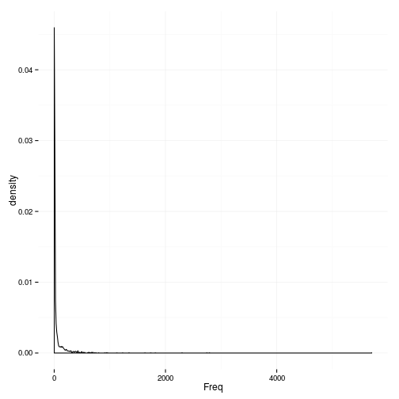
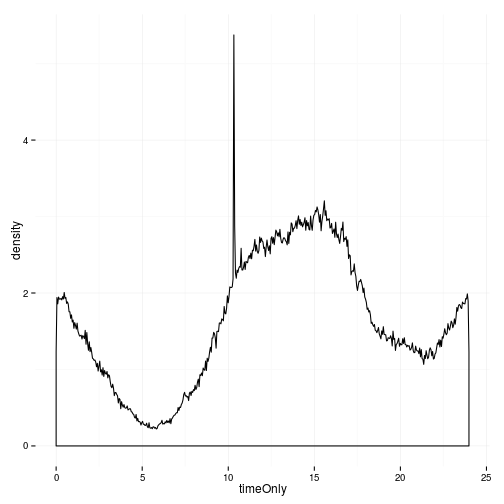
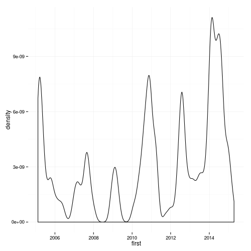

Last.fm Data analysis
=======================


I discovered that you can download your [last.fm](www.last.fm) [data](http://www.last.fm/settings/dataexporter).
For those that don't use it, last.fm records all the music you listen to (as long as you listen on something that supports it) and records it for you.
It uses this data to give you recomendations of other artists you might like.
It also gives you weekly, monthly, 6 monthly lists of who you have been listening to.

If I go to a care home when I am old, I intend to put my last.fm profile in as part of my [care plan](http://www.nhs.uk/Planners/Yourhealth/Pages/Careplan.aspx).
I don't want to spend the last years of my life listening to cruddy music.

Anyway, you can now download all your data quite easily.
So here I will just have a play around and see what is interesting.
By the way, I am [t3h_m013](www.last.fm/user/t3h_m013) on last.fm.
This is an old and embaressing nickname... but oh well.


Read in the data
-----------------

First some libraries

```r
library(ggplot2)
library(magrittr)
library(dplyr)
library(lubridate)

theme_set(theme_minimal())
```

Then read in the data.


```r
d <- read.table('data/scrobbles.tsv')
```

```
## Error: line 1091 did not have 15 elements
```

Ok. It doesn't work. Blerg. 

I've made a copy of the file and removed the offending line. I guess this will just move the error on to the next line with a similar problem.


```r
d <- read.table('data/scrobbles\ (copy).tsv')
```

```
## Error: line 1096 did not have 15 elements
```

Ok it's to do with quoted text inside song names. 
"07 - Excepts From ""The Six Wives Of Henry VIII""" for example. 
Funny that I've never encountered this before.


```r
d <- read.table('data/scrobbles.tsv', header = TRUE, sep = '\t', stringsAsFactors = FALSE, quote = "\"")
dim(d)
```

```
## [1] 104571     15
```

```r
names(d)
```

```
##  [1] "ISO.time"                "unixtime"               
##  [3] "track.name"              "track.mbid"             
##  [5] "artist.name"             "artist.mbid"            
##  [7] "uncorrected.track.name"  "uncorrected.track.mbid" 
##  [9] "uncorrected.artist.name" "uncorrected.artist.mbid"
## [11] "album.name"              "album.mbid"             
## [13] "album.artist.name"       "album.artist.mbid"      
## [15] "application"
```

Hooray. It works. 
We have some fairly obvious column names.
Note that last.fm matches incorrectly named artists.
So "uncorrected*" are the original data.

So let's look at some basic overview stuff.


```r
artistData <- data.frame(table(d$artist.name))
names(artistData)[1] <- 'Artist'

artistData[order(artistData$Freq, decreasing = TRUE), ] %>% head
```

```
##                  Artist Freq
## 1926       Van Morrison 5707
## 675        Frank Turner 2789
## 1356          Radiohead 2743
## 1651        The Beatles 2296
## 365  Coheed and Cambria 1819
## 1496          Sigur Rós 1734
```

```r
ggplot(artistData, aes(x = Freq)) + 
  geom_density() 
```

 

Ok, the top artists match.


And as expected, there's a few artists with loads of listen, and lots of artists with very few listens.

Now to think of some interesting things to look at.


When do I listen to music?
---------------------------


```r
# convert to POSIXct
d$time <- ymd_hms(d$ISO.time)


# Through time
ggplot(d, aes(x = time)) +
  geom_density(adjust = 0.1) 
```

 

```r
# Another simple way to look at times
#   Can't work out how to do this in ggplot2. 
plot(d$time)
```

 

I've had some periods where my music player didn't support scrobbling and things like that. 
Seems I also just listened to less music back in 2005/2006. 
I probably listened to more CDs back then.

To give some overview, I was doing my undergraduate degree September 2006 - July 2010.
Then I spent 1 year working and travelling (I'm surprised you can't see a drop in listens there.
From 2012 I've been doing an MRes/PhD in London.


```r
# Get the time of day
d$timeOnly <- hour(d$time) + minute(d$time)/60


ggplot(d, aes(x = timeOnly)) +
  geom_density(adjust = 0.001) 
```

 

So I listen to music less at night (makes sense).
I also listen less in the evening.
Which I guess is me being either out or listening to music with other people and therefore not necessarily on my player.

That spike is I think artificial. 
But I can't think what it might be.


```r
table(d$timeOnly)[order(table(d$timeOnly), decreasing = TRUE)] %>% head
```

```
## 
## 10.3333333333333            14.95 15.5833333333333 14.7833333333333 
##              593              174              154              152 
##            15.15            14.45 
##              150              149
```

It seems the spike is 10:20 (above is decimal I think). 
I think this must be something server side at last.fm.


When did I start listening to bands?
-------------------------------------


So first I'll look at a cumulative graph of number of bands in my 'library'.
I expect there will be a quick ramp up (I already listened to plenty of bands before I started scrobbling).
I'm not sure what else I might see.
Perhaps a ramp up in about 2010.
In particular I started listening to more electonic music and importantly more compilations at that time.


```r
first <- d %>% 
  group_by(artist.name) %>% 
  select(time) %>%
  summarise(first = sort(time)[1])

first %>% head
```

```
## Source: local data frame [6 x 2]
## 
##            artist.name               first
## 1               *shels 2007-11-01 14:36:20
## 2                  +44 2012-04-27 15:32:33
## 3              101/SiD 2006-01-17 22:49:38
## 4 13th Floor Elevators 2014-07-03 15:17:43
## 5                16bit 2010-10-27 12:43:01
## 6          2 Many DJ's 2005-03-08 12:44:25
```

```r
# Add this data to artistData data.frame
#   If someone knows how to do this better please tell me.
artistData$first <- first$first[sapply(as.character(artistData$Artist), function(x) which(x == first$artist.name))]


ggplot(artistData, aes(x = first)) +
  geom_density(adjust = 0.2)
```

 

```r
ggplot(artistData, aes(x = first)) + 
  stat_ecdf()
```

 

Well I guess that's pretty much just when I was scrobbling lots, I added new artists. 
I guess it's nice to know I'm still discovering new music and now just listening to bands from my youth.


When did I most listen to my favourite bands?
----------------------------------------------


Diversity of bands listened to
--------------------------------


