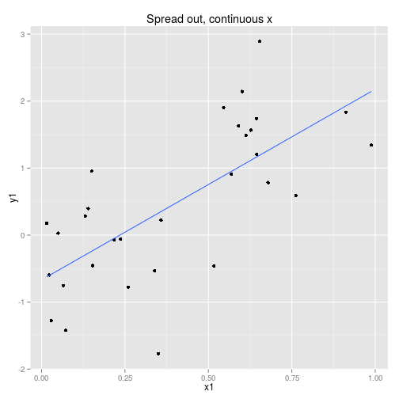
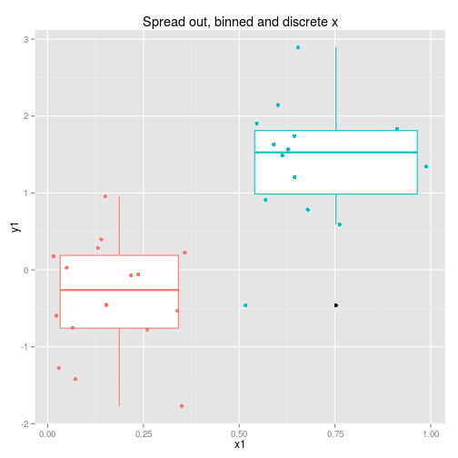
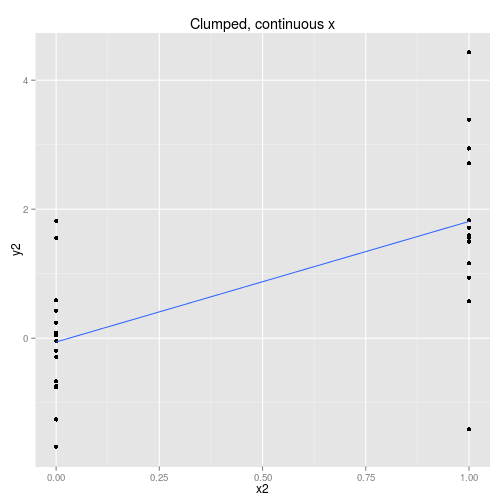
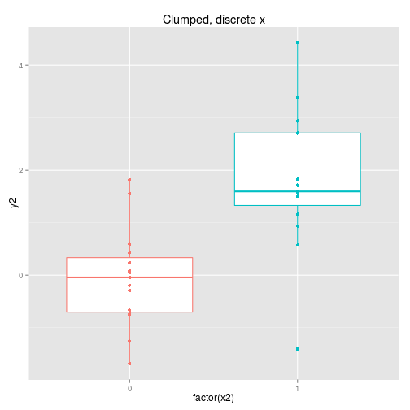
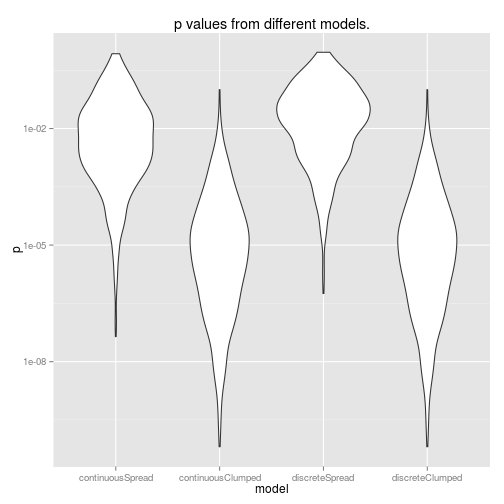

# Power of different linear models

If you want to test for a change over a variable we can consider some different ways to do it.

We can collect the data so that it is spread out along the x axis or clumped at either end.

We can analyse the x axis as a continuous variable or a discrete variable (binning the x if it is spread out.)
These four options are displayed below with boxplots implying the data is analysed as discrete x values.
Note that only two sets of data are simulated, one clumped and one spread out.




So to examine the power of these approaches here's a function that simulates some data (from a linear model with normal error) and then calculates and extracts p-values (sorry) for the four cases shown above.


```r
calcLM <- function(){

x1 <- runif(30)
y1 <- x1 * 2 + rnorm(30)
x2 <- rep(c(0,1), 15)
y2 <- x2 * 2 + rnorm(30)

coef <- c( summary(lm(y1 ~ x1))$coef[8],
           summary(lm(y2 ~ x2))$coef[8],
           summary(lm(y1 ~ x1 > 0.5))$coef[8],
           summary(lm(y2 ~ as.factor(x2)))$coef[8]
          )
}
```

Then let's run the simulation 1000 times.


```r
p <- t(replicate(1000, calcLM())) %>% data.frame

colnames(p) <- c('continuousSpread', 'continuousClumped', 'discreteSpread', 'discreteClumped')

pLong <- melt(p, variable.name = 'model', value.name = 'p')
```

And plot the results.

```r
ggplot(pLong, aes(x = model, y = p)) +
  scale_y_log10() +
  geom_violin() +
  ggtitle('p values from different models.')
```



So, using data from the edges of our range of x values gives us more power (lower p-values). 
Also, it's interesting to note that doing a discrete ANOVA with the x values as a factor is identical to treating this as a continuous linear model.
This will not be true if you have more than two groups though. 
Furthermore, if you actually want to use this as a linear model, you will have to do an extra step to scale the coefficients if you do an ANOVA rather than a linear model.

So... that was kinda fun. And another chance to get to know ggplot2 better. Some code is suppressed here but you can see the full knitr document [here](lmVSanova.Rmd).


