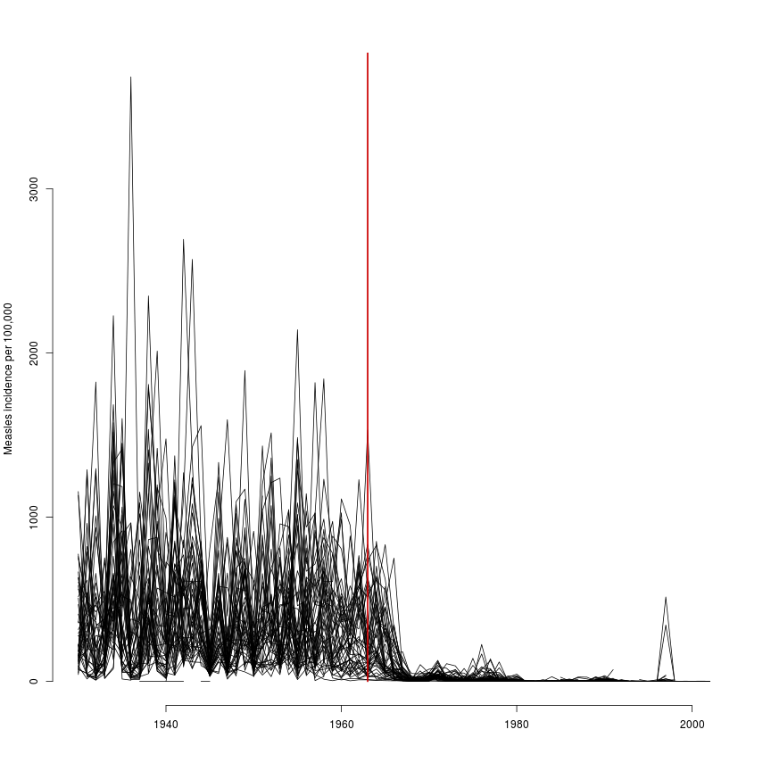
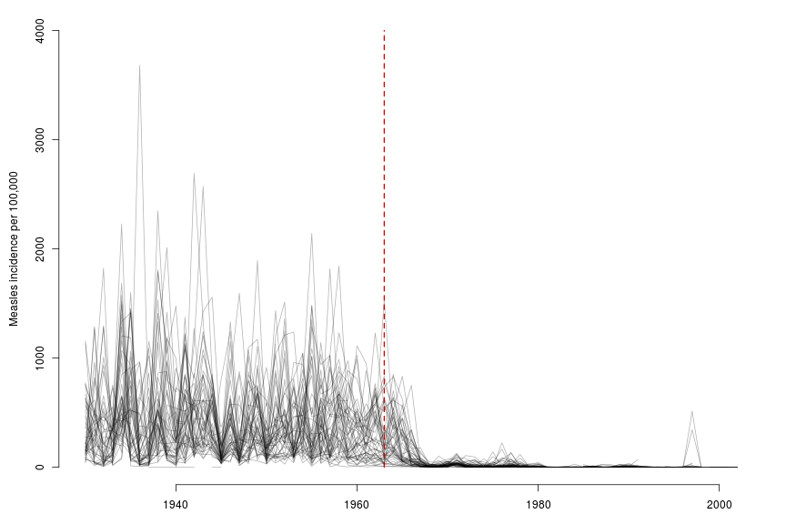

Measles Extra Vizualisation
============================


I'm going to use this to play around with some other ways of displaying the measles data. See [measlesviz.md](measlesviz.md) for background.


Sort data
----------


```r
m <- read.csv('MEASLES_Incidence_1928-2003_20150409110701.csv', stringsAsFactors = FALSE)

# yoink. Cheers @biomickwatson
m[m == "-"] <- NA
for (i in 2:NCOL(m)) {
   m[, i] <- as.numeric(m[, i])
}

m <- m[m$YEAR>=1930,]
y <- aggregate(m[,3:NCOL(m)], by=list(year=m[,1]), function(x) 52*mean(x, na.rm = TRUE))

for (i in 1:NCOL(y)) {
   y[is.nan(y[, i]), i] <- NA
}


y <- y[order(y$year),]

stNames <- read.csv('stateNames.csv', header = FALSE, stringsAsFactors = FALSE)

names(y)[2:52] <- stNames[,2]
```


Line chart
-----------

First let's do the most basic line chart.


```r
plot(y[, 2] ~ y[, 1], type = 'l', 
  ylim = c(0, max(y, na.rm = TRUE)), 
  ylab = 'Measles incidence per 100,000',
  xlab = '',
  frame = FALSE
  ) 

for(s in 3:NCOL(y)){
  lines(y[, s] ~ y[, 1])
}

segments(1963, 0, 1963, signif(max(y, na.rm = TRUE), 1), col = '#CD0000', lwd = 2.3)
```

 
Messy, messy, messy. As was obviously going to happen. I think NAs are dealt with properly though which is good. 

Let's try some opacity.


```r
par(mar = c(3, 4.5, 1, 1))

op <- 0.3

plot(y[, 2] ~ y[, 1], type = 'l', 
  ylim = c(0, signif(max(y, na.rm = TRUE), 1)), 
  ylab = 'Measles incidence per 100,000',
  xlab = '',
  frame = FALSE, 
  col = rgb(0, 0, 0, op)
  ) 

for(s in 3:NCOL(y)){
  lines(y[, s] ~ y[, 1],   
  col = rgb(0, 0, 0, op))
}

segments(1963, 0, 1963, signif(max(y, na.rm = TRUE), 1), col = '#CD0000', lwd = 1.6, lty = 2)
```

 

This is still messy, but actually not too bad.


Small Multiples
----------------


