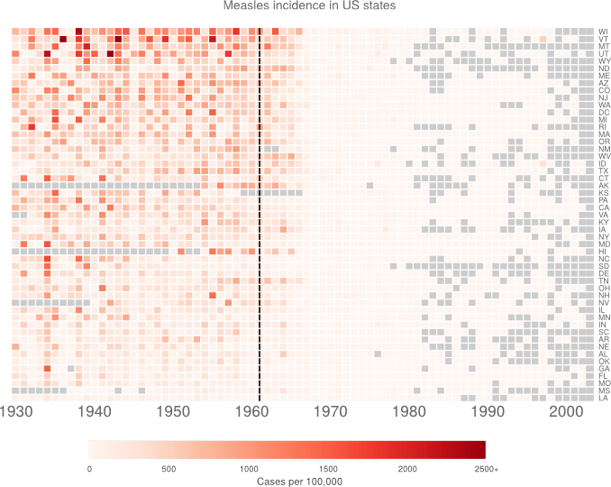

Measles vizualisation
=======================

First there was the Wall Street Journal [vizualisation](http://graphics.wsj.com/infectious-diseases-and-vaccines/)

Then [@RobertAllison__](http://www.twitter.com/RobertAllison__) redrew the [plot](http://blogs.sas.com/content/sastraining/2015/02/17/how-to-make-infectious-diseases-look-better/?utm_source=feedburner&utm_medium=feed&utm_campaign=Feed%3A+sasblogs+%28SAS+Blogs%29). 


Then (@biomickwatson](www.twitter.com/biomickwatson) recreated the [plot](https://biomickwatson.wordpress.com/2015/04/09/recreating-a-famous-visualisation/). Finally, [@benjaminlmoore](http://www.twitter.com/benjaminlmoore) recreated the [plot](http://www.r-bloggers.com/recreating-the-vaccination-heatmaps-in-r/) in ggplot2.

So I thought I'd have a go as well. I've downloaded the *incidence* data from the Tycho website. [http://www.tycho.pitt.edu/l1advanced.php](http://www.tycho.pitt.edu/l1advanced.php) You have to register and stuff. I also deleted the first two rows with titles in.


Before I start, my aims:

* No funky colour ramps. Let the data speak for itself.
* Distinguish between missing data and zeros.
* I'm considering reordering the states. Perhaps largest states at the top? Or high measles burden at top.

The code
---------

So, read in data. Then shamelessly copy code from @biomickwatson to get to a decent starting point.

To go from weekly data to annual, I am taking the mean across the year (with NAs removed). As pointed out by [@RobertAllison__](http://blogs.sas.com/content/sastraining/2015/02/17/how-to-make-infectious-diseases-look-better/?utm_source=feedburner&utm_medium=feed&utm_campaign=Feed%3A+sasblogs+%28SAS+Blogs%29), if you sum the data, the NAs introduce a bias. So I am taking the mean, then multiplying back by 52. To get expected cases per 100,000, per year.

```{r setup, fig.height = 7, fig.width = 10}


library(gplots)

m <- read.csv('MEASLES_Incidence_1928-2003_20150409110701.csv', stringsAsFactors = FALSE)

# yoink. Cheers @biomickwatson
m[m == "-"] <- NA
for (i in 2:NCOL(m)) {
   m[, i] <- as.numeric(m[, i])
}

m <- m[m$YEAR>=1930,]
y <- aggregate(m[,3:NCOL(m)], by=list(year=m[,1]), function(x) 52*mean(x, na.rm = TRUE))

for (i in 1:NCOL(y)) {
   y[is.nan(y[, i]), i] <- NA
}


y <- y[order(y$year),]


row.labels <- rep("", 72)
row.labels[c(1,11,21,31,41,51,61,71)] <- c("1930","1940","1950","1960","1970",
                                           "1980","1990","2000")
                 
cols <- colorRampPalette(c("red", "blue"))(100)
bks <- seq(0, max(y[, -1], na.rm = TRUE), length.out = 101)


par(cex.main=0.8)

heatmap.2(as.matrix(t(y[,2:NCOL(y)])), Rowv=NULL, Colv=NULL, 
        dendrogram="none", trace="none", key=FALSE,
        labCol=row.labels, cexCol=1, lhei=c(0.15,1), lwid=c(0.1,1), margins=c(5,12),
        col=cols, breaks=bks, colsep=1:72, srtCol=0, rowsep=1:57, sepcolor="white",
        add.expr=lines(c(32,32),c(0,1000),lwd=2),
        main='Measles cases in US states 1930-2001\nVaccine introduced 1961
             \n(data from Project Tycho)')


```

OK. NA's are white. Other colours are ramped. That's good. The colour ramp here is funny because I'm using @biomickwatson's values which match the cases data rather than the incidence data. 

I like the labels on the right so I'll leave that. 


Now to get some good colours. I might try and leave NA's white and have a ramp that doesn't include white. RColorBrewer asseeeeemble.

Also going to change to 2 letter state names. The csv is just a list copied from the [web](http://www.50states.com/abbreviations.htm#.VSgJpXXd89Y).


```{r nas, fig.height = 7, fig.width = 10}

library(RColorBrewer)

stNames <- read.csv('stateNames.csv', header = FALSE, stringsAsFactors = FALSE)

names(y)[2:52] <- stNames[,2]


cols <- colorRampPalette(brewer.pal(8, 'Reds'))(100)
bks <- seq(0, max(y[, -1], na.rm = TRUE), length.out = 101)

par(cex.main=0.8)
heatmap.2(as.matrix(t(y[,2:NCOL(y)])), Rowv=NULL, Colv=NULL, 
        dendrogram="none", trace="none", key=FALSE,
        labCol=row.labels, cexCol=1, lhei=c(0.15,1), lwid=c(0.1,1), margins=c(5,12),
        breaks=bks, colsep=1:72, srtCol=0, rowsep=1:57, sepcolor="white", col=cols, 
        add.expr=lines(c(32,32),c(0,1000),lwd=2),
        main='Measles cases in US states 1930-2001\nVaccine introduced 1961', na.color = grey(0.8))

```

As suggested by [@bulboussquidge](https://twitter.com/BulbousSquidge/status/567318406857515008) I'll try just clipping the few high values to a something+ category.

```{r clipped, fig.height = 7, fig.width = 10}

hist(as.matrix(y[,1:NCOL(y)]))

y2 <- y[, 2:NCOL(y)]
sum(y2[!is.na(y2)] > 2500)

y2[y2 > 2500] <- 2500

cols <- colorRampPalette(brewer.pal(8, 'Reds'))(100)
bks <- seq(0, max(y2, na.rm = TRUE), length.out = 101)

par(cex.main=0.8)
heatmap.2(as.matrix(t(y2)), Rowv=NULL, Colv=NULL, 
        dendrogram="none", trace="none", key=FALSE,
        labCol=row.labels, cexCol=1, lhei=c(0.15,1), lwid=c(0.1,1), margins=c(5,12),
        breaks=bks, colsep=1:72, srtCol=0, rowsep=1:57, sepcolor="white", col=cols, 
        add.expr=lines(c(32,32),c(0,1000),lwd=2),
        main='Measles cases in US states 1930-2001\nVaccine introduced 1961', na.color = grey(0.8))

```

Only 3 data points are affected. I'm torn here. 

Now I want to try organising the data by measles burden. The areas with lots of measles are the important bit, so I think that makes sense. I think I'll just do mean (with NAs removed) and order by size. Certainly a useful thing could be to order by number of cases rather than incidence. But I don't want to go get the other dataset.


```{r ordered, fig.height = 7, fig.width = 10}


means <- apply(y2, 2, function(x) mean(x, na.rm = TRUE))

y3 <- y2[, rev(order(means))]


par(cex.main=0.8)
heatmap.2(as.matrix(t(y3)), Rowv=NULL, Colv=NULL, 
        dendrogram="none", trace="none", key=FALSE,
        labCol=row.labels, cexCol=1, lhei=c(0.15,1), lwid=c(0.1,1), margins=c(5,12),
        breaks=bks, colsep=1:72, srtCol=0, rowsep=1:57, sepcolor="white", col=cols, 
        add.expr=lines(c(32,32),c(0,1000),lwd=2),
        main='Measles cases in US states 1930-2001\nVaccine introduced 1961', na.color = grey(0.85))

```

I think the reordering is an improvement. It's interesting at least.


Finally, I just want to tweak a few things. This turns out to be a complete pain. I had ago hacking `heatmap.2()`. The new function is saved in customHeatmap.R. 

```{r final, dev = c('png', 'pdf'), fig.height = 8, fig.width = 10}


source('customHeatmap.R')

customHeatmap(as.matrix(t(y3)), Rowv=NULL, Colv=NULL, lmat = rbind(c(0,3),c(2,1),c(0,4)),
        dendrogram="none", trace="none", key=TRUE,
        labCol=row.labels, lhei=c(0.15,1,0.25), lwid=c(0.1,1), margins=c(3,6),
        breaks=bks, colsep=1:72, rowsep=1:57, sepcolor="white", col=cols, 
        add.expr=lines(c(32,32),c(0,1000),lwd=2),
        main='Measles incidence in US states', na.color = grey(0.8),
        density.info = 'none', RowLabColors = grey(0.4), cexCol = 1.3, key.title = '',
        cexRow = 0.65, ColLabColors = grey(0.4), key.xlab = 'Cases per 100,000', titleColor = grey(0.4), key.par = list(col = grey(0.6), lwd = 0.1 ) 
        )
```

At this point, I'm bored of hacking. I'm just going to make the last few changes in inkscape.

Which gives me:



Still not perfect. But I'm bored now.


