# Lets look at twitter data!

## Preamble: Load libs, read data

Load libraries. `lubridate` and `scales` deal with time data. `grid` allows plotting side by side `ggplot2` objects. 

```r
library(ggplot2)
library(reshape2)
library(dplyr)
library(magrittr)
library(lubridate)
library(grid)
library(scales)
```

Read in data downloaded from [analytics.twitter.com](analytical.twitter.com


```r
setwd('~/Dropbox/Documents/statsforbios/twitterData')
d <- read.csv('tweet_activity_metrics0121.csv', stringsAsFactors = FALSE)

dim(d)
```

```
## [1] 2388   40
```

```r
names(d)
```

```
##  [1] "Tweet.id"                       "Tweet.permalink"               
##  [3] "Tweet.text"                     "time"                          
##  [5] "impressions"                    "engagements"                   
##  [7] "engagement.rate"                "retweets"                      
##  [9] "replies"                        "favorites"                     
## [11] "user.profile.clicks"            "url.clicks"                    
## [13] "hashtag.clicks"                 "detail.expands"                
## [15] "permalink.clicks"               "embedded.media.clicks"         
## [17] "app.opens"                      "app.installs"                  
## [19] "follows"                        "email.tweet"                   
## [21] "dial.phone"                     "video.views"                   
## [23] "promoted.impressions"           "promoted.engagements"          
## [25] "promoted.engagement.rate"       "promoted.retweets"             
## [27] "promoted.replies"               "promoted.favorites"            
## [29] "promoted.user.profile.clicks"   "promoted.url.clicks"           
## [31] "promoted.hashtag.clicks"        "promoted.detail.expands"       
## [33] "promoted.permalink.clicks"      "promoted.embedded.media.clicks"
## [35] "promoted.app.opens"             "promoted.app.installs"         
## [37] "promoted.follows"               "promoted.email.tweet"          
## [39] "promoted.dial.phone"            "promoted.video.views"
```

Set `ggplot2` options.


```r
theme_set(theme_minimal(base_size = 20))
```


## Some basic time stuff

Number of tweets has remained relatively constant over the period.


```r
d$time %<>% as.POSIXct
ggplot(d, aes(x = time)) +
  geom_histogram(bin = 7*24*60*60) +
  ylab('No. of tweets (weekly)') +
  xlab('Date')
```

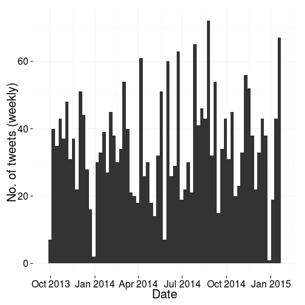 

Most of my tweets are between 10 and 5 GMT. Quite a few in the evening as well.


```r
d$timeOnly <- hour(d$time) + minute(d$time)/60

ggplot(d, aes(x = timeOnly)) + 
  geom_histogram() +
  ylab('No. of tweets') +
  xlab('Time (hr)')
```

```
## stat_bin: binwidth defaulted to range/30. Use 'binwidth = x' to adjust this.
```

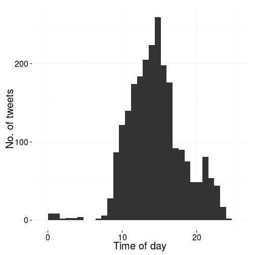 


## Impressions exploratory analysis

Another reminder of first rule of stats. Plot the data.


```r
imprPlot <- ggplot(d, aes(x = time, y = impressions)) +
  geom_point(alpha = 0.3) +
  scale_y_sqrt() +
  scale_x_datetime("", labels = date_format("%b"))

rtPlot <- ggplot(d, aes(x = time, y = retweets)) + 
  geom_point(alpha = 0.3) +
  scale_x_datetime("", labels = date_format("%b"))

pushViewport(viewport(layout = grid.layout(1, 2)))
print(imprPlot, vp = viewport(layout.pos.row = 1, layout.pos.col = 1))
print(rtPlot, vp = viewport(layout.pos.row = 1, layout.pos.col = 2))
```

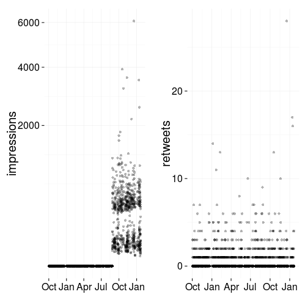 

Turns out this dataset has all my tweets, but only records impressions from October 2014 (when I started using twitter analytics. 
So, any analysis on impressions must be done only on the later data. 
Retweets are fine.
I'm just going to remove all old tweets. 
Seems cleaner.


```r
d %<>% filter(., time > 1409150040)
```

## Replies

Add a logical column of whether a tweet is a reply.


```r
d$reply <- factor(substring(d$Tweet.text, 1, 1) == '@')

ggplot(d, aes(y = impressions, x = reply)) +
  geom_violin() +
  scale_y_log10()
```

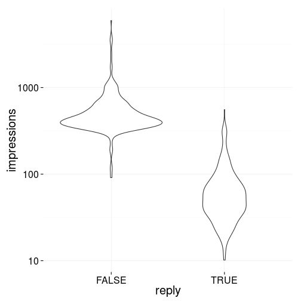 

Unsurprisingly, there are much fewer impressions for replies. 
So I'm going to remove them from further analysis as well.


```r
d %<>% filter(reply == FALSE)
```

## Time regressions

Time of day is marginally significant, but not much there.

```r
lm(d$impressions ~ d$timeOnly) %>% summary
```

```
## 
## Call:
## lm(formula = d$impressions ~ d$timeOnly)
## 
## Residuals:
##    Min     1Q Median     3Q    Max 
## -477.6 -181.5 -125.3   19.7 5498.5 
## 
## Coefficients:
##             Estimate Std. Error t value Pr(>|t|)    
## (Intercept)  452.718     97.966   4.621 5.13e-06 ***
## d$timeOnly     7.079      6.432   1.101    0.272    
## ---
## Signif. codes:  0 '***' 0.001 '**' 0.01 '*' 0.05 '.' 0.1 ' ' 1
## 
## Residual standard error: 480.9 on 406 degrees of freedom
## Multiple R-squared:  0.002975,	Adjusted R-squared:  0.000519 
## F-statistic: 1.211 on 1 and 406 DF,  p-value: 0.2717
```

```r
ggplot(d, aes(x = timeOnly, y = impressions)) +
  geom_point() +
  scale_y_sqrt()
```

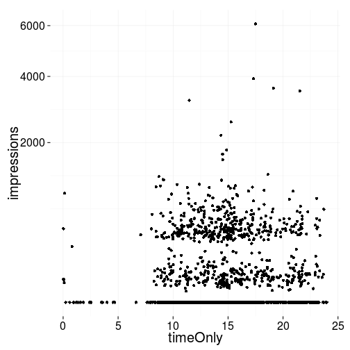 

However I think it's slightly better to do from 6am rather than midnight.


```r
d$frmMorn <- d$timeOnly - 6
d$frmMorn[d$frmMorn < 0] <- d$frmMorn[d$frmMorn < 0] + 24 

ggplot(d, aes(x = frmMorn)) + 
  geom_histogram()
```

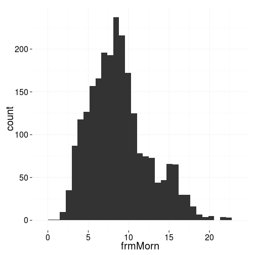 

```r
ggplot(d, aes(x = frmMorn, y = impressions)) +
  geom_point() +
  scale_y_sqrt() +
  stat_smooth(method = 'lm', se = FALSE, size = 1.7, linetype = '22') + 
  stat_smooth(method = 'glm', family = 'quasipoisson', colour = 'red4', se = FALSE, size = 1.7, linetype = '21')
```

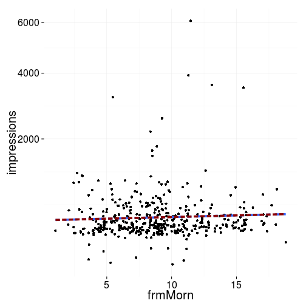 

```r
lm(d$impressions ~ d$frmMorn) %>% summary
```

```
## 
## Call:
## lm(formula = d$impressions ~ d$frmMorn)
## 
## Residuals:
##    Min     1Q Median     3Q    Max 
## -476.5 -181.0 -125.2   21.5 5499.3 
## 
## Coefficients:
##             Estimate Std. Error t value Pr(>|t|)    
## (Intercept)  492.290     64.142   7.675 1.24e-13 ***
## d$frmMorn      7.264      6.654   1.092    0.276    
## ---
## Signif. codes:  0 '***' 0.001 '**' 0.01 '*' 0.05 '.' 0.1 ' ' 1
## 
## Residual standard error: 480.9 on 406 degrees of freedom
## Multiple R-squared:  0.002927,	Adjusted R-squared:  0.0004708 
## F-statistic: 1.192 on 1 and 406 DF,  p-value: 0.2756
```

```r
glm(d$impressions ~ d$frmMorn, family = 'quasipoisson') %>% summary
```

```
## 
## Call:
## glm(formula = d$impressions ~ d$frmMorn, family = "quasipoisson")
## 
## Deviance Residuals: 
##     Min       1Q   Median       3Q      Max  
## -24.957   -8.246   -5.503    0.921  132.817  
## 
## Coefficients:
##             Estimate Std. Error t value Pr(>|t|)    
## (Intercept)  6.20646    0.11485  54.040   <2e-16 ***
## d$frmMorn    0.01291    0.01171   1.103    0.271    
## ---
## Signif. codes:  0 '***' 0.001 '**' 0.01 '*' 0.05 '.' 0.1 ' ' 1
## 
## (Dispersion parameter for quasipoisson family taken to be 406.6379)
## 
##     Null deviance: 88594  on 407  degrees of freedom
## Residual deviance: 88102  on 406  degrees of freedom
## AIC: NA
## 
## Number of Fisher Scoring iterations: 5
```

Linear model is not significant. 
GLM is not significant. 
I don't think there's anything here. 


### Try removing retweets

In a sense, when looking at factors such as time of day, we want to look at the number of impressions *irrespective* of how good that tweet was. 
So I'll remove the retweeted tweets and redo analysis.


```r
rmRT <- d %>% filter(retweets == 0)


ggplot(rmRT, aes(x = frmMorn, y = impressions)) +
  geom_point() +
  scale_y_sqrt() +
  stat_smooth(method = 'lm', se = FALSE, size = 1.7, linetype = '22') + 
  stat_smooth(method = 'glm', family = 'quasipoisson', colour = 'red4', se = FALSE, size = 1.7, linetype = '21')
```

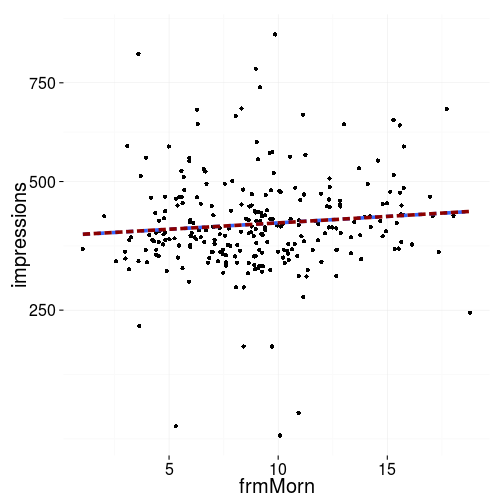 

```r
lm(rmRT$impressions ~ rmRT$frmMorn) %>% summary
```

```
## 
## Call:
## lm(formula = rmRT$impressions ~ rmRT$frmMorn)
## 
## Residuals:
##     Min      1Q  Median      3Q     Max 
## -327.78  -58.10  -15.75   36.99  474.80 
## 
## Coefficients:
##              Estimate Std. Error t value Pr(>|t|)    
## (Intercept)   390.117     17.205  22.674   <2e-16 ***
## rmRT$frmMorn    2.644      1.764   1.499    0.135    
## ---
## Signif. codes:  0 '***' 0.001 '**' 0.01 '*' 0.05 '.' 0.1 ' ' 1
## 
## Residual standard error: 101.8 on 258 degrees of freedom
## Multiple R-squared:  0.008632,	Adjusted R-squared:  0.00479 
## F-statistic: 2.247 on 1 and 258 DF,  p-value: 0.1351
```

```r
glm(rmRT$impressions ~ rmRT$frmMorn, family = 'quasipoisson') %>% summary
```

```
## 
## Call:
## glm(formula = rmRT$impressions ~ rmRT$frmMorn, family = "quasipoisson")
## 
## Deviance Residuals: 
##      Min        1Q    Median        3Q       Max  
## -19.5080   -2.9318   -0.7844    1.7915   20.1759  
## 
## Coefficients:
##              Estimate Std. Error t value Pr(>|t|)    
## (Intercept)  5.968171   0.041739 142.988   <2e-16 ***
## rmRT$frmMorn 0.006358   0.004244   1.498    0.135    
## ---
## Signif. codes:  0 '***' 0.001 '**' 0.01 '*' 0.05 '.' 0.1 ' ' 1
## 
## (Dispersion parameter for quasipoisson family taken to be 25.02464)
## 
##     Null deviance: 6339.6  on 259  degrees of freedom
## Residual deviance: 6283.5  on 258  degrees of freedom
## AIC: NA
## 
## Number of Fisher Scoring iterations: 4
```


## Pictures

Turns out the data doesn't indicate whether a tweet contains an image.
There's an app [here](http://stackoverflow.com/questions/6500721/find-where-a-t-co-link-goes-to) that turns `t.co` domains back into original urls.
Could probably use this and then `grep` for `.png`, `.jpg` etc. etc.
But that's a pain. So for now I'm just going to use `embedded.media.clicks > 0` as a proxy for 'contains embedded media.'
This obviously biases the number of impressions upwards.


```r
ggplot(d, aes(x = embedded.media.clicks > 0, y = impressions)) +
  geom_violin() +
  scale_y_log10()
```

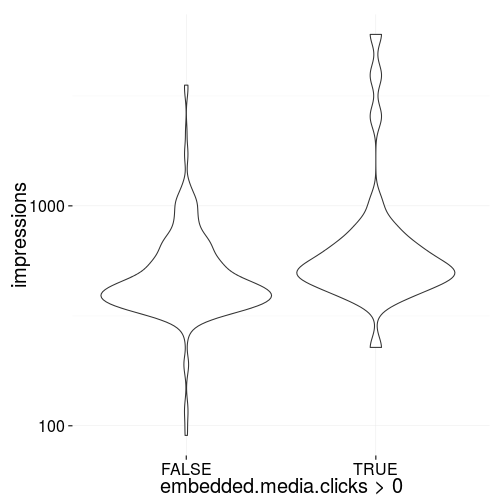 

```r
glm(d$impressions ~ (d$embedded.media.clicks > 0), family='quasipoisson') %>% summary
```

```
## 
## Call:
## glm(formula = d$impressions ~ (d$embedded.media.clicks > 0), 
##     family = "quasipoisson")
## 
## Deviance Residuals: 
##     Min       1Q   Median       3Q      Max  
## -26.398   -7.946   -4.772    1.030  114.365  
## 
## Coefficients:
##                                 Estimate Std. Error t value Pr(>|t|)    
## (Intercept)                      6.27076    0.04147 151.220  < 2e-16 ***
## d$embedded.media.clicks > 0TRUE  0.50961    0.11601   4.393 1.43e-05 ***
## ---
## Signif. codes:  0 '***' 0.001 '**' 0.01 '*' 0.05 '.' 0.1 ' ' 1
## 
## (Dispersion parameter for quasipoisson family taken to be 341.0414)
## 
##     Null deviance: 88594  on 407  degrees of freedom
## Residual deviance: 82795  on 406  degrees of freedom
## AIC: NA
## 
## Number of Fisher Scoring iterations: 5
```

So while significant, the effect size isn't massive.
Including a picture increases impressions by 50% before accounting for the bias mentioned above.

## Hashtags

Do hashtags affect the number of people that see my tweets? 
I'll look at `#dataviz` and `#rstats` as these are the only hashtags I use a lot.


```r
ggplot(d, aes(x = grepl('#rstats', d$Tweet.text), y = impressions)) + 
  geom_violin() + 
  scale_y_log10() +
  xlab('#rstats')
```

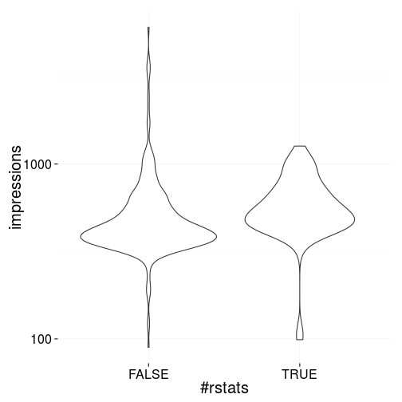 

```r
glm(d$impressions ~ (grepl('#rstats', d$Tweet.text)), family='quasipoisson') %>% summary
```

```
## 
## Call:
## glm(formula = d$impressions ~ (grepl("#rstats", d$Tweet.text)), 
##     family = "quasipoisson")
## 
## Deviance Residuals: 
##     Min       1Q   Median       3Q      Max  
## -25.205   -8.088   -5.450    0.629  134.626  
## 
## Coefficients:
##                                    Estimate Std. Error t value Pr(>|t|)
## (Intercept)                         6.31086    0.04729  133.45   <2e-16
## grepl("#rstats", d$Tweet.text)TRUE  0.07245    0.11324    0.64    0.523
##                                       
## (Intercept)                        ***
## grepl("#rstats", d$Tweet.text)TRUE    
## ---
## Signif. codes:  0 '***' 0.001 '**' 0.01 '*' 0.05 '.' 0.1 ' ' 1
## 
## (Dispersion parameter for quasipoisson family taken to be 419.8404)
## 
##     Null deviance: 88594  on 407  degrees of freedom
## Residual deviance: 88425  on 406  degrees of freedom
## AIC: NA
## 
## Number of Fisher Scoring iterations: 5
```

```r
ggplot(d, aes(x = grepl('#dataviz', d$Tweet.text), y = impressions)) + 
  geom_violin() + 
  scale_y_log10() +
  xlab('#dataviz')
```

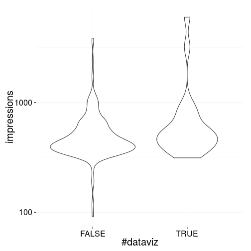 

```r
glm(d$impressions ~ (grepl('#dataviz', d$Tweet.text)), family='quasipoisson') %>% summary
```

```
## 
## Call:
## glm(formula = d$impressions ~ (grepl("#dataviz", d$Tweet.text)), 
##     family = "quasipoisson")
## 
## Deviance Residuals: 
##     Min       1Q   Median       3Q      Max  
## -24.019   -7.867   -4.899    1.134  113.929  
## 
## Coefficients:
##                                     Estimate Std. Error t value Pr(>|t|)
## (Intercept)                           6.2869     0.0414 151.841  < 2e-16
## grepl("#dataviz", d$Tweet.text)TRUE   0.5030     0.1381   3.643 0.000305
##                                        
## (Intercept)                         ***
## grepl("#dataviz", d$Tweet.text)TRUE ***
## ---
## Signif. codes:  0 '***' 0.001 '**' 0.01 '*' 0.05 '.' 0.1 ' ' 1
## 
## (Dispersion parameter for quasipoisson family taken to be 354.7639)
## 
##     Null deviance: 88594  on 407  degrees of freedom
## Residual deviance: 84483  on 406  degrees of freedom
## AIC: NA
## 
## Number of Fisher Scoring iterations: 5
```

So `#rstats` does not increase the number of impressions while `#dataviz` does by about 50%.
However there's a few tweets with very large numbers of impressions that are probably driving most of the #dataviz` effect.


